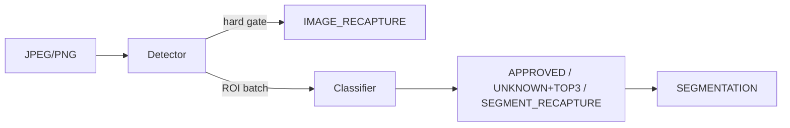

# Bixolon Scanner

여러 상품이 있는 JPEG/PNG 한 장을 판정하는 Windows 시스템입니다. 저장소에는 ONNX Runtime Worker, PyTorch 학습·평가 도구, 버전 관리되는 실험과 Flutter 작업자 앱이 함께 있습니다.

## 현재 운영 상태

| 구분 | 현재 값 | 의미 |
|---|---|---|
| Python 배포 | `bixolon-scanner 1.0.0` | 정식 Worker API 코드와 CLI 배포 버전 |
| 운영 Worker | `1.0.0` | Detector/Classifier 조합 버전, `production` |
| 운영 Detector | `1.0.0` | D-FINE-N 640, 독립 버전 |
| 운영 Classifier | `1.0.0` | DINOv3 ConvNeXt-Tiny staged TTA, 독립 버전 |
| Detector 학습 파이프라인 | `1.0.0` | D-FINE-N 학습·선택·export 계약, 독립 버전 |
| Classifier 학습 파이프라인 | `1.0.0` | DINOv3 학습·선택·staged TTA export 계약, 독립 버전 |
| 데이터셋 | `bread-1.0-a52b4faa3e20` | `single_objects_3` 종류별 12장과 평가 이미지 SHA-256 잠금 |
| Flutter 앱 | `1.0.0+2` | Worker 1.0.0 연동 작업자 앱 버전 |
| 이전 운영 package | `bread-worker-0.1.1` | 테스트 계열 rollback 기준 |

`0.x` Worker/Detector/Classifier는 모두 테스트 계열이며 `bread-worker-0.1.1`은 rollback용으로만 유지합니다. 이전 `0.2.4` classifier는 자연 장면 Top-1 94.98%, 오인 위험 상한 1.92%, P95 110.95ms로 실패했고, detector `0.2.5`도 hard·독립성·risk gate에 실패했습니다.

운영 `bread-worker-1.0.0`은 `multi_object_scenes`에서 인식률 99.0780%, 승인 오인율 0%(0/1,121), segmentation recall/precision 99.2908%/99.7151%, 평균/P95 77.79/96.01ms를 기록했고 RECAPTURE는 0건입니다. 프로젝트 소유자의 명시적 지시에 따라 운영 승격했으며, 표본 부족으로 단측 95% 오인율 상한이 0.2669%라는 잔여 위험과 독립 이미지 사후 검증 의무를 package promotion record에 보존합니다.

## 판정 계약

Worker는 이미지에 정확히 하나의 최상위 상태를 반환합니다.

- `SEGMENTATION`: detector가 만든 `segmentations[]`와 각 segmentation 결과
- `IMAGE_RECAPTURE`: detector hard gate로 이미지 전체 재촬영 필요
- `ERROR`: 입력, 구성, 모델 또는 시스템 오류

각 segmentation 상태는 `APPROVED`, `UNKNOWN`+Top-3 또는 `SEGMENT_RECAPTURE`입니다. Classifier 품질 클래스와 낮은 신뢰도의 경계 접촉 ROI는 해당 segmentation만 `SEGMENT_RECAPTURE`로 만들며 다른 객체를 버리지 않습니다. 패키지에서 포함 중복 검토 정책을 활성화하면, 거의 완전히 포함된 두 ROI가 같은 Top-1을 갖는 경우 detector 점수가 낮은 고신뢰 ROI만 `DETECTOR_CONTAINED_DUPLICATE` `UNKNOWN`+Top-3로 보존합니다. 이 정책은 segmentation을 삭제하거나 `RECAPTURE`를 만들지 않습니다. `ERROR`는 재촬영으로 변환하지 않습니다. 실행 버전은 최상위 `worker_version`, `detector_version`, `classifier_version`으로 반환하고, classifier 조기 종료 시 `classifier_version=null`입니다.



전체 공개 필드, reason code와 HTTP 매핑은 [API 계약](docs/contracts/api.md), 변경 불가능한 구현 규칙은 [AGENTS.md](AGENTS.md)를 따릅니다.

## 저장소 구조

```text
apps/product_scanner/           Flutter Windows 작업자 앱
configs/                        runtime, training, operations, experiments 설정
docs/                           아키텍처, 계약, 가이드, 상태, 실험 기록
manifests/                      버전 관리되는 데이터 manifest와 metadata
schemas/scan-response.schema.json
src/bixolon_scanner/
  contracts/                    API·모델 패키지·오류 계약
  pipeline/                     단일 판정 정책과 inference port
  runtime/                      이미지 decode와 ONNX Runtime adapter
  worker/                       FastAPI, 설정, 로깅, 실행 조립
  training/                     재사용 가능한 데이터·모델·trainer
  evaluation/                   KPI, parity, benchmark
  experiments/                 bread, detector, RPC200 orchestration
  operations/                  운영 로그 수집과 검수 export
tests/                          Python 계약·회귀·구조 테스트
```

기존 `bixolon_scanner.api`, `pipeline`, `inference`, `package`와 과거 `training.*` 실험 import는 `0.3.x`까지 호환됩니다. 새 코드는 위 canonical 패키지를 사용하십시오. 제거는 `0.4.0` 이상의 명시적 호환성 변경에서만 가능합니다.

## 설치와 Worker 실행

Python `3.11` 이상 `3.14` 미만을 지원합니다.

```powershell
python -m pip install -e ".[cuda]"

$env:BIXOLON_PACKAGE_DIR = "artifacts\packages\bread-worker-1.0.0"
$env:BIXOLON_PROVIDER = "cuda"
$env:BIXOLON_CUDA_DLL_DIR = "C:\path\to\CUDA-and-cuDNN-bin"
bixolon worker
```

기존 `bixolon-worker` 명령도 동일하게 동작합니다. 기본 endpoint는 다음과 같습니다.

- `POST /v1/scan`
- `GET /health/live`
- `GET /health/ready`

`/health/ready`의 준비 완료 응답에는 실행 중인 `provider`와 독립적인
`worker_version`, `detector_version`, `classifier_version`이 포함됩니다. BIXOLON SCANNER
`1.0.0+2`는 스캔 전에 Worker 계약 버전 `1.0.0`을 확인합니다.

CUDA 강제 모드는 초기화 실패 시 시작을 실패시키며 CPU로 조용히 전환하지 않습니다. `auto`에서만 두 ONNX session을 함께 CPU로 다시 생성합니다.

## 통합 CLI

새 작업은 `bixolon <group> <command>` 형식을 사용합니다.

```powershell
bixolon --help
bixolon data manifest --help
bixolon train detector --help
bixolon train verify-pipeline --help
bixolon evaluate worker --help
bixolon model export --help
bixolon experiment detector-target --help
bixolon operations ingest-logs --help
```

그룹은 `worker`, `data`, `train`, `evaluate`, `model`, `experiment`, `operations`, `tools`입니다. 기존 `bixolon-*` console 명령은 같은 canonical 함수를 가리키는 호환 alias로 유지됩니다. 완료·거절된 과거 실험 설정은 `configs/archive`에 보존되며 통합 CLI의 활성 실험 목록에는 노출하지 않습니다.

설정은 다음 경계를 사용합니다.

- `configs/runtime`: Worker 실행 환경 예시
- `configs/training`: 공용 trainer/export 기본값
- `configs/operations`: 운영 로그와 검수 설정
- `configs/experiments/{bread,detector,rpc200}`: 현재 재현 가능한 실험
- `configs/archive`: 완료·거절·prototype 설정

기존 루트 JSON 경로는 `$redirect` 파일이므로 기존 명령도 계속 동작합니다. loader는 누락 대상과 redirect 순환을 거부합니다.

## Flutter Windows 앱

```powershell
cd apps\product_scanner
flutter pub get
flutter run -d windows
```

배포용 Release는 먼저 `powershell.exe -NoProfile -ExecutionPolicy Bypass -File .\scripts\build_worker.ps1`로 독립 실행 Worker를 만든 뒤 `flutter build windows --release`로 빌드합니다. 앱은 기본적으로 `http://127.0.0.1:8000`의 Worker를 사용하고 release bundle에서는 Python 설치가 필요 없는 로컬 Worker를 자식 프로세스로 관리합니다. 상세 실행, CUDA DLL bundle, 로컬 Scan Log와 UI 계약은 [앱 README](apps/product_scanner/README.md)와 [디자인 시스템](apps/product_scanner/DESIGN_SYSTEM.md)을 참고하십시오.

## 개발 검증

```powershell
python -m pip install -e ".[cpu,test,dev]"
powershell -ExecutionPolicy Bypass -File scripts\verify.ps1
```

개별 명령은 다음과 같습니다.

```powershell
python -m ruff check src tests
python -m ruff format --check src tests
python -m pytest -q

cd apps\product_scanner
flutter analyze
flutter test
```

GitHub Actions는 Windows의 Python `3.11`·`3.13` CPU 테스트와 Flutter `3.44.9` analyze/test를 실행합니다. CUDA parity, RTX 5080 benchmark, 외부 데이터 KPI는 로컬 하드웨어와 잠긴 데이터가 필요한 수동 승격 gate입니다.

## 데이터와 모델

원본·증강 이미지, checkpoint, ONNX, benchmark artifact는 Git에 커밋하지 않습니다. 이 제품의 데이터는 `datasets/bread_dataset`만 허용합니다. `single_objects` 10장, `single_objects_1` 7장, `single_objects_2` 10장, `single_objects_3` 12장은 서로 섞지 않고 독립 학습·비교합니다. 현재 운영 Detector는 `single_objects` 10장, Classifier는 `single_objects_3` 12장의 recovered provenance를 사용합니다. 실제 합격 기준은 `multi_object_scenes` 300장이며 `scan_log_samples`는 참고용으로만 유지하고 합격 판정에는 포함하지 않습니다. 각 manifest와 Detector 합성 학습 데이터는 선택한 원본의 SHA-256 provenance를 보존해야 합니다.

release composition 데이터 계약은 `manifests/bread-1.0-a52b4faa3e20`이며 Detector 학습 provenance는 과거 10장 계약 `manifests/bread-1.0.0`에 별도로 잠깁니다. Detector와 Classifier 학습 파이프라인은 통합 버전 없이 각각 `1.0.0`으로 관리합니다. schema 2.1 package는 구성요소별 학습 데이터셋·manifest와 파이프라인 계약 SHA를 모두 기록합니다. 계약, 검증 명령과 버전 상승 규칙은 [학습 파이프라인 1.0.0 가이드](docs/guides/training-pipeline-1.0.0.md)를 따릅니다.

정식 1.0 gate는 인식률 ≥99%, 승인 오인율 ≤0.1% 및 그 95% 상한 ≤0.1%, segmentation IoU@0.5 recall/precision ≥99%, 이미지 RECAPTURE recall ≥99%, 정상 이미지/segment의 불필요 RECAPTURE ≤1%, CUDA 평균/P95 ≤100ms입니다. 재촬영률은 기준보다 증가할 수 없습니다. 오인 0건으로 0.1% 상한을 입증하려면 최소 2,995개의 독립 승인 표본이 필요합니다. 현재 1,121개 승인 표본의 상한은 0.2669%이며, 이번 운영 승격은 프로젝트 소유자의 명시적 지시에 따른 이 gate 하나의 예외입니다.

모델 승격 순서는 다음과 같습니다.

```text
PyTorch checkpoint
→ 고정 validation KPI
→ ONNX export
→ PyTorch/CPU/CUDA parity
→ model package
→ locked test
→ RTX 5080 benchmark
→ promotion decision
```

세부 규칙은 [모델 승격 가이드](docs/guides/model-promotion.md)를 따릅니다.

## 문서

- [문서 인덱스](docs/README.md)
- [아키텍처](docs/architecture/overview.md)
- [API 계약](docs/contracts/api.md)
- [개발 가이드](docs/guides/development.md)
- [Detector·Classifier 학습 파이프라인 1.0.0](docs/guides/training-pipeline-1.0.0.md)
- [현재 운영·실험 상태](docs/status/current.md)
- [Detector 0.2.5 재실행 가이드](docs/guides/detector-target-0.2.5-runbook.md)
- [Bread 실험 기록](docs/experiments/bread/README.md)
- [Detector 실험 기록](docs/experiments/detector/README.md)
- [RPC200 실험 기록](docs/experiments/rpc200/README.md)
