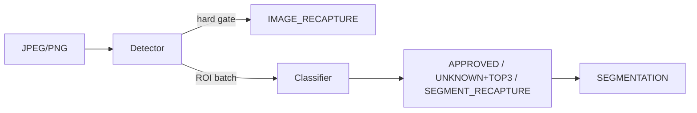

# Bixolon Scanner

여러 상품이 있는 JPEG/PNG 한 장을 판정하는 Windows 시스템입니다. 저장소에는 ONNX Runtime Worker, PyTorch 학습·평가 도구, 버전 관리되는 실험과 Flutter 작업자 앱이 함께 있습니다.

## 현재 운영 상태

| 구분 | 현재 값 | 의미 |
|---|---|---|
| Python 배포 | `bixolon-scanner 1.0.0` | 정식 Worker API 코드와 CLI 배포 버전 |
| 현재 운영 release | `scanner-2.0.1` | rc.3 고정 산출물의 owner-waiver `production` |
| 운영 Worker / Detector | `2.0.1` | D-FINE-N 4-model Detector와 selective refinement |
| 운영 Embedder / Classifier policy | `2.0.1` | frozen DINOv3 ViT-B/16 + ridge/retrieval 안전 정책 |
| 운영 Store Catalog | `2.0.1` | 원본 `single_objects` 200장, `CHECKSUM-SHA256` |
| 승격 원본 | `2.0.1-rc.3` | 300장 development point gate 통과, owner waiver 적용 |
| Detector 학습 파이프라인 | `1.0.0` | D-FINE-N 학습·선택·export 계약, 독립 버전 |
| Classifier 학습 파이프라인 | `1.0.0` | DINOv3 학습·선택·staged TTA export 계약, 독립 버전 |
| 데이터셋 | `bread-scanner-2.0.0-development` | 300장 정책 선택 계보, 독립 test로 주장하지 않음 |
| Flutter 앱 | `2.0.1+5` | Worker·Detector·Embedder·Policy·Catalog 2.0.1 readiness 확인 |
| 이전 운영 release | `scanner-2.0.0` | 첫 rollback 기준 |
| Bridge rollback package | `bread-worker-1.1.0` | 2.x 장애 시 수동 복구 기준 |
| 비상 rollback package | `bread-worker-0.1.1` | 테스트 계열 최종 수동 복구 기준 |

`0.x` Worker/Detector/Classifier는 모두 테스트 계열이며 `bread-worker-0.1.1`은 rollback용으로만 유지합니다. 이전 `0.2.4` classifier는 자연 장면 Top-1 94.98%, 오인 위험 상한 1.92%, P95 110.95ms로 실패했고, detector `0.2.5`도 hard·독립성·risk gate에 실패했습니다.

이전 운영 `bread-worker-1.1.0`은 2.x 장애 시 bridge rollback으로 보존합니다. 프로젝트 소유자의
2026-08-19 승인과 학습 데이터 제한 waiver도 삭제하지 않습니다.

Scanner 2.0은 공용 Detector와 frozen DINOv3 ViT-B/16 Embedder, 상품별 10장으로 자동 생성하는
checksum 검증 Store Catalog/ridge adapter를 구현했습니다. 고객은 SKU별 유효 사진 10장만 등록하며 다중
상품 승격 사진을 제출하지 않습니다. RC.10의 300장 개발 회귀는 `SEGMENTATION` 98.0000%,
`APPROVED` 구성비 97.3091%(1,338/1,375 segmentation), all-GT 승인 coverage 94.8936%, FN/FP
포함 `SEGMENTATION` 이미지 각각 0%, 전체 GT 대비 승인 오인 0.0709%, Candidate out 0%입니다.
DINOv3 Embedder parity, 300장 CPU/CUDA 최종 판정 parity와 연속 warm CUDA full-path
평균/P95 84.74/95.38ms는 통과했습니다.

과거 RC.10은 요청 시작 간격 1,000ms에서 Python 전용 NVIDIA 최대 성능 정책을 적용해도 full-path
평균/P95/P99가 119.08/159.12/190.02ms이므로 RC.10은 production 성능 gate를 실패했습니다.
RC.9는 CPU/CUDA 임계값 경계 판정 불일치 한 건으로 반려했고 RC.10은 0.005 provider guard로
최종 상태·class rank parity를 고정했습니다. 이 수치 때문에 RC.10은 반려 기록으로 남으며 현재
`2.0.1` 승격 근거로 사용하지 않습니다. 기존 RC.8은 DINOv2 비교 evidence로 보존합니다. 이 300장은 개발
데이터이므로 독립 성능 증거가 아닙니다. 자세한 분모와 evidence는
[Scanner 2.0.0 300장 개발 평가](docs/experiments/bread/scanner-2.0.0-development-300.md)를 따릅니다.

원본 `single_objects` 200장 Catalog를 쓰는 `2.0.1-rc.3`는 ridge/retrieval Top-1 합의와
retrieval similarity 하한을 승인 조건에 추가했습니다. 같은 300장 개발 회귀에서 오승인은
6/1,410에서 0/1,410으로 줄었고 정답 승인 coverage는 92.9787%입니다. 이 결과는 선택에 사용한
development 재평가입니다. 프로젝트 소유자는 2026-08-20 남은 통계·독립 test·parity·cadence·
reliability·supply-chain gate를 명시적 `manual_waiver`로 남기고 이 후보를 최종 `2.0.1`로
승격했습니다. CPU/CUDA packaged Worker smoke와 Windows EXE CUDA readiness는 통과했습니다.
운영 승격이 독립 성능 인증을 뜻하지는 않습니다. 자세한 내용은
[RC.3 기록](docs/experiments/bread/scanner-2.0.1-rc.3-single-objects.md)을 따릅니다.

## 판정 계약

Worker는 이미지에 정확히 하나의 최상위 상태를 반환합니다.

- `SEGMENTATION`: detector가 만든 `segmentations[]`와 각 segmentation 결과
- `IMAGE_RECAPTURE`: detector hard gate로 이미지 전체 재촬영 필요
- `ERROR`: 입력, 구성, 모델 또는 시스템 오류

각 segmentation 상태는 `APPROVED`, `UNKNOWN`+Top-3 또는 `SEGMENT_RECAPTURE`입니다. Classifier 품질 클래스, 낮은 신뢰도의 경계 접촉 ROI, 그리고 활성화된 선택적 분류 정책이 안전한 Top-3를 제공하지 못한 ROI(`CLASSIFIER_TOP3_UNSAFE`)는 해당 segmentation만 `SEGMENT_RECAPTURE`로 만들며 다른 객체를 버리지 않습니다. 패키지에서 포함 중복 검토 정책을 활성화하면, 거의 완전히 포함된 두 ROI가 같은 Top-1을 갖는 경우 detector 점수가 낮은 고신뢰 ROI만 `DETECTOR_CONTAINED_DUPLICATE` `UNKNOWN`+Top-3로 보존합니다. 이 정책은 segmentation을 삭제하거나 `RECAPTURE`를 만들지 않습니다. `ERROR`는 재촬영으로 변환하지 않습니다. 실행 버전은 최상위 `worker_version`, `detector_version`, `classifier_version`으로 반환하고, 2.0은 `embedder_version`, `detector_policy_version`, `classifier_policy_version`, `catalog_version`도 반환합니다. Detector 조기 종료 시 실행하지 않은 classifier와 Catalog 계열 version은 `null`입니다.



전체 공개 필드, reason code와 HTTP 매핑은 [API 계약](docs/contracts/api.md), 변경 불가능한 구현 규칙은 [AGENTS.md](AGENTS.md)를 따릅니다.

## 저장소 구조

```text
apps/product_scanner/           Flutter Windows 작업자 앱
configs/                        runtime, training, operations, experiments 설정
docs/                           아키텍처, 계약, 가이드, 상태, 실험 기록
manifests/                      버전 관리되는 데이터 manifest와 metadata
schemas/scan-response.schema.json
src/bixolon_scanner/
  contracts/                    API·모델 패키지·오류 계약
  pipeline/                     단일 판정 정책과 inference port
  runtime/                      이미지 decode와 ONNX Runtime adapter
  worker/                       FastAPI, 설정, 로깅, 실행 조립
  training/                     재사용 가능한 데이터·모델·trainer
  evaluation/                   KPI, parity, benchmark
  experiments/                 bread, detector, RPC200 orchestration
  operations/                  운영 로그 수집과 검수 export
tests/                          Python 계약·회귀·구조 테스트
```

기존 `bixolon_scanner.api`, `pipeline`, `inference`, `package`와 과거 `training.*` 실험 import는 `0.3.x`까지 호환됩니다. 새 코드는 위 canonical 패키지를 사용하십시오. 제거는 `0.4.0` 이상의 명시적 호환성 변경에서만 가능합니다.

## 설치와 Worker 실행

Python `3.11` 이상 `3.14` 미만을 지원합니다.

```powershell
python -m pip install -e ".[cuda]"

$env:BIXOLON_PACKAGE_DIR = "artifacts\releases\scanner-2.0.1-production\runtime"
$env:BIXOLON_CATALOG_DIR = "artifacts\releases\scanner-2.0.1-production\catalog"
$env:BIXOLON_PROVIDER = "cuda"
$env:BIXOLON_CUDA_DLL_DIR = "C:\path\to\CUDA-and-cuDNN-bin"
bixolon worker
```

2.0.1 Runtime은 추가로 checksum 검증 Store Catalog를 지정합니다. 현재 owner-approved 운영
계약은 영구 무키 `CHECKSUM-SHA256`이며 `signature.json`이나 signing secret을 번들에 넣지 않습니다.

```powershell
$env:BIXOLON_PACKAGE_DIR = "artifacts\releases\scanner-2.0.1-production\runtime"
$env:BIXOLON_CATALOG_DIR = "artifacts\releases\scanner-2.0.1-production\catalog"
bixolon worker
```

기존 `bixolon-worker` 명령도 동일하게 동작합니다. 기본 endpoint는 다음과 같습니다.

- `POST /v1/scan`
- `GET /health/live`
- `GET /health/ready`

`/health/ready`의 준비 완료 응답에는 실행 중인 `provider`와 독립적인
`worker_version`, `detector_version`, `classifier_version`이 포함됩니다. BIXOLON SCANNER
`2.0.1+5`는 스캔 전에 Worker·Detector·Classifier 계약 버전 `2.0.1`을 확인합니다.

CUDA 강제 모드는 초기화 실패 시 시작을 실패시키며 CPU로 조용히 전환하지 않습니다. `auto`에서만 두 ONNX session을 함께 CPU로 다시 생성합니다.

## 통합 CLI

새 작업은 `bixolon <group> <command>` 형식을 사용합니다.

```powershell
bixolon --help
bixolon data manifest --help
bixolon train detector --help
bixolon train verify-pipeline --help
bixolon evaluate worker --help
bixolon evaluate bread-1.1-runtime --help
bixolon evaluate bread-1.1-runtime-parity --help
bixolon evaluate bread-1.1-independent-preflight --help
bixolon experiment bread-1.1-development-identity --help
bixolon model bread-1.1-candidate-package --help
bixolon evaluate scanner-2.0 --help
bixolon evaluate scanner-2.0-breakdown --help
bixolon evaluate scanner-2.0-parity --help
bixolon evaluate scanner-2.0-embedder-parity --help
bixolon evaluate scanner-2.0-packaged-worker-smoke --help
bixolon evaluate scanner-2.0-private-preflight --help
bixolon evaluate scanner-2.0-private --help
bixolon release lock-scanner-2.0 --help
bixolon release promote-scanner-2.0 --help
bixolon release promote-scanner-2.0-owner-waiver --help
bixolon model export-dinov2-embedder --help
bixolon model export-dinov3-embedder --help
bixolon model bread-2.0-runtime --help
bixolon catalog activate --help
bixolon model export --help
bixolon experiment detector-target --help
bixolon operations ingest-logs --help
```

그룹은 `worker`, `data`, `train`, `evaluate`, `model`, `experiment`, `operations`, `tools`입니다. 기존 `bixolon-*` console 명령은 같은 canonical 함수를 가리키는 호환 alias로 유지됩니다. 완료·거절된 과거 실험 설정은 `configs/archive`에 보존되며 통합 CLI의 활성 실험 목록에는 노출하지 않습니다.

설정은 다음 경계를 사용합니다.

- `configs/runtime`: Worker 실행 환경 예시
- `configs/training`: 공용 trainer/export 기본값
- `configs/operations`: 운영 로그와 검수 설정
- `configs/experiments/{bread,detector,rpc200}`: 현재 재현 가능한 실험
- `configs/archive`: 완료·거절·prototype 설정

기존 루트 JSON 경로는 `$redirect` 파일이므로 기존 명령도 계속 동작합니다. loader는 누락 대상과 redirect 순환을 거부합니다.

## Flutter Windows 앱

```powershell
cd apps\product_scanner
flutter pub get
flutter run -d windows
```

배포용 Release는 먼저 `powershell.exe -NoProfile -ExecutionPolicy Bypass -File .\scripts\build_worker.ps1`로 독립 실행 Worker를 만든 뒤 `flutter build windows --release`로 빌드합니다. 앱은 기본적으로 `http://127.0.0.1:8000`의 Worker를 사용하고 release bundle에서는 Python 설치가 필요 없는 로컬 Worker를 자식 프로세스로 관리합니다. 상세 실행, CUDA DLL bundle, 로컬 Scan Log와 UI 계약은 [앱 README](apps/product_scanner/README.md)와 [디자인 시스템](apps/product_scanner/DESIGN_SYSTEM.md)을 참고하십시오.

## 개발 검증

```powershell
python -m pip install -e ".[cpu,test,dev]"
powershell -ExecutionPolicy Bypass -File scripts\verify.ps1
```

개별 명령은 다음과 같습니다.

```powershell
python -m ruff check src tests
python -m ruff format --check src tests
python -m pytest -q

cd apps\product_scanner
flutter analyze
flutter test
```

GitHub Actions는 Windows의 Python `3.11`·`3.13` CPU 테스트와 Flutter `3.44.9` analyze/test를 실행합니다. CUDA parity, RTX 5080 benchmark, 외부 데이터 KPI는 로컬 하드웨어와 잠긴 데이터가 필요한 수동 승격 gate입니다.

## 데이터와 모델

원본·증강 이미지, checkpoint, ONNX, benchmark artifact는 Git에 커밋하지 않습니다. 이 제품의 데이터는 `datasets/bread_dataset`만 허용합니다. `single_objects` 10장, `single_objects_1` 7장, `single_objects_2` 10장, `single_objects_3` 12장은 서로 섞지 않고 독립 학습·비교합니다. 운영 1.1.0은 DINOv3 기반 feature에 E/M/H ROI로 fit한 LDA를 사용한다는 owner-waiver 계보를 보존합니다. 1.1.1부터 Classifier의 파라미터·fitted statistic·calibration·threshold는 `single_objects` 종류별 10장, 총 200장만 사용합니다. E/M/H 300장은 Detector 개발과 end-to-end 회귀에 사용하고 운영 수집본은 개발 회귀 전용입니다.

과거 1.0 release composition 데이터 계약은 `manifests/bread-1.0-a52b4faa3e20`이며 Detector 학습 provenance는 10장 계약 `manifests/bread-1.0.0`에 별도로 잠깁니다. 현재 1.1.0의 owner-waiver 계보는 `configs/releases/bread_1.1.0_owner_waiver.json`, 1.1.1+의 200장 허용 목록은 `manifests/bread-zero-error-1.1/classifier_manifest.jsonl`이 소유합니다. 기존 1.0 계약과 검증 명령은 [학습 파이프라인 1.0.0 가이드](docs/guides/training-pipeline-1.0.0.md), successor 계획은 [Classifier 200장 전용 1.1.1+ 계획](docs/experiments/bread/bread-classifier-200-only-1.1.1-plan.md)을 따릅니다.

Bread 1.1의 schema 2.0 development package는 `detector.ensemble`에 member checksum,
fusion, base selection, policy consensus, ambiguity union, class-verified selector와 선택적
`draft_refinement`를 기록합니다. 단계별 draft 크기, consensus/unanimous fast path 경계와 최대
box 면적은 모두 metadata 값이며 runtime에 하드코딩하지 않습니다. Classifier의 normalized
margin 정책도 `neighbor_mask_inference.approval_metric`과 class별 `approval_thresholds`로
직렬화합니다. ensemble member 누락·checksum 불일치, consensus가 참조하지 않는 member,
CUDA graph의 병렬 실행 조합은 package 시작 오류입니다.

정식 1.0 gate는 인식률 ≥99%, 승인 오인율 ≤0.1% 및 그 95% 상한 ≤0.1%, segmentation IoU@0.5 recall/precision ≥99%, 이미지 RECAPTURE recall ≥99%, 정상 이미지/segment의 불필요 RECAPTURE ≤1%, CUDA 평균/P95 ≤100ms입니다. 재촬영률은 기준보다 증가할 수 없습니다. 오인 0건으로 0.1% 상한을 입증하려면 최소 2,995개의 독립 승인 표본이 필요합니다. 현재 1,121개 승인 표본의 상한은 0.2669%이며, 이번 운영 승격은 프로젝트 소유자의 명시적 지시에 따른 이 gate 하나의 예외입니다.

Bread `1.1.0`은 2026-08-18 지정된 version-specific end-to-end 목표를 사용합니다. 최종 목표는
전체 판정 가능 이미지의 모든 GT 객체 대비 `APPROVED ≥99%`입니다. 운영 기준은
`SEGMENTATION ≥90%`, end-to-end `APPROVED ≥90%`, `SEGMENTATION` 이미지 FP/FN·승인 오인·
Candidate out은 각각 ≤0.1%입니다. `UNKNOWN + Top-3` 비율과 `SEGMENT_RECAPTURE` 비율은
진단용으로만 보고하고 승격 gate에는 포함하지 않습니다. 분모와 현재 판정은
[Bread zero-error 1.1.0 실험 문서](docs/experiments/bread/bread-zero-error-1.1.0.md)를 따릅니다.
1.1의 개발 평가 범위는 `multi_object_scenes`의 EASY/MEDIUM/HARD 300장입니다. 1.1.0은 소유자
승인 예외로 운영 기준선이지만 이 범위를 독립 test로 해석하지 않습니다. 200장 전용 1.1.1+
successor의 정상 승격에는 후보가 보지 않은 새 독립 촬영 세션의 잠금 평가가 필요합니다.
먼저 각 이미지를 최종 `SEGMENTATION`/`IMAGE_RECAPTURE`로 나눈 뒤, FP/FN은 최종
`SEGMENTATION` 이미지 중 IoU@0.5 FP/FN이 하나라도 있는 이미지의 비율로 계산합니다.
End-to-end `APPROVED` 분모에는 정답상 객체 판정 대상 이미지의 모든 GT를 포함하므로, 예측
`IMAGE_RECAPTURE` 또는 detector FN으로 classifier에 도달하지 못한 GT도 미승인으로 남습니다.
정답상 이미지 전체 재촬영 대상은 객체 분모에서 제외하고 recapture recall로 별도 평가합니다.
99% 최종 목표 달성과 여섯 운영 기준 통과는 별도로 보고합니다.

Bread 1.1 실행 패키지 평가는 `bixolon evaluate bread-1.1-runtime`으로 수행합니다. 평가기는
공식 all-GT 분모, 여섯 gate, 최종 99% 목표와 decode부터 최종 결정까지의 p50/p95/p99를 한
보고서에 기록합니다. `--decision-trace-output`으로 request ID와 처리시간을 제외한 공개 판정을
JSONL로 고정한 뒤 `bixolon evaluate bread-1.1-runtime-parity`로 CPU/CUDA 최종 상태·클래스·
Top-3 순위와 bbox/confidence 허용 오차를 비교할 수 있습니다. `--evidence-role independent`는
후보 선택에 사용하지 않은 잠금 데이터에만 지정하십시오.

새 독립 데이터는 모델을 실행하기 전에 `bixolon evaluate bread-1.1-independent-preflight`로
검사합니다. 이 명령은 COCO 무결성, 이미지 SHA-256, 크기, annotation review 완료,
capture-session provenance, 후보 manifest가 고정한 전체 개발 계보와의 exact 및 dHash≤2 중복을
검사하고 model inference를 수행하지 않습니다. 반려 locked test를 후속 후보 개발에 사용했다면
`bixolon experiment bread-1.1-development-identity`로 그 이미지 계보도 source manifest에
포함해야 합니다. 하나라도 실패한 데이터는 잠그거나 `--evidence-role independent`로 평가하지
마십시오. Runtime 평가기의 `--evidence-role independent`는 적격 `--preflight-report`와
`--candidate-manifest`가 현재 annotation·이미지·package 및 전체 source 계보와 일치할 때만
ONNX session을 생성합니다.

v3 development package는
`bixolon model bread-1.1-candidate-package --output-dir <새 경로> --report <보고서>`로
재조립합니다. 명령은 versioned manifest와 metadata template의 checksum을 먼저 검증하고,
네 Detector와 Classifier ONNX가 고정 checksum과 일치할 때만 package를 만듭니다. 이미 존재하는
파일은 checksum이 같을 때만 재사용하며 다른 파일을 덮어쓰지 않습니다.

모델 승격 순서는 다음과 같습니다.

```text
PyTorch checkpoint
→ 고정 validation KPI
→ ONNX export
→ PyTorch/CPU/CUDA parity
→ model package
→ locked test
→ RTX 5080 benchmark
→ promotion decision
```

세부 규칙은 [모델 승격 가이드](docs/guides/model-promotion.md)를 따릅니다.

## 문서

- [문서 인덱스](docs/README.md)
- [아키텍처](docs/architecture/overview.md)
- [Scanner 2.0.0 전체 설계](docs/architecture/scanner-2.0.0.md)
- [Scanner 2.0.0 300장 개발 평가](docs/experiments/bread/scanner-2.0.0-development-300.md)
- [Scanner 2.0 owner-private test 가이드](docs/guides/scanner-2.0-private-test.md)
- [API 계약](docs/contracts/api.md)
- [개발 가이드](docs/guides/development.md)
- [Detector·Classifier 학습 파이프라인 1.0.0](docs/guides/training-pipeline-1.0.0.md)
- [현재 운영·실험 상태](docs/status/current.md)
- [Detector 0.2.5 재실행 가이드](docs/guides/detector-target-0.2.5-runbook.md)
- [Bread 실험 기록](docs/experiments/bread/README.md)
- [Detector 실험 기록](docs/experiments/detector/README.md)
- [RPC200 실험 기록](docs/experiments/rpc200/README.md)
