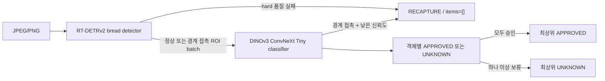

# Bixolon Multi-Bread Scanner Worker

한 장의 JPEG/PNG에서 여러 빵을 검출하고 20개 등록 클래스 중 하나로 분류하는 Windows용 Worker입니다. JPEG에 MPF/MPO 정보가 포함된 경우 첫 프레임을 입력 이미지로 사용합니다. 학습은 PyTorch, 배포는 ONNX Runtime만 사용합니다.

현재 운영 패키지 버전은 `0.1.1`, 데이터셋 버전은 `bread-43093242294f`, 승격 상태는 `production`입니다. `0.1.1`은 `0.1.0`과 동일한 ONNX 가중치를 사용하고 detector 불확실 객체 후처리만 추가합니다. 300장 단일 실행에서 `UNKNOWN` Top-3가 90%로 기준에 미달하고 299장이 정책 적합 세트와 중복된다는 사실을 보존한 채 프로젝트 책임자 요청에 따라 수동 예외 승격했습니다.

## 판정 계약



- `APPROVED`: 모든 item의 Top-1 신뢰도가 승인 임계값 이상입니다.
- `UNKNOWN`: 미등록/OOD 판정이 아닙니다. 20종 중 Top-1 신뢰도가 임계값 미만인 선택적 보류이며 `prediction=null`, 점수 내림차순 Top-3와 Top-1 `confidence`를 제공합니다.
- `RECAPTURE`: 무검출, query 포화, 최소 크기 미달, detector 불확실 후보, 활성화된 count verifier/blur/exposure gate 실패입니다. 이 detector hard gate는 classifier를 호출하지 않고 `items=[]`, `model_versions.classifier=null`을 반환합니다.
- `DETECTOR_BORDER_CLIPPED`는 schema `1.1`의 `classifier_confidence` 정책에서 경계 접촉만으로 즉시 재촬영하지 않습니다. ROI를 분류한 뒤 경계 접촉 item의 Top-1 신뢰도가 기존 classifier 승인 임계값 미만일 때만 `RECAPTURE`를 반환합니다. 이 경우 classifier가 실행되었으므로 `model_versions.classifier`는 null이 아닙니다. schema `1.0`은 기존 `always_recapture` 동작을 유지합니다.
- `ERROR`: 입력·패키지·provider·추론 장애입니다. 모델 판정인 `RECAPTURE`로 바꾸지 않습니다.

item은 원본 픽셀 bbox를 가지며 `(y, x)` 순으로 정렬됩니다. 객체 수에 업무상 상한을 두지 않습니다. detector query 포화가 의심되면 `DETECTOR_CAPACITY_EXCEEDED`로 안전하게 재촬영을 요구합니다.

Detector 관련 `RECAPTURE` reason code는 다음과 같습니다.

| reason code | 의미 | classifier 실행 |
|---|---|---:|
| `DETECTOR_NO_OBJECT` | 승인 threshold 이상의 객체가 없음 | 아니요 |
| `DETECTOR_CAPACITY_EXCEEDED` | detector query 포화 가능성 | 아니요 |
| `DETECTOR_OBJECT_TOO_SMALL` | 최소 면적 미달 객체 | 아니요 |
| `DETECTOR_UNCERTAIN_OBJECT` | 낮은 detector score의 독립 후보가 존재 | 아니요 |
| `DETECTOR_COUNT_MISMATCH` | 선택적 count verifier와 detector 객체 수가 불일치 | 아니요 |
| `DETECTOR_COUNT_UNCERTAIN` | 선택적 count verifier 신뢰도 미달 | 아니요 |
| `DETECTOR_UNDEREXPOSED` / `DETECTOR_OVEREXPOSED` / `DETECTOR_BLUR` | 활성화된 촬영 품질 gate 실패 | 아니요 |
| `DETECTOR_BORDER_CLIPPED` | 경계 접촉 객체가 정책상 재촬영 대상 | `always_recapture`: 아니요, `classifier_confidence`: 예 |

## API

`POST /v1/scan`은 `image` multipart 필드에 JPEG/PNG 한 장을 받습니다. 스마트폰 JPEG가 MPO 컨테이너로 식별되면 첫 프레임만 처리합니다.

아래는 중간 `APPROVED` item 세 개를 생략한 축약 예시입니다. 전체 실측 응답은 `artifacts/reports/api-sample-unknown.json`에 있습니다.

```json
{
  "request_id": "196b91998cbd47c0abfdbe9f5bc0c2d6",
  "status": "UNKNOWN",
  "reason_codes": ["ITEM_BELOW_APPROVAL_THRESHOLD"],
  "items": [
    {
      "item_id": "item_001",
      "bbox": {"x": 241, "y": 666, "width": 1179, "height": 1457},
      "status": "APPROVED",
      "reason_codes": [],
      "prediction": {"class_id": "bread_19", "class_name": "Pastry Bread"},
      "top3": [],
      "confidence": 0.9999773502349854
    },
    {
      "item_id": "item_005",
      "bbox": {"x": 976, "y": 2110, "width": 1204, "height": 1011},
      "status": "UNKNOWN",
      "reason_codes": ["BELOW_APPROVAL_THRESHOLD"],
      "prediction": null,
      "top3": [
        {"class_id": "bread_13", "class_name": "Muffin", "confidence": 0.7369906306266785},
        {"class_id": "bread_06", "class_name": "Croissant", "confidence": 0.213413804769516},
        {"class_id": "bread_03", "class_name": "Waffle", "confidence": 0.03721670061349869}
      ],
      "confidence": 0.7369906306266785
    }
  ],
  "processing_time_ms": 142.7919,
  "model_versions": {"detector": "0.1.0", "classifier": "0.1.0"}
}
```

공개 필드는 `request_id`, `status`, `reason_codes`, `items`, `processing_time_ms`, `model_versions`입니다. 내부 예외, tensor, 경로와 전체 logits는 응답이나 기본 로그에 포함하지 않습니다.

버전 관리되는 JSON Schema는 `schemas/scan-response.schema.json`입니다. 상태별 null/빈 배열과 집계 의미는 Pydantic validator 및 소비자 계약 테스트가 추가로 강제합니다.

Health endpoint:

- `GET /health/live`
- `GET /health/ready`

## 설치와 Worker 실행

```powershell
python -m pip install -e ".[cuda]"

$env:BIXOLON_PACKAGE_DIR = "artifacts\packages\bread-worker-0.1.1"
$env:BIXOLON_PROVIDER = "cuda"
$env:BIXOLON_CUDA_DLL_DIR = "C:\path\to\CUDA-and-cuDNN-bin"
bixolon-worker
```

Worker 런타임 의존성은 FastAPI, Pillow, NumPy, ONNX Runtime입니다. PyTorch, Transformers와 DINOv3 코드는 운영 Worker에 필요하지 않습니다.

두 ONNX session에는 동일 provider가 적용됩니다. `cuda` 강제 모드의 CUDA 초기화 실패는 시작 실패이며 조용히 CPU로 전환하지 않습니다. `auto`에서만 두 session을 함께 CPU로 다시 생성합니다. checksum 검증, session 생성, detector warm-up과 classifier ROI batch 1~7 warm-up이 끝난 뒤 readiness가 열립니다.

예시 환경 변수는 `configs/worker.env.example`에 있습니다.

## 데이터 manifest

원본 데이터는 저장소 밖 `C:\workspace\raw_data\bread_project`에 유지합니다.

```powershell
python -m pip install -e ".[training,test]"

bixolon-manifest `
  --dataset-root C:\workspace\raw_data\bread_project `
  --output-dir manifests\bread-v1
```

manifest는 상대 이미지 경로, 이미지 SHA-256, annotation/클래스, 촬영시각·카메라, `capture_session_id`, split, fold를 기록합니다. 현재 1,979 records이며 분류 보조 이미지 1,680장과 COCO 이미지 299장·객체 1,406개를 포함합니다.

`2026-07-21` 촬영분 94장·511개 객체는 최종 test로 격리했습니다. 이전 촬영분 205장·895개 객체는 시간 단위 촬영 session을 유지한 3-fold development 평가에 사용합니다. 독립 분류 이미지는 학습 보조에만 포함되고 평가는 COCO ROI에서 수행합니다.

원본, cache, checkpoint, ONNX와 benchmark 산출물은 `.gitignore` 대상입니다.

## 버전 관리 설정

재현 seed와 기본 hyperparameter는 `configs/training.json`에서 읽을 수 있습니다. 필수 데이터·출력 경로는 CLI에서 명시합니다.

```powershell
bixolon-train-detector --config configs\training.json `
  --manifest manifests\bread-v1\manifest.jsonl `
  --dataset-root C:\workspace\raw_data\bread_project `
  --output-dir artifacts\detector\fold0 `
  --fold 0
```

각 학습 디렉터리의 `run.json`에는 seed, arguments, dependency 버전, device, 데이터 수, dataset version과 manifest checksum을 기록합니다.

## Classifier 학습·calibration

주력 backbone은 사용자가 라이선스를 승인받은 공식 `dinov3_convnext_tiny`입니다. 공식 코드는 revision `6876159a11b4df116f30f667f8c9888617df0751`로 고정했고, 승인 URL은 저장·로그하지 않습니다. 모델 package에는 architecture, revision, 가중치 파일명과 SHA-256만 기록합니다. DINOv2 Small은 비교 baseline으로 유지합니다.

```powershell
$dinoV3Weights = "C:\workspace\raw_data\model_cache\dinov3_convnext_tiny_pretrain_lvd1689m-21b726bb.pth"

bixolon-cache-classifier `
  --manifest manifests\bread-v1\manifest.jsonl `
  --dataset-root C:\workspace\raw_data\bread_project `
  --output-dir artifacts\cache\classifier-bread-v1-runtime `
  --train-margin-ratio 0.08 `
  --eval-margin-ratio 0.05

0..2 | ForEach-Object {
  bixolon-train-classifier --config configs\training.json `
    --manifest manifests\bread-v1\manifest.jsonl `
    --dataset-root C:\workspace\raw_data\bread_project `
    --fold $_ `
    --weights $dinoV3Weights `
    --cache-dir artifacts\cache\classifier-bread-v1-runtime `
    --output-dir "artifacts\classifier\dinov3-fold$_"
}
```

먼저 frozen backbone linear probe를 30 epochs 학습하고 마지막 두 stage를 20 epochs 미세조정합니다. 미세조정 모델은 validation accuracy가 유지되고 승인 coverage가 증가할 때만 fold checkpoint로 채택합니다.

fold별 runtime-crop logits를 합쳐 global temperature와 승인 threshold를 OOF에서만 정합니다.

```powershell
bixolon-evaluate `
  --predictions `
    artifacts\predictions\dinov3-fold0-runtime-validation.npz `
    artifacts\predictions\dinov3-fold1-runtime-validation.npz `
    artifacts\predictions\dinov3-fold2-runtime-validation.npz `
  --dataset-metadata manifests\bread-v1\metadata.json `
  --output artifacts\reports\classifier-dinov3-oof-runtime-crop.json
```

OOF 895개에서 temperature는 `0.3549453438`, approval threshold는 `0.9611232767`입니다. 승인 coverage `97.6536%`, 승인 precision `100%`, 95% 단측 false-approval upper bound `0.3422%`로 risk-control 조건을 만족했습니다.

최종 classifier는 모든 development ROI와 보조 분류 이미지로 다시 학습합니다.

```powershell
bixolon-train-classifier --config configs\training.json `
  --manifest manifests\bread-v1\manifest.jsonl `
  --dataset-root C:\workspace\raw_data\bread_project `
  --weights $dinoV3Weights `
  --cache-dir artifacts\cache\classifier-bread-v1-runtime `
  --output-dir artifacts\classifier\dinov3-final `
  --final-training
```

## Detector 학습·OOF threshold

COCO의 20개 category를 단일 `bread` detector class로 통합해 Apache-2.0 `PekingU/rtdetr_v2_r18vd`를 640×640으로 미세조정합니다.

```powershell
bixolon-cache-detector `
  --manifest manifests\bread-v1\manifest.jsonl `
  --dataset-root C:\workspace\raw_data\bread_project `
  --output-dir artifacts\cache\detector-bread-v1

0..2 | ForEach-Object {
  bixolon-train-detector --config configs\training.json `
    --manifest manifests\bread-v1\manifest.jsonl `
    --dataset-root C:\workspace\raw_data\bread_project `
    --fold $_ `
    --cache-dir artifacts\cache\detector-bread-v1 `
    --output-dir "artifacts\detector\fold$_"
}
```

각 validation 예측을 JSONL로 저장한 뒤 공통 OOF threshold 하나를 선택합니다.

```powershell
bixolon-aggregate-detector `
  --manifest manifests\bread-v1\manifest.jsonl `
  --predictions `
    artifacts\predictions\detector-fold0-validation.jsonl `
    artifacts\predictions\detector-fold1-validation.jsonl `
    artifacts\predictions\detector-fold2-validation.jsonl `
  --output artifacts\reports\detector-oof.json
```

공통 threshold는 `0.56`이며 OOF recall `99.7765%`, precision `99.8881%`, count accuracy `99.5122%`입니다. fold 1 best에서 시작해 development 전체를 20 epochs, learning rate `1e-6`로 최종 fitting한 checkpoint가 `artifacts/detector/final/best`입니다.

