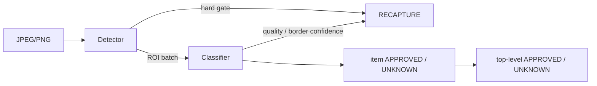

# Bixolon Scanner

여러 상품이 있는 JPEG/PNG 한 장을 판정하는 Windows 시스템입니다. 저장소에는 ONNX Runtime Worker, PyTorch 학습·평가 도구, 버전 관리되는 실험과 Flutter 작업자 앱이 함께 있습니다.

## 현재 운영 상태

| 구분 | 현재 값 | 의미 |
|---|---|---|
| Python 배포 | `bixolon-scanner 0.2.0` | 코드와 CLI 배포 버전 |
| 운영 모델 패키지 | `bread-worker-0.1.1` | Windows 앱 기본 모델, `production` |
| 운영 데이터셋 | `bread-43093242294f` | 운영 모델의 데이터 provenance |
| Flutter 앱 | `1.0.0+1` | 작업자 앱 버전 |
| 최신 detector 실험 | `0.2.5` | `experiment_only`, 운영 승격 안 함 |

`0.2.5`는 ONNX parity와 RTX 5080 full-path p95를 통과했지만 독립 데이터, detector/E2E risk, Hard recall, `UNKNOWN` Top-3 gate를 통과하지 못했습니다. 따라서 앱과 Worker의 기본 모델은 계속 `bread-worker-0.1.1`입니다. 자세한 수치는 [현재 상태](docs/status/current.md)와 [0.2.5 보고서](docs/experiments/detector/detector-target-0.2.5.md)를 참고하십시오.

## 판정 계약

Worker는 정확히 하나의 최상위 상태를 반환합니다.

- `APPROVED`: 검출된 모든 item이 승인 임계값 이상
- `UNKNOWN`: 하나 이상의 item이 승인 임계값 미만이며 해당 item에 점수 내림차순 Top-3 제공
- `RECAPTURE`: detector hard gate, classifier 품질 클래스 또는 낮은 신뢰도의 경계 접촉 item
- `ERROR`: 입력, 구성, 모델 또는 시스템 오류

`ERROR`는 `RECAPTURE`로 변환하지 않습니다. Detector hard gate가 classifier 실행 전에 종료되면 `model_versions.classifier=null`이고, `RECAPTURE`와 `ERROR`의 `items`는 빈 배열입니다.



전체 공개 필드, reason code와 HTTP 매핑은 [API 계약](docs/contracts/api.md), 변경 불가능한 구현 규칙은 [AGENTS.md](AGENTS.md)를 따릅니다.

## 저장소 구조

```text
apps/product_scanner/           Flutter Windows 작업자 앱
configs/                        runtime, training, operations, experiments 설정
docs/                           아키텍처, 계약, 가이드, 상태, 실험 기록
manifests/                      버전 관리되는 데이터 manifest와 metadata
schemas/scan-response.schema.json
src/bixolon_scanner/
  contracts/                    API·모델 패키지·오류 계약
  pipeline/                     단일 판정 정책과 inference port
  runtime/                      이미지 decode와 ONNX Runtime adapter
  worker/                       FastAPI, 설정, 로깅, 실행 조립
  training/                     재사용 가능한 데이터·모델·trainer
  evaluation/                   KPI, parity, benchmark
  experiments/                 bread, detector, RPC200 orchestration
  operations/                  운영 로그 수집과 검수 export
tests/                          Python 계약·회귀·구조 테스트
```

기존 `bixolon_scanner.api`, `pipeline`, `inference`, `package`와 과거 `training.*` 실험 import는 `0.3.x`까지 호환됩니다. 새 코드는 위 canonical 패키지를 사용하십시오. 제거는 `0.4.0` 이상의 명시적 호환성 변경에서만 가능합니다.

## 설치와 Worker 실행

Python `3.11` 이상 `3.14` 미만을 지원합니다.

```powershell
python -m pip install -e ".[cuda]"

$env:BIXOLON_PACKAGE_DIR = "artifacts\packages\bread-worker-0.1.1"
$env:BIXOLON_PROVIDER = "cuda"
$env:BIXOLON_CUDA_DLL_DIR = "C:\path\to\CUDA-and-cuDNN-bin"
bixolon worker
```

기존 `bixolon-worker` 명령도 동일하게 동작합니다. 기본 endpoint는 다음과 같습니다.

- `POST /v1/scan`
- `GET /health/live`
- `GET /health/ready`

CUDA 강제 모드는 초기화 실패 시 시작을 실패시키며 CPU로 조용히 전환하지 않습니다. `auto`에서만 두 ONNX session을 함께 CPU로 다시 생성합니다.

## 통합 CLI

새 작업은 `bixolon <group> <command>` 형식을 사용합니다.

```powershell
bixolon --help
bixolon data manifest --help
bixolon train detector --help
bixolon evaluate worker --help
bixolon model export --help
bixolon experiment detector-target --help
bixolon operations ingest-logs --help
```

그룹은 `worker`, `data`, `train`, `evaluate`, `model`, `experiment`, `operations`, `tools`입니다. 기존 `bixolon-*` console 명령은 같은 canonical 함수를 가리키는 호환 alias로 유지됩니다. 완료·거절된 과거 실험 설정은 `configs/archive`에 보존되며 통합 CLI의 활성 실험 목록에는 노출하지 않습니다.

설정은 다음 경계를 사용합니다.

- `configs/runtime`: Worker 실행 환경 예시
- `configs/training`: 공용 trainer/export 기본값
- `configs/operations`: 운영 로그와 검수 설정
- `configs/experiments/{bread,detector,rpc200}`: 현재 재현 가능한 실험
- `configs/archive`: 완료·거절·prototype 설정

기존 루트 JSON 경로는 `$redirect` 파일이므로 기존 명령도 계속 동작합니다. loader는 누락 대상과 redirect 순환을 거부합니다.

## Flutter Windows 앱

```powershell
cd apps\product_scanner
flutter pub get
flutter run -d windows
```

앱은 기본적으로 `http://127.0.0.1:8000`의 Worker를 사용하고 release bundle에서는 로컬 Worker를 자식 프로세스로 관리합니다. 상세 실행, CUDA DLL bundle, 로컬 Scan Log와 UI 계약은 [앱 README](apps/product_scanner/README.md)와 [디자인 시스템](apps/product_scanner/DESIGN_SYSTEM.md)을 참고하십시오.

## 개발 검증

```powershell
python -m pip install -e ".[cpu,test,dev]"
powershell -ExecutionPolicy Bypass -File scripts\verify.ps1
```

개별 명령은 다음과 같습니다.

```powershell
python -m ruff check src tests
python -m ruff format --check src tests
python -m pytest -q

cd apps\product_scanner
flutter analyze
flutter test
```

GitHub Actions는 Windows의 Python `3.11`·`3.13` CPU 테스트와 Flutter `3.44.9` analyze/test를 실행합니다. CUDA parity, RTX 5080 benchmark, 외부 데이터 KPI는 로컬 하드웨어와 잠긴 데이터가 필요한 수동 승격 gate입니다.

## 데이터와 모델

원본·증강 이미지, checkpoint, ONNX, benchmark artifact는 Git에 커밋하지 않습니다. 데이터는 `manifests/<dataset-version>`의 JSONL과 metadata로 참조하며 동일 물리 대상과 촬영 세션이 split을 넘지 않도록 group-aware split을 적용합니다.

모델 승격 순서는 다음과 같습니다.

```text
PyTorch checkpoint
→ 고정 validation KPI
→ ONNX export
→ PyTorch/CPU/CUDA parity
→ model package
→ locked test
→ RTX 5080 benchmark
→ promotion decision
```

세부 규칙은 [모델 승격 가이드](docs/guides/model-promotion.md)를 따릅니다.

## 문서

- [문서 인덱스](docs/README.md)
- [아키텍처](docs/architecture/overview.md)
- [API 계약](docs/contracts/api.md)
- [개발 가이드](docs/guides/development.md)
- [현재 운영·실험 상태](docs/status/current.md)
- [Detector 0.2.5 재실행 가이드](docs/guides/detector-target-0.2.5-runbook.md)
- [Bread 실험 기록](docs/experiments/bread/README.md)
- [Detector 실험 기록](docs/experiments/detector/README.md)
- [RPC200 실험 기록](docs/experiments/rpc200/README.md)
