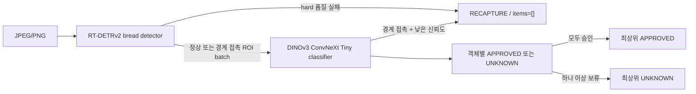

# Bixolon Multi-Bread Scanner Worker

## `0.2.5` detector 안전성 우선 목표 모드

`0.2.5`는 detector 후보와 score/NMS/`DETECTOR_UNCERTAIN_OBJECT` 정책을 이미지 단위 selective-risk로 함께 비교하는 실험 경로입니다. 객체 recall이나 count accuracy만으로 checkpoint를 고르지 않고, `Detector PASS Risk U95 ≤ 0.5%`와 `E2E APPROVED Risk U95 ≤ 0.5%`를 먼저 만족한 후보 중 `Safe Auto-Pass Rate`가 가장 높은 후보를 선택합니다. 적격 후보가 없거나 독립 표본이 부족하면 결과는 항상 `experiment_only`이며 수동 waiver를 허용하지 않습니다.

전체 추론 패키지는 단일 버전으로 관리합니다. `0.2.5` package의 `detector.version`, `classifier.version`, 응답의 실행된 component version은 모두 `0.2.5`입니다. classifier ONNX와 calibration은 `0.2.4`에서 byte-for-byte 계승하고 원본 버전과 SHA-256, Natural/Hard/Shift 평가 데이터 버전을 `bundle_provenance`에 보존합니다. detector hard gate가 classifier 호출 전에 종료되면 기존 계약대로 `model_versions.classifier=null`입니다.

`2026-08-13` 전체 실행에서는 14,896개 후보 중 적격 후보가 없어 baseline(score `0.68`, NMS `0.5`, uncertainty disabled)이 진단 후보로 선택됐습니다. locked Natural test 94장의 detector PASS risk는 `3.19%`(U95 `8.04%`), E2E 승인 오류는 0/38(U95 `7.58%`), Safe Auto-Pass는 `40.43%`, UNKNOWN Top-3는 `94.32%`였습니다. Hard Error Catch Recall은 `0%`였습니다. 반면 CPU/CUDA parity는 통과했고 RTX 5080 full-path 1,000회는 p50 `69.51ms`, p95 `96.10ms`, p99 `104.62ms`로 지연 gate를 통과했습니다. 최종 상태는 waiver 없는 `experiment_only`이며 운영 기본 package는 변경하지 않았습니다.

단계형 CLI는 다음 순서로 사용합니다. manifest는 natural/hard/shift를 분리하고 각 레코드에 `development` 또는 `test` split을 기록해야 합니다. `capture_session_id`, `physical_target_group_id`, SHA-256이 split을 넘나들면 `prepare`가 실패합니다.

```powershell
bixolon-detector-target `
  --config configs/detector_target_0.2.5.json `
  --training-manifest C:\path\to\training\manifest.jsonl `
  --training-dataset-root C:\path\to\training-data `
  --natural-manifest C:\path\to\natural\manifest.jsonl `
  --hard-manifest C:\path\to\hard\manifest.jsonl `
  --shift-manifest C:\path\to\shift\manifest.jsonl `
  --evaluation-dataset-root C:\path\to\evaluation-data `
  --classifier-package artifacts\packages\bread-worker-0.2.4 `
  --baseline-detector-checkpoint artifacts\detector\production\best `
  --classifier-manifest-metadata manifests\bread-10shot-v1\metadata.json `
  --output-dir artifacts\experiments\detector-target-0.2.5 `
  --phase prepare
```

후속 phase는 `train`, `cache`, `select`, `lock`, `test`, `export-package`, `parity`, `benchmark`, `finalize`입니다. `test` 이후 단계는 config·세 manifest·선택 결과·최종 detector·동결 classifier hash가 pre-test lock과 다르면 실행을 거부합니다. parity에는 기존 도구가 만든 CPU/CUDA 보고서를 `--parity-report`로 각각 전달하고, RTX 5080 보고서는 `--benchmark-report`로 전달합니다. 전체 평가 계약과 실제 gate 결과는 [0.2.5 detector 보고서](docs/reports/detector-target-0.2.5.md), 다음 재실행 절차와 장애 대응은 [0.2.5 재실행 가이드](docs/references/detector-target-0.2.5-runbook.md)에 기록합니다.

## `0.2.0` strict 10-shot classifier

`0.2.0`은 detector와 Worker API 계약을 `0.1.1` 그대로 유지하고 classifier 학습 경로만 교체합니다. classifier 가중치 학습에는 `C:\workspace\raw_data\bread_project_3`의 클래스별 정확히 10장만 사용합니다. `DETECTOR_UNCERTAIN_OBJECT`는 계속 classifier 호출 전 `RECAPTURE` hard gate이며 이 경로의 `model_versions.classifier`는 `null`입니다.

검증한 manifest 생성 명령은 다음과 같습니다.

```powershell
python -m bixolon_scanner.training.ten_shot_manifest `
  --dataset-root C:\workspace\raw_data\bread_project_3 `
  --labels-metadata manifests\bread-10shot-v1\metadata.json `
  --output-dir manifests\bread-10shot-v1
```

결과는 20개 클래스 × 10장, dataset version `bread-10shot-9df0df1d32c5`입니다. 전체 설계와 아직 실행되지 않은 학습·parity·benchmark 단계는 [0.2.0 개발 설계](docs/plans/bread-10shot-classifier-0.2.0.md)에 기록합니다. 실제 gate 증거가 완성되기 전에는 `0.1.1`을 운영 package로 유지합니다.

한 장의 JPEG/PNG에서 여러 빵을 검출하고 20개 등록 클래스 중 하나로 분류하는 Windows용 Worker입니다. JPEG에 MPF/MPO 정보가 포함된 경우 첫 프레임을 입력 이미지로 사용합니다. 학습은 PyTorch, 배포는 ONNX Runtime만 사용합니다.

현재 운영 패키지 버전은 `0.1.1`, 데이터셋 버전은 `bread-43093242294f`, 승격 상태는 `production`입니다. `0.1.1`은 `0.1.0`과 동일한 ONNX 가중치를 사용하고 detector 불확실 객체 후처리만 추가합니다. 300장 단일 실행에서 `UNKNOWN` Top-3가 90%로 기준에 미달하고 299장이 정책 적합 세트와 중복된다는 사실을 보존한 채 프로젝트 책임자 요청에 따라 수동 예외 승격했습니다.

## 판정 계약



- `APPROVED`: 모든 item의 Top-1 신뢰도가 승인 임계값 이상입니다.
- `UNKNOWN`: 미등록/OOD 판정이 아닙니다. 20종 중 Top-1 신뢰도가 임계값 미만인 선택적 보류이며 `prediction=null`, 점수 내림차순 Top-3와 Top-1 `confidence`를 제공합니다.
- `RECAPTURE`: 무검출, query 포화, 최소 크기 미달, detector 불확실 후보, 활성화된 count verifier/blur/exposure gate 실패입니다. 이 detector hard gate는 classifier를 호출하지 않고 `items=[]`, `model_versions.classifier=null`을 반환합니다.
- `DETECTOR_BORDER_CLIPPED`는 schema `1.1`의 `classifier_confidence` 정책에서 경계 접촉만으로 즉시 재촬영하지 않습니다. ROI를 분류한 뒤 경계 접촉 item의 Top-1 신뢰도가 기존 classifier 승인 임계값 미만일 때만 `RECAPTURE`를 반환합니다. 이 경우 classifier가 실행되었으므로 `model_versions.classifier`는 null이 아닙니다. schema `1.0`은 기존 `always_recapture` 동작을 유지합니다.
- `ERROR`: 입력·패키지·provider·추론 장애입니다. 모델 판정인 `RECAPTURE`로 바꾸지 않습니다.

item은 원본 픽셀 bbox를 가지며 `(y, x)` 순으로 정렬됩니다. 객체 수에 업무상 상한을 두지 않습니다. detector query 포화가 의심되면 `DETECTOR_CAPACITY_EXCEEDED`로 안전하게 재촬영을 요구합니다.

Detector 관련 `RECAPTURE` reason code는 다음과 같습니다.

| reason code | 의미 | classifier 실행 |
|---|---|---:|
| `DETECTOR_NO_OBJECT` | 승인 threshold 이상의 객체가 없음 | 아니요 |
| `DETECTOR_CAPACITY_EXCEEDED` | detector query 포화 가능성 | 아니요 |
| `DETECTOR_OBJECT_TOO_SMALL` | 최소 면적 미달 객체 | 아니요 |
| `DETECTOR_UNCERTAIN_OBJECT` | 낮은 detector score의 독립 후보가 존재 | 아니요 |
| `DETECTOR_COUNT_MISMATCH` | 선택적 count verifier와 detector 객체 수가 불일치 | 아니요 |
| `DETECTOR_COUNT_UNCERTAIN` | 선택적 count verifier 신뢰도 미달 | 아니요 |
| `DETECTOR_UNDEREXPOSED` / `DETECTOR_OVEREXPOSED` / `DETECTOR_BLUR` | 활성화된 촬영 품질 gate 실패 | 아니요 |
| `DETECTOR_BORDER_CLIPPED` | 경계 접촉 객체가 정책상 재촬영 대상 | `always_recapture`: 아니요, `classifier_confidence`: 예 |

## API

`POST /v1/scan`은 `image` multipart 필드에 JPEG/PNG 한 장을 받습니다. 스마트폰 JPEG가 MPO 컨테이너로 식별되면 첫 프레임만 처리합니다.

아래는 중간 `APPROVED` item 세 개를 생략한 축약 예시입니다. 전체 실측 응답은 `artifacts/reports/api-sample-unknown.json`에 있습니다.

```json
{
  "request_id": "196b91998cbd47c0abfdbe9f5bc0c2d6",
  "status": "UNKNOWN",
  "reason_codes": ["ITEM_BELOW_APPROVAL_THRESHOLD"],
  "items": [
    {
      "item_id": "item_001",
      "bbox": {"x": 241, "y": 666, "width": 1179, "height": 1457},
      "status": "APPROVED",
      "reason_codes": [],
      "prediction": {"class_id": "bread_19", "class_name": "Pastry Bread"},
      "top3": [],
      "confidence": 0.9999773502349854
    },
    {
      "item_id": "item_005",
      "bbox": {"x": 976, "y": 2110, "width": 1204, "height": 1011},
      "status": "UNKNOWN",
      "reason_codes": ["BELOW_APPROVAL_THRESHOLD"],
      "prediction": null,
      "top3": [
        {"class_id": "bread_13", "class_name": "Muffin", "confidence": 0.7369906306266785},
        {"class_id": "bread_06", "class_name": "Croissant", "confidence": 0.213413804769516},
        {"class_id": "bread_03", "class_name": "Waffle", "confidence": 0.03721670061349869}
      ],
      "confidence": 0.7369906306266785
    }
  ],
  "processing_time_ms": 142.7919,
  "model_versions": {"detector": "0.1.0", "classifier": "0.1.0"}
}
```

공개 필드는 `request_id`, `status`, `reason_codes`, `items`, `processing_time_ms`, `model_versions`입니다. 내부 예외, tensor, 경로와 전체 logits는 응답이나 기본 로그에 포함하지 않습니다.

버전 관리되는 JSON Schema는 `schemas/scan-response.schema.json`입니다. 상태별 null/빈 배열과 집계 의미는 Pydantic validator 및 소비자 계약 테스트가 추가로 강제합니다.

Health endpoint:

- `GET /health/live`
- `GET /health/ready`

## Flutter Windows 앱

작업자용 Product Scanner는 [`apps/product_scanner`](apps/product_scanner)에 있습니다. `Scan` 2-pane 작업대에서 Windows 카메라 촬영 또는 JPEG/PNG 선택, `/v1/scan` 분석, Bounding Box와 한국어 상품 목록 연동, Top-3/로컬 상품 검색 및 최종 확정을 처리합니다. 저장된 로컬 Scan Log는 `Activity` 화면에서 한국어 표시명·모델 영문명·class ID·Scan ID로 검색하고 상세 판정을 확인할 수 있습니다.

```powershell
cd apps\product_scanner
flutter pub get
flutter run -d windows
```

기본 Worker 주소는 `http://127.0.0.1:8000`입니다. Windows 앱은 실행될 때 설치된 `bixolon-worker`와 release bundle의 승격 모델 패키지를 자동으로 시작하고, 직접 시작한 Worker를 앱 종료 시 함께 종료합니다. release에 `worker\cuda-runtime`이 포함돼 있으면 런처가 해당 DLL 경로와 `cuda` provider를 강제해 CUDA 초기화 실패가 CPU 장기 실행으로 숨지 않게 합니다. 이미 같은 주소에 Worker가 실행 중이면 기존 서버를 사용합니다. 다른 호스트를 사용할 때는 `--dart-define=SCANNER_API_BASE_URL=http://host:port`를 전달하고 `SCANNER_AUTO_START_WORKER=0`으로 로컬 자동 실행을 끕니다. Flutter 설치, 테스트, CUDA runtime bundle과 로컬 저장 위치는 앱 디렉터리의 README를 참고하십시오.

## 설치와 Worker 실행

```powershell
python -m pip install -e ".[cuda]"

$env:BIXOLON_PACKAGE_DIR = "artifacts\packages\bread-worker-0.1.1"
$env:BIXOLON_PROVIDER = "cuda"
$env:BIXOLON_CUDA_DLL_DIR = "C:\path\to\CUDA-and-cuDNN-bin"
bixolon-worker
```

Worker 런타임 의존성은 FastAPI, Pillow, NumPy, ONNX Runtime입니다. PyTorch, Transformers와 DINOv3 코드는 운영 Worker에 필요하지 않습니다.

두 ONNX session에는 동일 provider가 적용됩니다. `cuda` 강제 모드의 CUDA 초기화 실패는 시작 실패이며 조용히 CPU로 전환하지 않습니다. `auto`에서만 두 session을 함께 CPU로 다시 생성합니다. checksum 검증, session 생성, detector warm-up과 classifier ROI batch 1~7 warm-up이 끝난 뒤 readiness가 열립니다.

예시 환경 변수는 `configs/worker.env.example`에 있습니다.

## 데이터 manifest

원본 데이터는 저장소 밖 `C:\workspace\raw_data\bread_project`에 유지합니다.

```powershell
python -m pip install -e ".[training,test]"

bixolon-manifest `
  --dataset-root C:\workspace\raw_data\bread_project `
  --output-dir manifests\bread-v1
```

manifest는 상대 이미지 경로, 이미지 SHA-256, annotation/클래스, 촬영시각·카메라, `capture_session_id`, split, fold를 기록합니다. 현재 1,979 records이며 분류 보조 이미지 1,680장과 COCO 이미지 299장·객체 1,406개를 포함합니다.

`2026-07-21` 촬영분 94장·511개 객체는 최종 test로 격리했습니다. 이전 촬영분 205장·895개 객체는 시간 단위 촬영 session을 유지한 3-fold development 평가에 사용합니다. 독립 분류 이미지는 학습 보조에만 포함되고 평가는 COCO ROI에서 수행합니다.

원본, cache, checkpoint, ONNX와 benchmark 산출물은 `.gitignore` 대상입니다.

## 버전 관리 설정

재현 seed와 기본 hyperparameter는 `configs/training.json`에서 읽을 수 있습니다. 필수 데이터·출력 경로는 CLI에서 명시합니다.

```powershell
bixolon-train-detector --config configs\training.json `
  --manifest manifests\bread-v1\manifest.jsonl `
  --dataset-root C:\workspace\raw_data\bread_project `
  --output-dir artifacts\detector\fold0 `
  --fold 0
```

각 학습 디렉터리의 `run.json`에는 seed, arguments, dependency 버전, device, 데이터 수, dataset version과 manifest checksum을 기록합니다.

## Classifier 학습·calibration

주력 backbone은 사용자가 라이선스를 승인받은 공식 `dinov3_convnext_tiny`입니다. 공식 코드는 revision `6876159a11b4df116f30f667f8c9888617df0751`로 고정했고, 승인 URL은 저장·로그하지 않습니다. 모델 package에는 architecture, revision, 가중치 파일명과 SHA-256만 기록합니다. DINOv2 Small은 비교 baseline으로 유지합니다.

```powershell
$dinoV3Weights = "C:\workspace\raw_data\model_cache\dinov3_convnext_tiny_pretrain_lvd1689m-21b726bb.pth"

bixolon-cache-classifier `
  --manifest manifests\bread-v1\manifest.jsonl `
  --dataset-root C:\workspace\raw_data\bread_project `
  --output-dir artifacts\cache\classifier-bread-v1-runtime `
  --train-margin-ratio 0.08 `
  --eval-margin-ratio 0.05

0..2 | ForEach-Object {
  bixolon-train-classifier --config configs\training.json `
    --manifest manifests\bread-v1\manifest.jsonl `
    --dataset-root C:\workspace\raw_data\bread_project `
    --fold $_ `
    --weights $dinoV3Weights `
    --cache-dir artifacts\cache\classifier-bread-v1-runtime `
    --output-dir "artifacts\classifier\dinov3-fold$_"
}
```

먼저 frozen backbone linear probe를 30 epochs 학습하고 마지막 두 stage를 20 epochs 미세조정합니다. 미세조정 모델은 validation accuracy가 유지되고 승인 coverage가 증가할 때만 fold checkpoint로 채택합니다.

fold별 runtime-crop logits를 합쳐 global temperature와 승인 threshold를 OOF에서만 정합니다.

```powershell
bixolon-evaluate `
  --predictions `
    artifacts\predictions\dinov3-fold0-runtime-validation.npz `
    artifacts\predictions\dinov3-fold1-runtime-validation.npz `
    artifacts\predictions\dinov3-fold2-runtime-validation.npz `
  --dataset-metadata manifests\bread-v1\metadata.json `
  --output artifacts\reports\classifier-dinov3-oof-runtime-crop.json
```

OOF 895개에서 temperature는 `0.3549453438`, approval threshold는 `0.9611232767`입니다. 승인 coverage `97.6536%`, 승인 precision `100%`, 95% 단측 false-approval upper bound `0.3422%`로 risk-control 조건을 만족했습니다.

최종 classifier는 모든 development ROI와 보조 분류 이미지로 다시 학습합니다.

```powershell
bixolon-train-classifier --config configs\training.json `
  --manifest manifests\bread-v1\manifest.jsonl `
  --dataset-root C:\workspace\raw_data\bread_project `
  --weights $dinoV3Weights `
  --cache-dir artifacts\cache\classifier-bread-v1-runtime `
  --output-dir artifacts\classifier\dinov3-final `
  --final-training
```

### RPC Classifier 시각 다양성·Worker-gated 데이터 규모 실험

`retail_product_checkout` 200개 상품의 최소 학습 이미지 수를 클래스당 5·10·15·20장과 세 seed로 비교합니다. 20장 조건을 비열등성 기준으로 사용합니다. camera 이름만 순환하지 않고 실제 ROI 외형 거리를 우선하며, Worker 흐름에서 `RECAPTURE`된 이미지는 정상 classifier 지표에서 분리해 별도 보고합니다.

```powershell
bixolon-rpc-data-scale `
  --config configs\rpc_data_scale.json `
  --dataset-root C:\workspace\raw_data\archive\retail_product_checkout `
  --weights C:\workspace\raw_data\model_cache\dinov3_convnext_tiny_pretrain_lvd1689m-21b726bb.pth `
  --output-dir artifacts\experiments\rpc-data-scale-diverse-worker-gated `
  --phase all `
  --resume
```

`detector`, `adapt-detector`, `prepare`, `train`, `select`, `test` phase를 따로 실행할 수 있습니다. `detector`는 checkout-domain RPC `val2019` 촬영 그룹 기준 3-fold OOF 학습·예측과 calibration 전용 threshold 선택을 수행합니다. `adapt-detector`의 train-rig domain adaptation은 classifier 학습 ROI를 선별하는 offline `train_gate_only` artifact입니다. 이 artifact는 `train2019` physical-group OOF 예측에만 사용하며 Worker, test, ONNX package의 active detector 또는 threshold로 승격하지 않습니다. `prepare`는 train ROI에는 이 train-gate OOF 예측을, validation ROI에는 immutable baseline OOF 예측과 baseline calibration threshold를 사용합니다.

제외 이미지는 삭제하지 않으며 비율과 reason code를 `prepared/worker_gate_report.json`에 기록합니다. 클래스·seed별 첫 5장 bbox/crop은 `prepared/sampling_contact_sheets`에서 확인할 수 있습니다. 선택 조건을 통과한 N이 있을 때만 checkout `val2019` 전체로 operational final detector를 baseline fold best epoch 중앙값만큼 고정 학습하고 `test2019`를 엽니다. target adaptation Stage-B는 만들지 않습니다. `model_lock.json`은 operational baseline/final lineage와 offline train-gate lineage를 서로 다른 role과 hash로 봉인하며, test/package threshold는 baseline calibration-only threshold로 고정합니다. `--resume`은 detector epoch 상태, 완료 marker, source/checkpoint hash와 cache fingerprint를 검증합니다. 운영 Worker, 20종 bread label map과 모델 패키지는 변경하지 않습니다.

### 빵 DINO 단품 학습 데이터량 실험

현재 운영 classifier는 단품 보조 사진 84장씩 1,680장과 development ROI 895개를 함께 사용합니다. 종류별 최종 학습 ROI는 119~138개이며 전체는 2,575개입니다. 아래 실험은 단품 사진만 종류별 5·10·15·20장으로 제한하고, 운영 `bread-worker-0.1.1`의 detector와 판정 정책을 고정한 채 DINOv3 classifier의 데이터량 효과를 비교합니다.

```powershell
bixolon-bread-data-scale `
  --config configs\bread_data_scale.json `
  --manifest manifests\bread-v1\manifest.jsonl `
  --manifest-metadata manifests\bread-v1\metadata.json `
  --dataset-root C:\workspace\raw_data\bread_project `
  --weights C:\workspace\raw_data\model_cache\dinov3_convnext_tiny_pretrain_lvd1689m-21b726bb.pth `
  --production-package artifacts\packages\bread-worker-0.1.1 `
  --classifier-cache-dir artifacts\cache\classifier-bread-v1-mmap `
  --benchmark-images artifacts\benchmark_images `
  --current-oof-report artifacts\reports\classifier-dinov3-oof-runtime-crop.json `
  --current-test-report artifacts\reports\worker-final-test-cuda.json `
  --current-benchmark-report artifacts\reports\benchmark-0.1.1-cuda.json `
  --output-dir artifacts\experiments\bread-dino-data-scale `
  --phase all `
  --approve-selection `
  --resume
```

`prepare`, `train`, `calibrate`, `export`, `evaluate`, `benchmark`, `report` phase를 따로 실행할 수 있습니다. `prepare`는 SHA-256 누출 검사, 회전 불변 perceptual hash 중복 후보 검사, DINO 중심점→farthest-first 중첩 순서와 종류별 first-5/order-20 contact sheet를 생성합니다. contact sheet를 검수한 뒤에만 `--approve-selection`으로 학습을 허용하십시오.

각 조건은 seed `20260810` 한 번만 학습합니다. threshold는 development 3-fold에서 held-out fold를 제외하고 교차 보정하며, 실험 package의 최종 threshold만 development 전체로 다시 계산합니다. CPU/CUDA ONNX parity와 RTX 5080의 30회 warm-up·1,000회 benchmark를 기록하지만 자동으로 N을 선택하거나 production으로 승격하지 않습니다. 최종 test 94장은 접근하지 않으며 보고서의 `test_accessed`는 `false`를 유지합니다. JSON·CSV·한국어 요약과 contact sheet는 지정한 실험 디렉터리 아래 생성됩니다.

소량 데이터 개선 재평가는 같은 명령에서 config와 output만 바꿉니다.

```powershell
bixolon-bread-data-scale `
  --config configs\bread_data_scale_small_data.json `
  --manifest manifests\bread-v1\manifest.jsonl `
  --manifest-metadata manifests\bread-v1\metadata.json `
  --dataset-root C:\workspace\raw_data\bread_project `
  --weights C:\workspace\raw_data\model_cache\dinov3_convnext_tiny_pretrain_lvd1689m-21b726bb.pth `
  --production-package artifacts\packages\bread-worker-0.1.1 `
  --classifier-cache-dir artifacts\cache\classifier-bread-v1-mmap `
  --benchmark-images artifacts\benchmark_images `
  --current-oof-report artifacts\reports\classifier-dinov3-oof-runtime-crop.json `
  --current-test-report artifacts\reports\worker-final-test-cuda.json `
  --current-benchmark-report artifacts\reports\benchmark-0.1.1-cuda.json `
  --output-dir artifacts\experiments\bread-dino-small-data-v2 `
  --phase all `
  --approve-selection `
  --resume
```

이 config는 DINOv3 backbone을 고정하고 spatial feature에 brightness `c²FroFA`를 적용한 뒤 L2 정규화된 max-margin linear SVM head만 학습합니다. 적용 근거, 제외한 대안과 사전 검증은 [빵 DINO 소량 학습 개선 근거](docs/bread-small-data-research.md)에 기록합니다.

## Detector 학습·OOF threshold

COCO의 20개 category를 단일 `bread` detector class로 통합해 Apache-2.0 `PekingU/rtdetr_v2_r18vd`를 640×640으로 미세조정합니다.

```powershell
bixolon-cache-detector `
  --manifest manifests\bread-v1\manifest.jsonl `
  --dataset-root C:\workspace\raw_data\bread_project `
  --output-dir artifacts\cache\detector-bread-v1

0..2 | ForEach-Object {
  bixolon-train-detector --config configs\training.json `
    --manifest manifests\bread-v1\manifest.jsonl `
    --dataset-root C:\workspace\raw_data\bread_project `
    --fold $_ `
    --cache-dir artifacts\cache\detector-bread-v1 `
    --output-dir "artifacts\detector\fold$_"
}
```

각 validation 예측을 JSONL로 저장한 뒤 공통 OOF threshold 하나를 선택합니다.

```powershell
bixolon-aggregate-detector `
  --manifest manifests\bread-v1\manifest.jsonl `
  --predictions `
    artifacts\predictions\detector-fold0-validation.jsonl `
    artifacts\predictions\detector-fold1-validation.jsonl `
    artifacts\predictions\detector-fold2-validation.jsonl `
  --output artifacts\reports\detector-oof.json
```

공통 threshold는 `0.56`이며 OOF recall `99.7765%`, precision `99.8881%`, count accuracy `99.5122%`입니다. fold 1 best에서 시작해 development 전체를 20 epochs, learning rate `1e-6`로 최종 fitting한 checkpoint가 `artifacts/detector/final/best`입니다.

## ONNX export·검증

```powershell
bixolon-export --config configs\training.json `
  --detector-checkpoint artifacts\detector\final\best `
  --classifier-checkpoint artifacts\classifier\dinov3-final\best.pt `
  --calibration-report artifacts\reports\classifier-dinov3-oof-runtime-crop.json `
  --detector-evaluation-report artifacts\reports\detector-oof.json `
  --manifest-metadata manifests\bread-v1\metadata.json `
  --output-dir artifacts\packages\bread-worker-0.1.1

bixolon-parity `
  --package-dir artifacts\packages\bread-worker-0.1.1 `
  --detector-checkpoint artifacts\detector\final\best `
  --classifier-checkpoint artifacts\classifier\dinov3-final\best.pt `
  --image C:\path\to\parity.jpg `
  --cuda-dll-dir C:\path\to\CUDA-and-cuDNN-bin `
  --output artifacts\reports\parity-cuda.json
```

detector ONNX는 고정 640 입력, classifier ONNX는 동적 ROI batch입니다. JPEG는 metadata의 `jpeg_draft_size=1500`으로 DCT 단계에서 축소 디코딩하되 응답 bbox는 원본 픽셀 좌표로 복원합니다. `metadata.json`은 이 입력 정책, crop, 다단계 downscale, threshold, label map, semantic version, 데이터셋 버전, 라이선스·출처와 ONNX SHA-256을 포함합니다. 필수 metadata 누락, 지원하지 않는 schema 또는 checksum 불일치는 시작 실패입니다.

모델 패키지 schema `1.1`은 다음 선택적 안전 정책을 추가합니다. schema `1.0` 패키지는 기존 동작으로 계속 로드됩니다.

- `quality.border_policy=classifier_confidence`: 경계 접촉 bbox를 classifier 신뢰도까지 확인합니다.
- `detector.uncertainty_score_threshold`: 운영 detector threshold 아래에 있으면서 기존 검출과 겹치지 않는 독립 후보를 `DETECTOR_UNCERTAIN_OBJECT`로 차단합니다. `null`이면 비활성입니다.
- `detector.uncertainty_min_area_ratio`: 작은 저점수 노이즈를 제외하는 원본 이미지 대비 최소 후보 면적입니다. 후보 `0.1.1`은 score `0.20`, 면적 `0.039`, 기존 검출과의 IoU `0.5` 미만을 사용합니다.
- `count_verifier`: 별도 ONNX count model의 파일명, 입출력, 신뢰도 threshold를 정의합니다. 모델이 패키지에 없으면 비활성입니다. 299장 이미지는 이 모델의 학습에 사용하지 않습니다.

CPU와 CUDA parity는 모두 통과했습니다. CUDA의 NMS 후 detection 최소 IoU는 `0.99927`, 정규화 좌표 최대 오차는 `8.83e-5`, score 최대 오차는 `0.00256`이며 classifier Top-3 순위와 승인 상태가 일치했습니다.

## 최종 test와 benchmark

package metadata의 OOF threshold를 고정한 test 명령입니다. test에서 threshold를 다시 선택하지 않습니다.

```powershell
bixolon-evaluate-worker `
  --package-dir artifacts\packages\bread-worker-0.1.0 `
  --manifest manifests\bread-v1\manifest.jsonl `
  --dataset-root C:\workspace\raw_data\bread_project `
  --mode test `
  --provider cuda `
  --cuda-dll-dir C:\path\to\CUDA-and-cuDNN-bin `
  --output artifacts\reports\worker-final-test-cuda.json

# 원본 COCO detection 전체를 파일명의 E/M/H 난이도로 분리 진단
bixolon-evaluate-difficulty `
  --package-dir artifacts\packages\bread-worker-0.1.1 `
  --dataset-root C:\workspace\bixolon_bakery_scanner\datasets\detection `
  --provider cuda `
  --match-iou-threshold 0.5 `
  --output artifacts\reports\worker-difficulty-0.1.1-cuda.json `
  --details-output artifacts\reports\worker-difficulty-errors-0.1.1-cuda.csv

bixolon-benchmark `
  --package-dir artifacts\packages\bread-worker-0.1.1 `
  --images artifacts\benchmark_images `
  --provider cuda `
  --cuda-dll-dir C:\path\to\CUDA-and-cuDNN-bin `
  --warmup 30 `
  --runs 1000 `
  --output artifacts\reports\benchmark-0.1.1-cuda.json
```

### 299장 정책 적합 평가

`C:\workspace\bixolon_bakery_scanner\datasets\detection`의 299장은 모델 학습에는 사용하지 않았지만 이번 low-score/면적 후처리 정책 선택에는 사용했습니다. 따라서 아래 결과는 독립 일반화 성능이나 최종 test KPI가 아니라 정책 적합 결과입니다. 후보 `0.1.1`의 결과는 다음과 같습니다.

| 난이도 | 이미지 | APPROVED | UNKNOWN | RECAPTURE |
|---|---:|---:|---:|---:|
| E | 100 | 99 | 0 | 1 |
| M | 99 | 91 | 5 | 3 |
| H | 100 | 86 | 12 | 2 |
| 전체 | 299 | 276 | 17 | 6 |

Detector 자체는 정답 bbox 1,406개 중 1,401개를 매칭했고 누락 5개, 오검출 1개로 기존 가중치와 동일합니다. 새 guard는 누락 5개가 포함된 4개 이미지를 모두 `DETECTOR_UNCERTAIN_OBJECT`로 차단했습니다. 정확히 검출된 이미지 중 `g20_b01_m_0710.jpg`, `g20_b02_e_0323.jpg` 2개도 추가 `RECAPTURE`됩니다. 기존 경계 오탐 3건은 계속 정상 처리되며, `RECAPTURE`를 제외한 `APPROVED` 박스 정답은 1,350/1,351입니다. 별도 count model은 없어 count verifier는 비활성입니다.

### 300장 운영 승격 평가

`C:\workspace\raw_data\bread_project_2`의 E/M/H 각 100장을 CUDA에서 이미지당 한 번씩 실행했습니다. 아래 결과 비율은 난이도별 전체 정답 객체 박스(E 410, M 500, H 500)를 공통 분모로 사용합니다. `인식 성공 + Top-3 Candidate + Candidate out + APPROVED 오인 + RECAPTURE 박스 + Segmentation 누락 = 100%`입니다. 속도는 파일 읽기를 제외한 디코딩부터 후처리까지의 이미지당 단일 실행 평균입니다.

| 난이도 | 전체 객체 | 인식 성공 | Top-3 Candidate | Candidate out | APPROVED 오인 | RECAPTURE 박스 | Segmentation 누락 | 추가 오검출 | 평균 속도 |
|---|---:|---:|---:|---:|---:|---:|---:|---:|---:|
| E | 410 | 407 (99.2683%) | 0 (0%) | 0 (0%) | 0 (0%) | 3 (0.7317%) | 0 (0%) | 0 (0%) | 77.611ms |
| M | 500 | 474 (94.8000%) | 6 (1.2000%) | 0 (0%) | 0 (0%) | 20 (4.0000%) | 0 (0%) | 0 (0%) | 78.080ms |
| H | 500 | 472 (94.4000%) | 12 (2.4000%) | 2 (0.4000%) | 1 (0.2000%) | 13 (2.6000%) | 0 (0%) | 0 (0%) | 78.625ms |
| 전체 | 1,410 | 1,353 (95.9574%) | 18 (1.2766%) | 2 (0.1418%) | 1 (0.0709%) | 36 (2.5532%) | 0 (0%) | 0 (0%) | 78.105ms |

Detector 원시 결과에는 누락 5개와 오검출 1개가 있지만 해당 이미지가 전부 `RECAPTURE`됐습니다. 따라서 최종 운영 결과의 차단되지 않은 Segmentation 누락과 추가 오검출은 모두 0입니다. `RECAPTURE 박스` 36개에는 이 원시 누락 5개도 포함됩니다.

Segmentation 실패 4장은 모두 `DETECTOR_UNCERTAIN_OBJECT`로 `RECAPTURE`되어 차단되지 않은 누락·오검출은 0장입니다. 상태 분포는 `APPROVED 276 / UNKNOWN 18 / RECAPTURE 6`입니다. 단, 300장 중 299장은 앞선 정책 적합 세트와 SHA-256이 동일하고 유일한 신규 이미지 `M/M_100.jpg`도 생성 이미지이므로 독립 일반화 성능으로 해석하지 않습니다. 원본 보고서는 `artifacts/reports/worker-difficulty-bread-project-2-0.1.1-cuda.json`, 오류 상세는 `artifacts/reports/worker-difficulty-bread-project-2-errors-0.1.1-cuda.csv`입니다.

| 지표 | 최종 test/benchmark | 기준 | 결과 |
|---|---:|---:|---|
| Detector recall | 99.0215% | ≥99% | 통과 |
| Detector precision | 99.8028% | 보고 | - |
| Detector count accuracy | 95.7447% | 보고 | - |
| APPROVED precision | 99.7947% | ≥99.5% | 통과 |
| APPROVED precision 95% CI | 98.8462–99.9637% | 보고 | - |
| Approval coverage | 96.0552% | 보고 | - |
| UNKNOWN Top-3 accuracy | 84.2105% (16/19) | ≥95% | 수동 예외 승인(원시 기준 미달) |
| Overall Top-1 / Top-3 | 98.2213% / 99.2095% | 보고 | - |
| 3~7 객체 CUDA p50/p95/p99 | 68.02 / 90.61 / 99.44ms | p95 ≤100ms | 통과 |
| `0.1.1` 후보 full-path CUDA p50/p95/p99 | 70.80 / 83.48 / 86.74ms | p95 ≤100ms | 통과 |

Benchmark 환경은 Windows 11, Core Ultra 9 285K, RAM 64GB, RTX 5080 16GB, ONNX Runtime GPU `1.28.0`, NVIDIA driver `591.86`입니다. 30회 warm-up 후 4·5·6개 검출 이미지를 1,000회 재생했습니다. `0.1.1` 후보의 full-path는 800건이며 p95 `83.48ms`입니다. 전체 stage 기준 decode p95 `40.19ms`, detector p95 `29.40ms`, classifier p95 `16.35ms`, 판정 overhead p95 `0.28ms`입니다. 나머지 200건은 `DETECTOR_UNCERTAIN_OBJECT` 조기 종료였고 p95 `51.99ms`입니다. 원본 실측 보고서는 `artifacts/reports/benchmark-0.1.1-cuda.json`입니다.

CPU와 CUDA의 전체 test 집계 결과는 동일했습니다. CPU는 기능·상태 호환만 요구하며 지연 기준은 없습니다.

## 승격 결정 및 제한

`2026-08-10` 프로젝트 책임자 요청에 따라 `0.1.1`을 `promotion_status=production`으로 승격했습니다. 300장 평가의 `UNKNOWN` Top-3 accuracy는 20개 중 18개 정답 포함으로 `90%`이며 원시 95% 기준 미달입니다. 평가 독립성도 1/300에 불과하므로 두 항목 모두 측정값을 변경하지 않고 `manual_waiver`로 기록했습니다.

다음 제한사항은 여전히 유효합니다.

- `UNKNOWN` Top-3 accuracy는 18/20(90%)로 95% 기준에 미달합니다.
- 운영 승격 평가 300장 중 299장이 후처리 정책 적합 세트와 중복되며, 유일한 신규 이미지도 생성 이미지입니다.
- 실제 blur, exposure, 잘림 등 `RECAPTURE` 정답 데이터가 충분하지 않아 `RECAPTURE recall ≥99%`를 인증할 수 없습니다.
- 새로운 생산 개체, 매장, 카메라와 조명 분포 일반화를 검증하지 않았습니다.

새 환경과 촬영불량 데이터를 추가하고 dataset version을 올린 뒤 동일한 OOF calibration, 고정 test, ONNX parity와 benchmark 순서로 예외를 해소해야 합니다.

## 연구 근거

- [RT-DETRv2: Improved Baseline with Bag-of-Freebies for Real-Time Detection Transformer](https://arxiv.org/abs/2407.17140)
- [DINOv3 공식 저장소와 라이선스](https://github.com/facebookresearch/dinov3)
- [DINOv3 논문](https://arxiv.org/abs/2508.10104)
- [DINOv2 baseline](https://arxiv.org/abs/2304.07193)
- [Learn then Test: Calibrating Predictive Algorithms to Achieve Risk Control](https://arxiv.org/abs/2110.01052)
- [ONNX Runtime CUDA Execution Provider와 I/O Binding](https://onnxruntime.ai/docs/execution-providers/CUDA-ExecutionProvider.html)
# 운영 로그 기반 detector 후보 `0.1.2`

Scan Log v2의 `DETECTOR_UNCERTAIN_OBJECT` 기록을 외부 데이터셋으로 수집하려면 다음 명령을 사용합니다. 원본과 복사 이미지는 Git 외부에 두고 manifest에는 상대 경로와 SHA-256만 기록합니다. CPU가 기본 provider이며, 모델 보조 bbox/class 초안의 재현 가능한 hash를 만들기 위한 선택입니다.

```powershell
bixolon-ingest-operational-logs `
  --log-dir "$env:APPDATA\bixolon\BIXOLON Scanner\ProductScanner\scan_logs" `
  --decisions configs\operational_logs_0.1.2.json `
  --package-dir artifacts\packages\bread-worker-0.1.1 `
  --base-manifest manifests\bread-v1\manifest.jsonl `
  --base-metadata manifests\bread-v1\metadata.json `
  --base-dataset-root C:\workspace\raw_data\bread_project `
  --dataset-root C:\workspace\raw_data `
  --manifest-dir manifests\bread-ops-v2 `
  --review-dir artifacts\reports\operational-label-review-0.1.2 `
  --annotation-review-status approved
```

승인된 manifest `bread-6bda7c231384`는 기존 detector development 205장에 단일 운영 세션 42장을 추가합니다. 정상 34장은 positive, 빈 트레이 7장은 annotation이 없는 hard negative, blur 1장은 품질 회귀 전용이며 detector positive 학습에서는 제외합니다. 이 운영 세션은 학습 적합도 진단일 뿐 production 승격 근거가 아닙니다.

후보 package `0.1.2`는 schema `1.1`, detector `0.1.1`, classifier `0.1.0`으로 생성되며 classifier ONNX SHA-256 `835a13da0a8f0084da42500c4721c738a4569b5520c844b0e7f054d348083c02`는 `0.1.1`과 동일합니다. detector 정책 `0.56/0.20/0.039/0.5`와 classifier 승인 임계값은 변경하지 않았습니다.

현재 후보는 `development`입니다. 운영 fit 정상 진행 20/34, 재촬영 유지 7/8, 기존 누락 이미지 차단 2/4, `UNKNOWN` Top-3 17/20, RTX 5080 full-path p95 100.461ms로 승격 게이트를 통과하지 못했습니다. 독립 운영 test 데이터도 없습니다. 따라서 Windows CMake와 앱 기본 package는 계속 `bread-worker-0.1.1`을 사용합니다. 원시 승격 판단은 `manifests/bread-ops-v2/promotion.json`에 기록합니다.

### 엄격한 10-shot classifier `0.2.1` 실험

`0.2.1`은 detector와 API를 변경하지 않고 border-connected foreground, 7% padding, DINOv3 local/global feature, normal/flipped 2-proxy cosine head와 2-view TTA를 평가합니다. 아래 명령에서 `prepare`, `baseline`, `train`, `challenger`, `calibrate` phase를 이 순서로 각각 실행했습니다.

```powershell
bixolon-bread-10shot `
  --config configs\bread_10shot_0.2.1.json `
  --manifest manifests\bread-10shot-v1\manifest.jsonl `
  --manifest-metadata manifests\bread-10shot-v1\metadata.json `
  --dataset-root C:\workspace\raw_data\bread_project_3 `
  --evaluation-manifest manifests\bread-v1\manifest.jsonl `
  --evaluation-dataset-root C:\workspace\raw_data\bread_project `
  --weights C:\workspace\raw_data\model_cache\dinov3_convnext_tiny_pretrain_lvd1689m-21b726bb.pth `
  --base-package artifacts\packages\bread-worker-0.1.1 `
  --output-dir artifacts\experiments\bread-10shot-0.2.1 `
  --provider cuda `
  --phase prepare
```

최선 development 결과는 Top-1 `95.1631%`, Top-3 `99.3251%`입니다. 전체 calibration은 승인 680/889, precision `100%`, false-approval 95% 상한 `0.4396%`였지만 coverage가 `76.4904%`에 그쳤고 capture-session 교차 calibration은 세 fold 모두 승인 0건이었습니다. 승격 상태는 `experiment_only`이며 test, ONNX export와 benchmark는 실행하지 않았습니다. 상세 결과는 [0.2.1 실험 보고서](docs/reports/bread-10shot-0.2.1.md)에 기록합니다.

### 엄격한 10-shot classifier `0.2.3` 최종 판정

`0.2.3`은 정확히 200장의 10-shot 학습만 사용해 development ROI Top-1 `97.630%`, Top-3 `99.774%`, 승인 precision `100%`, coverage `85.102%`를 얻었습니다. PyTorch CUDA/CPU ONNX/CUDA ONNX의 최종 상태와 Top-1·Top-3 순서도 886개에서 모두 일치했습니다.

하지만 pre-test lock 이후 실행한 기존 test 94장의 Top-1은 `93.096%`, 승인 precision `99.462%`, coverage `77.824%`였고 RTX 5080 full-path p95는 `117.874ms`였습니다. `bread_project_2` 300장도 coverage `82.625%`와 false approval 95% 상한 `0.558%`로 하한에 미달했습니다. 최종 상태는 `experiment_only`이며 운영 package는 계속 `bread-worker-0.1.1`입니다. 상세 lock, parity, 회귀 및 benchmark 결과는 [0.2.3 최종 평가](docs/reports/bread-10shot-0.2.3.md)에 기록합니다.

### 엄격한 10-shot classifier `0.2.4` parameter soup

`0.2.4`는 seed `20260813`·`20260814`의 strict checkpoint 전체 파라미터를 균등 평균한 단일 runtime 모델입니다. Development Top-1 `97.856%`, Top-3 `100%`, 승인 precision `100%`, coverage `89.391%`이며 PyTorch/CPU ONNX/CUDA ONNX 판정 parity를 통과했습니다.

잠긴 test 94장에서는 Top-1 `94.979%`, precision `99.254%`, coverage `84.100%`로 하한에 근접했지만 실패했습니다. `bread_project_2`는 Top-1 `96.943%`, precision `99.583%`, coverage `87.263%`를 통과했으나 false approval 95% 상한 `0.875%`가 실패했습니다. Full-path p95 `110.948ms` 측정 중에는 별도의 detector GPU 학습이 실행 중이어서 clean 재측정도 필요합니다.

또한 test 94장의 classifier-active ROI는 최대 478개라, 오류가 0건이어도 `0.5%` 한쪽 95% risk 상한 증명에 필요한 최소 598개에 미달합니다. 최종 상태는 `experiment_only`이며 상세 내용은 [0.2.4 최종 평가](docs/reports/bread-10shot-0.2.4.md)에 기록합니다.
