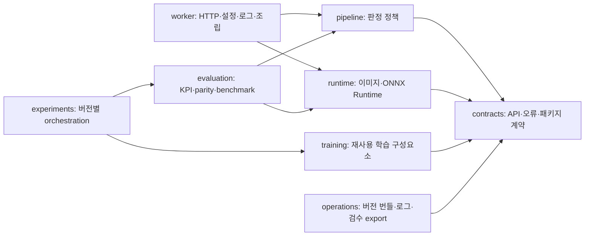

# 아키텍처 개요

## Python 경계

요청 경로의 의존 방향은 아래와 같습니다.



- `worker`는 `training`, `evaluation`, `experiments`, PyTorch를 import하지 않습니다.
- 상태 결정은 `pipeline` 한 곳에서 수행합니다. HTTP 계층과 ONNX adapter가 판정 우선순위를 복제하지 않습니다.
- 운영 추론은 ONNX Runtime만 사용합니다. `runtime`에 PyTorch 의존성을 추가하지 않습니다.
- `evaluation`은 재사용 가능한 측정만 소유하고, 실험별 조립은 `experiments`가 소유합니다.
- 공용 image/NMS 함수는 `runtime`의 명시적 내부 공용 API를 사용합니다.
- 루트의 과거 모듈은 호환 re-export입니다. 새 구현의 소유권은 canonical 하위 패키지에 있습니다.

## Python 소유권

| 영역 | 책임 |
|---|---|
| `contracts` | API schema, 오류, 이미지·모델 패키지 계약 |
| `pipeline` | detector 조기 종료, classifier batch, 최종 상태 집계 |
| `runtime` | decode, 전처리·후처리, ONNX session과 provider |
| `worker` | FastAPI, 환경 설정, 구조화 로그, 실행 조립 |
| `training` | 데이터셋, 모델, trainer, calibration |
| `evaluation` | 정확도, parity, latency와 회귀 평가 |
| `experiments` | bread·detector·RPC200 버전별 orchestration |
| `operations` | 단일 버전 번들, 실행 로그 수집과 검수용 export |

## Flutter 경계

Flutter 앱은 feature-first 구조를 사용합니다.

```text
lib/
  core/design_system/       token, theme, copy, 공통 component
  shared/                   공용 model, catalog, logging, presentation policy
  features/scanner/         domain/application/data/presentation
  features/activity/        domain/data/presentation
```

`features`끼리 화면 구현을 직접 참조하지 않습니다. 앱 조립 계층이 화면 builder를 주입하며, 공유 계약·로그 저장소·공통 표시 정책은 `shared`, 시각 토큰과 재사용 UI는 `core/design_system`에 둡니다. 과거 경로의 Dart 파일은 기존 import를 위한 export 계층입니다.

## 버전과 호환성

배포 조합은 `configs/versions/<version>.json` 하나로 식별하며 앱, Worker, Runtime과 Catalog의
non-null 버전을 동일하게 유지합니다. 과거 lifecycle metadata는 archive reader의 입력으로만
허용하고 새 번들에서 생성하지 않습니다. 공개 API와 과거 Python·Flutter import re-export를
제거하려면 migration 문서와 소비자 테스트를 포함한 명시적 호환성 변경으로 수행합니다.
