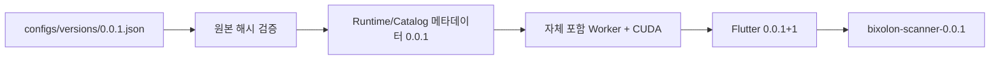

# Scanner 0.0.1 번들

`configs/versions/0.0.1.json`은 배포 가능한 조합의 유일한 기준입니다. 구성에는 제품 버전, Flutter
build 번호, rc.3 Runtime/Catalog의 경로와 고정 manifest SHA-256, CUDA 파일 목록, 평가 증빙의
경로와 SHA-256만 있습니다. lifecycle, gate, waiver 또는 배포 환경 이름은 없습니다.

`scripts/build_app.ps1 -Version 0.0.1`은 준비, Worker 빌드, Flutter Windows 빌드와 최종 manifest
생성을 순서대로 수행합니다. 결과의 `version.json`은 실행 버전을, `provenance.json`은
`source_candidate=2.0.1-rc.3`와 원본·평가 해시를 기록합니다. `bundle-manifest.json`은 번들 안의
모든 파일을 SHA-256으로 고정합니다.

Catalog 인증 방식은 `CHECKSUM-SHA256`입니다. 발행자 인증을 주장하지 않으며, Runtime과 Catalog
파일이 바뀌면 시작 시 checksum 검증에 실패합니다. 기존 lifecycle 필드는 archive 검사 전용
reader가 읽을 수 있지만 새 번들에는 생성하지 않습니다.

앱은 `/health/ready`에서 보고된 모든 non-null 구성요소 버전이 `0.0.1`인지 확인합니다. Detector
조기 종료에서는 실행하지 않은 classifier와 Catalog 계열 버전이 `null`인 공개 계약을 유지합니다.
