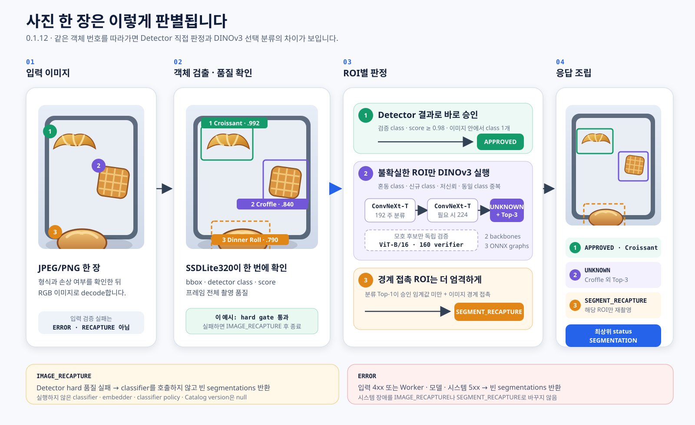
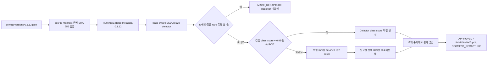

# BIXOLON Bakery AI Scanner 0.1.12 번들

`configs/versions/0.1.12.json`이 배포 조합의 유일한 기준입니다. Python·Worker·Detector·Embedder·
판정 정책·Catalog와 Windows ProductVersion은 `0.1.12`, Flutter 내부 빌드는 `0.1.12+15`입니다.

Python `DecisionPipeline.scan()`이 입력 검증, detector 조기 종료, ROI batch, classifier fallback과
segmentation 조립 순서를 소유합니다. Worker는 HTTP·예외·동시성·provider 조립만 담당하고 실행
경로에서 PyTorch를 import하지 않습니다.

Detector는 torchvision SSDLite320 MobileNetV3-Large 구조이며 외부 detector pretrained weight 없이
프로젝트 데이터로 학습했습니다. detector ensemble과 count verifier는 구성하지 않습니다. 혼동 이력,
신규 class, 저신뢰나 동일 class 중복이 있는 ROI만 DINOv3 classifier로 보내며, 직접 판정 ROI는
Detector class와 score를 사용합니다. classifier fallback은 전체 detection 문맥으로 neighbor mask
crop을 만들되 필요한 index의 tensor만 실행합니다.

Runtime의 detector 파일은 BSD-3-Clause torchvision 고지, classifier 파일은 DINOv3 License와 함께
배포합니다. YOLO 코드·weight와 AGPL 고지 파일은 `0.1.12` Runtime에 포함하지 않습니다.

`scripts/build_app.ps1 -Version 0.1.12`는 Runtime/Catalog/CUDA와 평가 증빙의 고정 해시를 확인하고
binary payload를 바꾸지 않은 채 실행 구성요소 version만 `0.1.12`로 맞춥니다. 최종 번들은
`version.json`, `provenance.json`, 전체 `bundle-manifest.json`과 Runtime metadata가 선언한 모든
license 파일을 포함합니다.

API와 null 규칙은 [Worker 연동 명세](../contracts/worker-integration-0.1.12.md), 평가 범위와 한계는
[Detector-first 선택 DINO 실험](../experiments/detector-primary-selective-dino-0.1.11.md)을 따릅니다.
