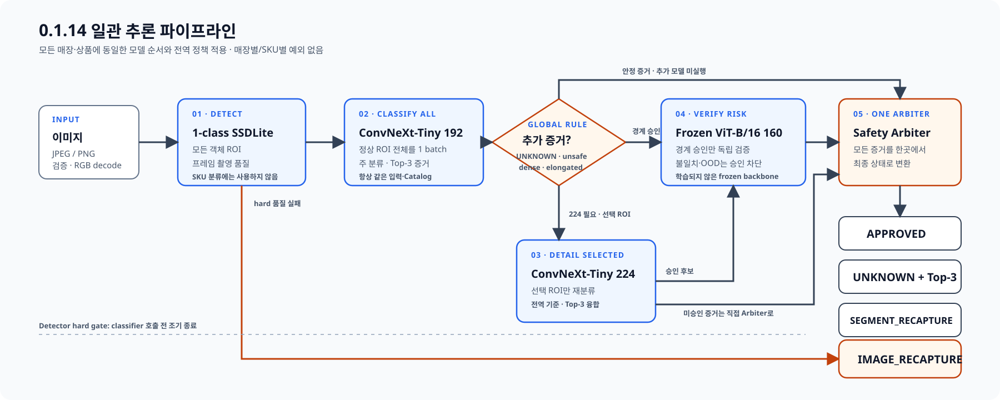

# BIXOLON Bakery AI Scanner 0.1.14 번들

`configs/versions/0.1.14.json`이 배포 조합의 유일한 기준입니다. Python·Worker·Detector·Embedder·
판정 정책·Catalog와 Windows ProductVersion은 `0.1.14`, Flutter 내부 빌드는 `0.1.14+17`입니다.

0.1.14는 0.1.13의 추론 정책을 바꾸지 않으며, 매장과 SKU가 달라도 같은 모델 순서와 전역
threshold를 사용하는 것을 우선합니다.
매장별·SKU별 우회 규칙은 없으며 Detector class를 상품 승인에 사용하지 않습니다. Python
`DecisionPipeline.scan()`만 최종 상태를 결정하고 Worker는 HTTP·예외·동시성·provider 조립만
담당합니다. 실행 경로는 PyTorch를 import하지 않고 ONNX Runtime만 사용합니다.

## 고정 실행 순서

1. 1-class SSDLite320 MobileNetV3-Large가 객체 box와 프레임 촬영 품질을 판단합니다.
2. hard 품질 실패는 classifier를 호출하지 않고 `IMAGE_RECAPTURE`로 조기 종료합니다.
3. 정상 ROI 전체를 DINOv3 ConvNeXt-Tiny 192 primary에 한 batch로 전달합니다.
4. `UNKNOWN`, unsafe, dense scene 저신뢰, 긴 ROI 저신뢰의 전역 조건에 해당하는 ROI만 같은
   ConvNeXt-Tiny의 224 detail path로 재분류하고 Top-3 증거를 병합합니다.
5. 전역 ambiguity 범위에 든 경계 승인 후보만 Frozen DINOv3 ViT-B/16 160으로 독립 검증합니다.
6. `DecisionPipeline`의 단일 Safety Arbiter가 `APPROVED`, `UNKNOWN`+Top-3,
   `SEGMENT_RECAPTURE`를 결정합니다. 입력·모델·시스템 실패는 별도 `ERROR`입니다.

Detector와 classifier의 graph·weight, Catalog payload는 source candidate에서 바꾸지 않았습니다.
Runtime metadata에 고정된 crop, 정규화, NMS, threshold와 입력 크기를 모든 매장에 동일하게
적용합니다. 새 SKU는 Catalog support를 추가하되 Detector를 SKU 분류기로 바꾸지 않습니다.

## 고정 실행 프로필

Windows는 Detector를 OpenVINO CPU `1 worker × 4 threads`, classifier·detail·verifier를 Intel GPU
자동 thread로 시작합니다. GPU session 초기화나 warm-up에 실패하면 요청을 받기 전에 classifier
전체를 OpenVINO CPU로 다시 만들며, CPU fallback도 실패하면 Worker 시작을 실패시킵니다. 요청 처리
중에는 provider를 바꾸거나 GPU·CPU 결과를 섞지 않습니다.

`GET /health/ready`의 `provider`는 GPU 정상 시 `openvino+openvino_gpu`, CPU fallback 시
`openvino`입니다. N100 device matrix는 설정·번들·installer의 필수 입력이 아니며, 관련 스크립트는
필요할 때만 실행하는 선택 진단 도구입니다.

## 전수 verifier를 사용하지 않는 이유

415장 1,914개 ROI에 ViT를 전수 실행한 진단은 FP/FN·오승인·Top-3 누락 0을 유지했지만 다음과
같이 운영 목표를 훼손했습니다.

| 전수 verifier 정책 | 정답 승인율 | `SEGMENT_RECAPTURE` | CPU full-path p95 |
|---|---:|---:|---:|
| 단일 verifier 품질 거부를 재촬영 | 95.40% | 68 | 1,122.7ms |
| class 불일치만 승인 차단 | 97.86% | 5 | 894.7ms |

따라서 ViT 존재 자체가 아니라 동일한 전역 위험 선택 규칙이 운영 일관성의 기준입니다. 전수
검증은 `RECAPTURE`·`UNKNOWN`을 늘리고 99% 정답 승인 목표를 깨므로 활성화하지 않습니다. 이
판단은 현재 개발 회귀 데이터에 한정되며 독립 일반화 성능이나 SLA 인증이 아닙니다.

## 패키징

`scripts/build_app.ps1 -Version 0.1.14`은 Runtime/Catalog/CUDA와 평가 증빙의 고정 해시를 확인하고
binary payload를 바꾸지 않은 채 공개 실행 구성요소 version만 `0.1.14`으로 맞춥니다. 최종 번들은
`version.json`, `provenance.json`, `bundle-manifest.json`과 Runtime metadata가 선언한 license 파일을
포함합니다.

API와 null 규칙은 [Worker 연동 명세](../contracts/worker-integration-0.1.14.md), 후보 비교와 평가
한계는 [0.1.13 일관 추론 실험](../experiments/consistent-evidence-0.1.13.md)을 따릅니다.
