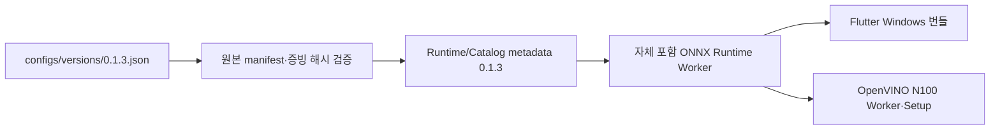

# Scanner 0.1.3 번들

`configs/versions/0.1.3.json`은 운영 조합의 유일한 기준입니다. Python·Worker·Detector·Embedder·
판정 정책·Catalog와 Windows ProductVersion은 `0.1.3`, Flutter 내부 빌드는 `0.1.3+6`입니다.
설정에는 입력 Runtime/Catalog/CUDA, 평가 증빙의 경로와 고정 SHA-256만 기록합니다.

Detector는 상품 label이 없는 YOLO26 objectness 모델입니다. 정상 ROI와 detector confidence 경계
ROI를 한 batch로 전달하는 Classifier는 DINOv3 ConvNeXt-Tiny soup, 180° 검증기와 DINOv3
ViT-B/16 독립 검증기를 사용합니다. 상태와 우선순위는 `pipeline`만 결정하며 Worker는 PyTorch를
포함하지 않습니다.

N100 기본 profile은 Detector를 OpenVINO CPU, 모든 Embedder를 Intel GPU에 배치합니다. GPU graph
초기화가 실패하면 원인을 로그에 남기고 CPU Embedder profile로 한 번 명시적으로 재조립합니다.
`/health/ready`는 실제 provider와 모든 non-null 구성요소 버전을 공개하며 warm-up 전에는 scan을
받지 않습니다.

`scripts/build_app.ps1 -Version 0.1.3`은 원본 hash 검증, Worker·Flutter 빌드와 전체
`bundle-manifest.json` 생성을 수행합니다. Catalog 인증 방식은 무키 `CHECKSUM-SHA256`이며 파일
변경은 시작 오류입니다. checksum은 손상 탐지일 뿐 발행자 진위 인증은 제공하지 않습니다.

평가 결과는 번들 입력으로 hash를 고정하지만 배포 gate나 별도 수명주기로 사용하지 않습니다.
현재 데이터 범위와 한계는 [0.1.3 평가 보고서](../evaluation/scanner-0.1.3.md), API와 null 규칙은
[Worker 연동 명세](../contracts/worker-integration-0.1.3.md)를 따릅니다.
