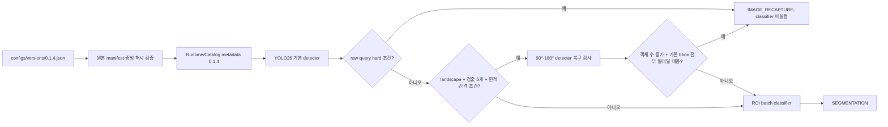

# Scanner 0.1.4 번들

`configs/versions/0.1.4.json`이 운영 조합의 유일한 기준입니다. Python·Worker·Detector·Embedder·
판정 정책·Catalog와 Windows ProductVersion은 `0.1.4`, Flutter 내부 빌드는 `0.1.4+7`입니다.

겹침 정책은 먼저 detector raw query를 재사용하고, 그 조건이 정상인 landscape 중 기본 검출이 정확히
5개이며 bbox 합산 면적과 최소 중심 거리 조건을 만족하는 장면에만 회전 detector를 최대 2회 추가
실행합니다. 회전 결과의 단순 개수만 믿지 않고 기본 bbox 전부의 일대일 대응을 요구합니다. 정책
수치는 Runtime `detector_crowding` metadata가 소유하고, 판정 상태와 조기 종료 순서는 `pipeline`이
소유합니다. Detector 조기 종료의 Classifier·Embedder·Classifier policy·Catalog version은 `null`입니다.

`scripts/build_app.ps1 -Version 0.1.4`는 source Runtime/Catalog/CUDA와 평가 증빙 해시를 확인하고,
binary payload를 변경하지 않은 채 실행 구성요소 version만 `0.1.4`로 맞춥니다. 최종 번들은
`version.json`, `provenance.json`, 전체 `bundle-manifest.json`과 필수 license를 포함합니다.

데이터 범위와 한계는 [0.1.4 평가 보고서](../evaluation/scanner-0.1.4.md), API와 null 규칙은
[Worker 연동 명세](../contracts/worker-integration-0.1.4.md)를 따릅니다.
