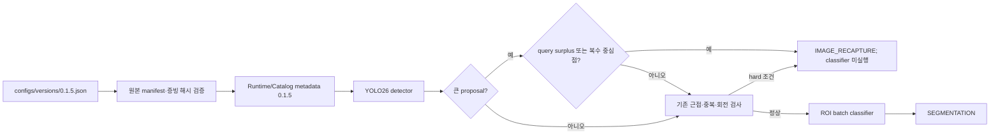

# Scanner 0.1.5 번들

`configs/versions/0.1.5.json`이 운영 조합의 유일한 기준입니다. Python·Worker·Detector·Embedder·
판정 정책·Catalog와 Windows ProductVersion은 `0.1.5`, Flutter 내부 빌드는 `0.1.5+8`입니다.

큰 proposal의 면적은 후보 조건이며 단독 재촬영 사유가 아닙니다. 해당 proposal 안의 raw query
containment surplus 또는 제한된 선택 detection의 복수 중심점으로 crowding이 보강될 때만 기존 hard
gate가 작동합니다. 기존 raw-query 근접·중복과 선택적 90°·180° 회전 복구 검사는 유지됩니다. 모든
수치는 Runtime metadata가 소유하고, 판정 상태와 조기 종료 순서는 `pipeline`이 소유합니다.

`scripts/build_app.ps1 -Version 0.1.5`는 source Runtime/Catalog/CUDA와 평가 증빙 해시를 확인하고,
binary payload를 변경하지 않은 채 실행 구성요소 version만 `0.1.5`로 맞춥니다. 최종 번들은
`version.json`, `provenance.json`, 전체 `bundle-manifest.json`과 필수 license를 포함합니다.

데이터 범위와 한계는 [0.1.5 평가 보고서](../evaluation/scanner-0.1.5.md), API와 null 규칙은
[Worker 연동 명세](../contracts/worker-integration-0.1.5.md)를 따릅니다.
