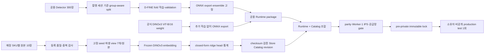
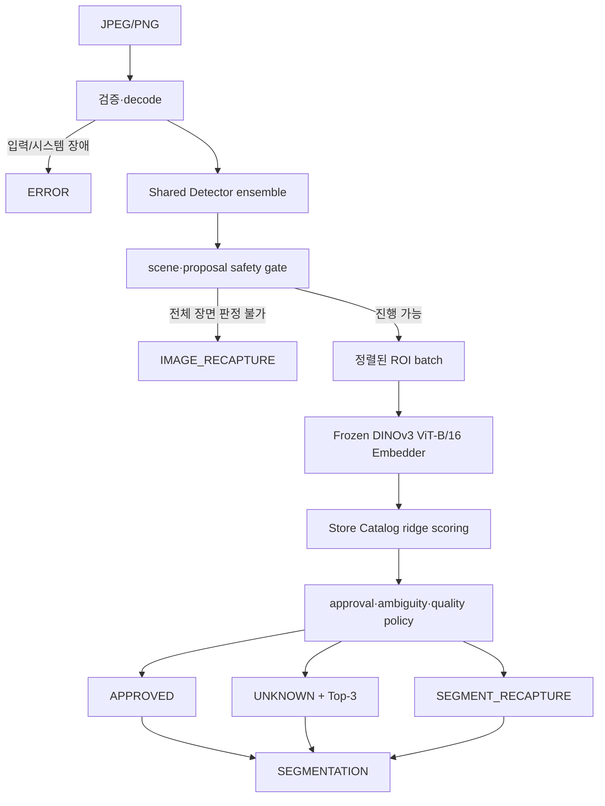

# Bixolon Scanner 2.x 설계와 승격 계약

- 상태: `scanner-2.0.1 — owner-waiver production`
- 기준일: 2026-08-20
- 승격 원본: `2.0.1-rc.3`
- 독립 certification: 미완료
- Windows 앱: `2.0.1+5`

`scanner-2.0.1`은 fixed four-model Detector, frozen DINOv3 ViT-B/16 Embedder와 원본
`single_objects` 200장 Store Catalog를 결합한다. rc.3의 300장 개발 point gate와 연속 CUDA
p95는 통과했고 packaged Worker CPU/CUDA smoke와 Windows EXE CUDA readiness를 확인했다.
프로젝트 소유자는 비공개 test, 통계 상한, 전체 parity, 1 IPS cadence, reliability와 release별
supply-chain 미완료를 숨기지 않는 `manual_waiver`로 운영 승격했다. 따라서 `production`은 배포
상태를 뜻하지만 독립 일반화 certification 통과를 뜻하지 않는다. 과거 RC.10의 1 IPS 실패는 반려
기록으로 유지한다.

## 1. 제품 경계

2.0은 다음 두 수명주기를 분리한다.

- 공용 Runtime 승격: Worker, Detector ensemble, frozen Embedder, crop·decision policy와 Catalog
  compiler를 중앙에서 한 번 검증하고 배포한다.
- Store Catalog 활성화: 이미 승격된 Runtime에서 매장이 SKU마다 등록한 10장으로 Catalog revision을
  결정적으로 만들고 자동 활성화한다.

새 매장에 Runtime 승격용 다중 상품 사진, hidden test, shadow 기간이나 사람의 별도 승인을 요구하지
않는다. 등록 사진의 유효성이 충족되면 Catalog를 활성화하고, 유사 상품 위험은 해당 요청을
`UNKNOWN` 또는 `SEGMENT_RECAPTURE`로 방어한다.

Python 배포 버전, Runtime component version, Store Catalog version, 데이터셋 version과 Flutter 앱
version은 독립적으로 관리한다. 한 축의 변경이 다른 축의 자동 승격을 뜻하지 않는다.

## 2. 학습·등록 및 추론 파이프라인

### 2.1 중앙 학습과 매장 등록



Detector 학습과 Runtime 승격은 중앙 작업이다. 매장에서는 foundation model을 fine-tuning하지 않고
SKU별 10장의 유효한 등록 사진으로 Catalog만 결정적으로 만든다. private test는 모델·threshold·
Catalog를 모두 고정한 뒤 마지막에 한 번만 사용하며, 결과를 보고 다시 fitting하지 않는다.

### 2.2 공개 추론 파이프라인



요청 순서와 우선순위는 다음과 같다.

1. multipart, byte/pixel 제한, JPEG/PNG 형식과 decode를 검증한다.
2. Detector가 모든 proposal과 장면 전체의 판정 가능성을 계산한다.
3. hard gate가 실패하면 Classifier를 호출하지 않고 `IMAGE_RECAPTURE`를 반환한다.
4. 정상 ROI와 classifier 확인이 필요한 경계 ROI를 한 batch로 처리한다.
5. ROI 품질·OOD·후보 안전성을 평가한다.
6. 승인 안전 조건을 모두 만족한 ROI만 `APPROVED`한다.
7. 정상 ROI지만 하나로 확정할 수 없으면 `UNKNOWN`과 점수 내림차순 Top-3를 반환한다.
8. 잘못된 box, 미등록/OOD, 안전한 Top-3 부재 또는 ROI 품질 실패는
   `SEGMENT_RECAPTURE`로 반환한다.
9. segmentation이 하나 이상이면 이미지 최상위 상태는 `SEGMENTATION`이다.

`ERROR`는 입력·구성·모델·provider·시스템 장애다. 모델의 재촬영 판정으로 변환하지 않는다.
timeout, GPU memory와 provider 상태에 따라 같은 이미지의 판정 상태를 바꾸지 않는다.

## 3. Detector 2.0

### 3.1 책임

Detector는 SKU를 확정하지 않고 다음만 책임진다.

- object box와 objectness
- 누락·중복·독립 후보·query 포화 위험
- border truncation, 최소 크기와 심한 겹침
- scale/model 사이 proposal 안정성
- 전체 이미지가 ROI 분류로 진행 가능한지 여부

일부 ROI만 나쁘면 정상 객체 전체를 버리지 않는다. 전체 장면에서 객체 집합을 신뢰할 수 없을 때만
`IMAGE_RECAPTURE`하고, 국소 문제는 Classifier 이후 `SEGMENT_RECAPTURE`로 격리한다.

### 3.2 RC.10 구현

현재 후보는 같은 640×640 전처리를 쓰는 고정 4개 D-FINE ONNX 모델을 순차 실행한다.

- 3개 group-aware fold model
- 1개 기존 production model
- metadata 기반 score/NMS/containment fusion
- 모델 합의와 proposal geometry를 함께 보는 selective ambiguity gate
- 복잡 장면 한정 full-resolution refinement 최대 1회

ensemble 구성, member hash, threshold, fusion과 refinement trigger는 Runtime metadata에 고정한다.
선택 정책은 300장 development set에서 결정됐으므로 private test에서 변경하거나 재선택하지 않는다.
항상 두 번째 pass를 실행하지 않으며, refinement를 실행해도 최종 상태와 latency trace에 그 사실을
기록한다.

모델과 weight의 출처·라이선스는 [D-FINE 공식 저장소](https://github.com/Peterande/D-FINE)와
`licenses/THIRD_PARTY_MODELS.md`를 따른다.

## 4. Classifier Engine과 Store Catalog

### 4.1 Frozen Embedder

RC.10은 DINOv3 ViT-B/16의 frozen 768차원 global representation을 ONNX로 실행한다. foundation
weight를 매장 데이터로 추가 학습하지 않는다. PyTorch 원본과 ONNX CUDA, ONNX CPU와 CUDA
embedding은 별도의 수치 parity gate를 통과해야 한다.

공식 source revision은 `6876159a11b4df116f30f667f8c9888617df0751`, source weight SHA-256은
`73cec8be7427c8655ceced13ce62f6e20a1fa90d1b4d4a550df17a1144081a7c`다. DINOv3는 DINOv2의
Apache-2.0 조건으로 간주하지 않는다. 배포물에는 공식 DINOv3 license 원문과 third-party notice를
포함하고, revision·source weight·exported ONNX hash를 Runtime metadata에 기록한다.

- [DINOv3 공식 저장소와 라이선스](https://github.com/facebookresearch/dinov3)

### 4.2 SKU당 10장 계약

`10-shot`은 매장 전체가 아니라 SKU마다 정확히 10장이다. 등록 단계는 identity, decode, blur,
exposure, 최소 객체 크기, exact/near duplicate와 Runtime compatibility를 검사한다. 유효 장수가
부족하면 부족한 사진만 교체하도록 요청한다.

RC.10 Catalog compiler는 각 원본 support에서 고정 seed로 7개의 결정적 파생 view를 만든다. 파생
view는 rotation, scale, 작은 perspective, 밝기·대비·채도, 제한적 blur/JPEG와 배경 합성을 포함한다.
이는 새 운영 데이터나 별도 학습 사진이 아니며, 10장과 그 결정적 파생 입력만 사용한다.

원본과 파생 embedding을 L2 normalize한 뒤 정규화된 closed-form ridge head를 fit한다.

- foundation parameter update: 없음
- `ridge_alpha`: `0.1`
- development-selected approval margin threshold: `0.1501057893037796`
- CPU/CUDA provider guard: `0.005`
- effective approval margin threshold: `0.1551057893037796`
- Top-3 safety threshold: `-2.960296869277954`
- threshold의 매장별 재선택: 금지

지원 이미지 leave-one-out과 compactness/confusability는 등록 오류 진단에만 사용한다. 비슷한 SKU는
Catalog 전체를 막지 않고 관련 SKU/pair만 `approval_restricted`로 두어 `UNKNOWN`으로 방어한다.

`2.0.1-rc.3` 개발 후보는 원본 `single_objects` Catalog의 domain shift를 방어하기 위해 ridge와
exact retrieval Top-1의 일치를 승인 필수 조건으로 추가한다. 불일치는
`CLASSIFIER_AMBIGUOUS_TOP2` `UNKNOWN`, retrieval similarity가 Runtime metadata의
`ridge_retrieval_minimum_similarity` 미만이면 `CLASSIFIER_OUT_OF_CATALOG`
`SEGMENT_RECAPTURE`다. 이 설정은 Runtime의 versioned policy이며 매장 Catalog가 임의로 다시
선택하지 않는다. 자세한 개발 근거는
[RC.3 기록](../experiments/bread/scanner-2.0.1-rc.3-single-objects.md)을 따른다.

### 4.3 Catalog package

```text
store-catalog/
  catalog.json
  activation.json
  supports.bin
  prototypes.bin
  adapter.bin
  statistics.json
  source-manifest.jsonl
  checksums.json
  signature.json  # HMAC 개발 Catalog에서만 존재
```

Catalog는 executable code와 foundation model을 포함하지 않는다. 모든 배열 shape와 SHA-256을
검증한다. 운영 `2.0.1`은 owner-approved 영구 무키 `CHECKSUM-SHA256`이므로 `signature.json`을
포함하지 않는다. HMAC 개발 Catalog만 signature를 추가 검증한다. 원본 등록 이미지는 Catalog package에 넣지 않는다. 일반 매장 크기에서는
외부 vector DB 없이 Worker memory에서 exact scoring을 수행한다.

Catalog 수명주기는 `collecting → validating → active|active_restricted → superseded`다. 활성화는
승격이 아니며, 새 immutable revision을 검증한 뒤 Worker를 정상 재시작해 적용한다. 현재 2.0 Worker는
in-process hot reload를 제공하지 않는다. rollback도 이전 immutable Runtime+Catalog 조합으로 재시작해
수행한다.

## 5. 판정 점수와 API

ranking과 approval을 분리한다.

- `ranking_score`: Top-3 순서
- `approval_score`: 승인 안전 경계에 쓰는 정규화 점수
- `quality/OOD diagnostic`: 내부 evaluation trace 전용

`segmentations[].confidence`는 Top-1 approval score이고 `top3[].confidence`는 ranking score다. 두
값을 같은 확률로 해석하거나 서로 비교하지 않는다. `UNKNOWN` Top-3는 항상 점수 내림차순이다.

`POST /v1/scan`의 최상위 상태는 `SEGMENTATION`, `IMAGE_RECAPTURE`, `ERROR`, 객체 상태는
`APPROVED`, `UNKNOWN`, `SEGMENT_RECAPTURE`만 허용한다. 응답은 Worker, Detector, Embedder,
Detector policy, Classifier policy와 Catalog version을 구분해 기록한다. Detector 조기 종료에서
실행하지 않은 Classifier 계열 version은 `null`이다.

raw tensor, 전체 logits, embedding, source image 경로, 내부 예외와 stack trace는 응답이나 기본
로그에 포함하지 않는다.

## 6. 데이터 역할과 누수 방지

| 데이터 | 역할 | RC.10 fitting 허용 여부 |
|---|---|---|
| Detector 300장과 파생 manifest | 구조·threshold·policy development와 회귀 | 허용 |
| SKU별 등록 10장 | 해당 Catalog support와 고정 ridge 계수 | 허용 |
| 10장의 결정적 파생 view | 같은 Catalog의 고정 compiler 입력 | 허용 |
| 300장 query/GT | development metric과 정책 선택 | 허용; 독립 주장 금지 |
| owner-private locked test | 최종 production 증거 | 일체 금지 |
| production scan log | drift·차기 version 후보 | 현재 version 자동 fitting 금지 |

같은 물리 대상, 촬영 session과 파생 이미지를 train/validation/test에 분산하지 않는다. private 결과를
본 뒤 모델, crop, threshold, augmentation 또는 policy를 변경하면 해당 test는 영구적으로 development
evidence로 전환되고 새 private test가 필요하다.

## 7. 2.0 승격 gate

### 7.1 Pre-private RC gate

소유자의 비공개 이미지를 열기 전에 다음을 모두 통과한다.

RC.10은 현재 5번 항목인 실제 운영 cadence 성능을 실패했으므로 이 단계가 완료되지 않았다.

1. Runtime·Catalog schema, checksum, signature와 version 조합 검증
2. 300장 development regression:
   - `SEGMENTATION` ≥ 90%
   - `APPROVED / judgeable GT` ≥ 90%
   - `SEGMENTATION` 이미지 FN·FP 비율 각각 ≤ 0.1%
   - `wrong APPROVED / judgeable GT` ≤ 0.1%
   - `UNKNOWN` Top-3 Candidate out ≤ 0.1%

운영 보고에서 `APPROVED`, `UNKNOWN` Top-3, `SEGMENT_RECAPTURE`의 구성비는 실제
`SEGMENTATION` 응답이 반환한 전체 `segmentations[]`를 공통 분모로 사용한다. 이 세 구성비와
승격용 all-GT coverage는 다른 지표다. Detector 누락이나 `IMAGE_RECAPTURE`로 coverage를 높여
보이는 일을 막기 위해 승격 gate의 `APPROVED / judgeable GT`, 오인율과 Candidate out 분모는
그대로 유지하고 난이도별 결과도 둘을 분리해 보고한다.
3. frozen Embedder PyTorch↔ONNX 및 ONNX CPU↔CUDA 수치 parity
4. 300장 CPU↔CUDA 최종 상태·class rank·Top-3·bbox parity
5. 동시성 1, 요청 시작 간격 1,000ms의 CUDA full-path mean·p95 ≤ 100 ms, p99 ≤ 150 ms
6. 실제 FastAPI Worker와 frozen standalone executable의 readiness, 정상 scan과 대표 4xx
   `ERROR` smoke; standalone bundle에 PyTorch·TorchVision·SciPy·pytest 경로와 dependency lock 밖
   bundled distribution 각각 0개
7. 실제 Worker 10,000회 순차 요청:
   - non-200, decision mismatch, readiness failure 각각 0건
   - 처음/마지막 RSS p95 증가율 ≤ 5%
8. Windows/Python/CUDA dependency exact lock, CycloneDX SBOM과 known vulnerability 0건
9. D-FINE·DINOv3 provenance, license text와 third-party notice 잠금
10. 모든 artifact와 evidence SHA-256을 묶은 pre-private release lock 생성

10,000회 gate는 동시성 1, 초당 1장 이하의 운영 계약을 빠르게 반복하는 가속 안정성 검사다. 장시간
wall-clock drift를 보장하지 않으므로 release 후 관측은 계속하지만 별도 고객 사진이나 24/72시간
대기로 승격을 다시 막지 않는다.

### 7.2 Owner-private production gate

pre-private lock 뒤 소유자가 비공개로 준비한 독립 bundle을 단 한 번 평가한다. 이는 고객 onboarding
사진이 아니며, 별도의 RC 정확도 세트를 추가로 요구하지 않는다. 실행 전에는 inference하지 않고
manifest schema, GT review, group provenance, image SHA-256, 실제 이미지에서 재계산한 dHash≤2 개발
중복과 lock checksum만 preflight한다. release lock에 고정된 Detector, Catalog support, 과거 비교
source와 재사용된 운영 개발본의 전체 identity manifest를 하나라도 생략할 수 없다.
현재 lock은 여섯 source manifest를 중복 제거한 757장 통합 계보까지 함께 고정한다. source에 dHash가
없던 경우 원본의 SHA-256을 먼저 확인한 뒤 dHash를 재계산하므로 exact 중복뿐 아니라 근접 중복도
같은 기준으로 차단한다.

분모는 다음과 같다.

- `judgeable_gt_object`: 정답상 이미지 전체 재촬영 대상이 아닌 모든 판정 대상 GT
- `approved_output`: correct와 wrong `APPROVED`의 합
- `eligible_image`: 정답상 `SEGMENTATION`이어야 하는 이미지
- `recapture_gt_image`: 정답상 이미지 전체 재촬영 대상
- `certification_group_id`: burst/session/physical object 파생을 하나로 묶은 독립성 단위

예측이 `IMAGE_RECAPTURE`, Detector FN 또는 `SEGMENT_RECAPTURE`여도 judgeable GT 분모에서 빼지
않는다. production gate는 다음을 모두 만족해야 한다.

| 영역 | 기준 |
|---|---:|
| `SEGMENTATION / eligible image` | ≥ 90% |
| `correct APPROVED / judgeable GT` | ≥ 95% |
| 장기 개선 목표 | ≥ 99%, 승격 합격과 별도 보고 |
| `wrong APPROVED / approved output` | point와 one-sided 95% upper ≤ 0.1% |
| `wrong APPROVED / judgeable GT` | point ≤ 0.1% |
| `SEGMENTATION` 이미지 FN·FP | 각각 point와 upper 95% ≤ 0.1% |
| forced Top-3 Candidate out | point와 upper 95% ≤ 0.1% |
| OOD false `APPROVED` | point와 upper 95% ≤ 0.1% |
| image recapture recall | point와 lower 95% ≥ 99% |
| 불필요 `IMAGE_RECAPTURE` | point와 upper 95% ≤ 1% |
| invalid-ROI의 올바른 `SEGMENT_RECAPTURE` recall | point와 lower 95% ≥ 99% |

상관된 ROI를 독립 표본으로 부풀리지 않는다. 오류율은 사전에 고정한 certification group당 최대 한
trial로 one-sided 95% Clopper-Pearson bound를 계산한다. 0건 오류에서 upper 0.1%를 입증하려면 최소
2,995개의 독립 trial이 필요하다. 표본이 부족하면 좋은 point metric도 `insufficient_evidence`이며
waiver로 production을 선언하지 않는다.

private test 실패 시 해당 RC는 `rejected`로 잠그고 결과를 개발 회귀로 보존한다. 통과한 경우에만 같은
hash의 Runtime과 policy를 `2.0.0` production metadata로 attestation한다. test 후 모델을 다시 만들지
않는다. finalizer는 model graph·weight·threshold·crop·decision policy를 바꿀 수 없고 component
version, runtime promotion status, Catalog metadata checksum과 production signature만 갱신한다.

## 8. 운영·신뢰성·공급망

- 운영 Worker는 ONNX Runtime만 import하며 PyTorch를 포함하지 않는다.
- CPU는 기능·판정 호환 fallback이고 latency SLO는 CUDA에만 적용한다.
- 시작 시 metadata schema, 모든 model hash, Catalog checksum과 Runtime 호환성을 검증한다.
- readiness 실패 상태에서 정상 판정처럼 2xx를 반환하지 않는다.
- 구조화 로그는 `request_id`, 단계별 latency, 상태·reason과 실행 version만 기록한다.
- 원본 image bytes/path, embedding, 전체 logits와 민감 metadata는 기본 로그에 기록하지 않는다.
- process crash, `ERROR`, p95/p99, recapture·unknown drift, GPU/RSS와 Catalog별 approval safety를
  운영 중 계속 감시한다.
- rollback은 이전 immutable release lock의 Runtime+Catalog 조합으로 재시작한다.

RC.10의 Python runtime은 Windows x86-64, Python 3.11.9, ONNX Runtime GPU 1.28.0과 Pillow 12.3.0을
포함한 exact dependency lock을 사용한다. security audit에서 알려진 취약점이 생기면 decoder·runtime
dependency를 갱신하고 판정 회귀와 parity를 다시 실행한다.

## 9. 현재 운영 조합과 남은 인증

현재 운영 조합은 다음과 같다.

- Runtime: `artifacts/releases/scanner-2.0.1-production/runtime`
- Catalog: `artifacts/releases/scanner-2.0.1-production/catalog`
- Detector: fixed four-model D-FINE ensemble + selective refinement
- Embedder: frozen DINOv3 ViT-B/16 ONNX
- Classifier: SKU별 원본 10장 + 원본별 결정적 파생 view 7개 + ridge adapter
- 운영 상태: owner-waiver `production`, independent certification 미완료

300장 개발 metric과 난이도별 결과는 rc.3 실험 보고서에 기록한다. 남은 독립 test와 통계 상한,
전체 CPU/CUDA parity, 1 IPS cadence, 10,000회 reliability 및 release별 vulnerability/SBOM은
`configs/releases/scanner_2.0.1_owner_waiver.json`의 열린 제한이다. 다음 일반 승격에서는 이
waiver를 상속하지 않고 정상 gate를 다시 통과해야 한다. rollback 순서는 `scanner-2.0.0`,
`bread-worker-1.1.0`이다.
