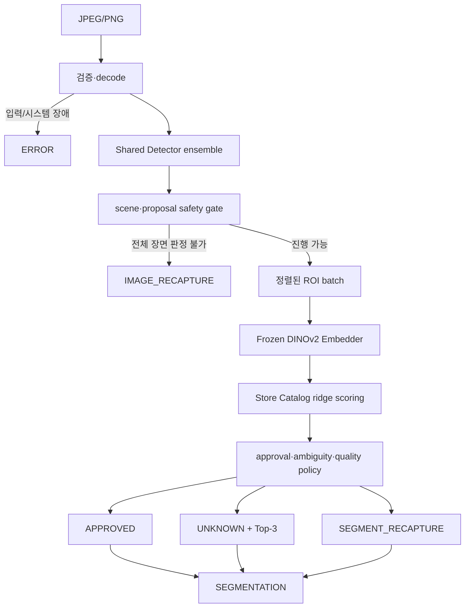

# Bixolon Scanner 2.0.0 설계와 승격 계약

- 상태: `2.0.0 — production`
- 기준일: 2026-08-20
- 현재 production 기본값: `2.0.0`
- 승격 근거: `2.0.0-rc.8` 고정 산출물 + 소유자 명시적 `manual_waiver`
- 독립 인증: 없음(`independent_certified=false`)

`2.0.0-rc.8`은 RC.7의 승인 오인을 분석한 뒤 300장과 2026-08-18 운영 수집본 115장을 하나의
개발·캘리브레이션 계보로 사용한다. 따라서 두 세트와 그 파생본은 더 이상 독립 승격 증거가 아니다.
RC.8은 Top-1/Top-2 애매성, Ridge·retrieval 불일치와 out-of-catalog 방어를 일반 정책으로 고정했다.
개발 gate, ONNX CPU/CUDA parity, Worker·공급망·안정성 gate를 통과한 동일 hash 후보를 release
lock으로 고정했다. 프로젝트 소유자는 2026-08-20 별도 private test 없이 이 후보를 production으로
승격하고 Catalog를 영구 무키로 운용하도록 승인했다. 이 예외는 독립 성능 인증을 만들어내지 않는다.
300장·115장과 파생본은 계속 개발 evidence이며, 해당 수치를 독립 일반화 성능으로 표현하지 않는다.

## 1. 제품 경계

2.0은 다음 두 수명주기를 분리한다.

- 공용 Runtime 승격: Worker, Detector ensemble, frozen Embedder, crop·decision policy와 Catalog
  compiler를 중앙에서 한 번 검증하고 배포한다.
- Store Catalog 활성화: 이미 승격된 Runtime에서 매장이 SKU마다 등록한 10장으로 Catalog revision을
  결정적으로 만들고 자동 활성화한다.

새 매장에 Runtime 승격용 다중 상품 사진, hidden test, shadow 기간이나 사람의 별도 승인을 요구하지
않는다. 등록 사진의 유효성이 충족되면 Catalog를 활성화하고, 유사 상품 위험은 해당 요청을
`UNKNOWN` 또는 `SEGMENT_RECAPTURE`로 방어한다.

Python 배포 버전, Runtime component version, Store Catalog version, 데이터셋 version과 Flutter 앱
version은 독립적으로 관리한다. 한 축의 변경이 다른 축의 자동 승격을 뜻하지 않는다.

## 2. 공개 판정 파이프라인



요청 순서와 우선순위는 다음과 같다.

1. multipart, byte/pixel 제한, JPEG/PNG 형식과 decode를 검증한다.
2. Detector가 모든 proposal과 장면 전체의 판정 가능성을 계산한다.
3. hard gate가 실패하면 Classifier를 호출하지 않고 `IMAGE_RECAPTURE`를 반환한다.
4. 정상 ROI와 classifier 확인이 필요한 경계 ROI를 한 batch로 처리한다.
5. ROI 품질·OOD·후보 안전성을 평가한다.
6. 승인 안전 조건을 모두 만족한 ROI만 `APPROVED`한다.
7. 정상 ROI지만 하나로 확정할 수 없으면 `UNKNOWN`과 점수 내림차순 Top-3를 반환한다.
8. 잘못된 box, 미등록/OOD, 안전한 Top-3 부재 또는 ROI 품질 실패는
   `SEGMENT_RECAPTURE`로 반환한다.
9. segmentation이 하나 이상이면 이미지 최상위 상태는 `SEGMENTATION`이다.

`ERROR`는 입력·구성·모델·provider·시스템 장애다. 모델의 재촬영 판정으로 변환하지 않는다.
timeout, GPU memory와 provider 상태에 따라 같은 이미지의 판정 상태를 바꾸지 않는다.

## 3. Detector 2.0

### 3.1 책임

Detector는 SKU를 확정하지 않고 다음만 책임진다.

- object box와 objectness
- 누락·중복·독립 후보·query 포화 위험
- border truncation, 최소 크기와 심한 겹침
- scale/model 사이 proposal 안정성
- 전체 이미지가 ROI 분류로 진행 가능한지 여부

일부 ROI만 나쁘면 정상 객체 전체를 버리지 않는다. 전체 장면에서 객체 집합을 신뢰할 수 없을 때만
`IMAGE_RECAPTURE`하고, 국소 문제는 Classifier 이후 `SEGMENT_RECAPTURE`로 격리한다.

### 3.2 2.0.0 구현

2.0.0은 RC.8과 같은 640×640 전처리를 쓰는 고정 4개 D-FINE ONNX 모델을 순차 실행한다.

- 3개 group-aware fold model
- 1개 기존 production model
- metadata 기반 score/NMS/containment fusion
- 모델 합의와 proposal geometry를 함께 보는 selective ambiguity gate
- 복잡 장면 한정 full-resolution refinement 최대 1회

ensemble 구성, member hash, threshold, fusion과 refinement trigger는 Runtime metadata에 고정한다.
선택 정책은 300장 development set에서 결정됐고 production 승격 과정에서 변경하거나 재선택하지 않았다.
항상 두 번째 pass를 실행하지 않으며, refinement를 실행해도 최종 상태와 latency trace에 그 사실을
기록한다.

모델과 weight의 출처·라이선스는 [D-FINE 공식 저장소](https://github.com/Peterande/D-FINE)와
`licenses/THIRD_PARTY_MODELS.md`를 따른다.

## 4. Classifier Engine과 Store Catalog

### 4.1 Frozen Embedder

2.0.0은 DINOv2 ViT-Base/14의 frozen CLS embedding을 ONNX로 실행한다. foundation weight를 매장
데이터로 추가 학습하지 않는다. PyTorch 원본과 ONNX CUDA, ONNX CPU와 CUDA embedding은 별도의
수치 parity gate를 통과해야 한다.

DINOv2 code와 공개 model weight는 Apache-2.0이며, 정확한 revision과 source weight hash는 Runtime
metadata와 `licenses/THIRD_PARTY_MODELS.md`에 기록한다.

- [DINOv2 공식 저장소와 라이선스](https://github.com/facebookresearch/dinov2)

### 4.2 SKU당 10장 계약

`10-shot`은 매장 전체가 아니라 SKU마다 정확히 10장이다. 등록 단계는 identity, decode, blur,
exposure, 최소 객체 크기, exact/near duplicate와 Runtime compatibility를 검사한다. 유효 장수가
부족하면 부족한 사진만 교체하도록 요청한다.

2.0.0 Catalog compiler는 각 원본 support에서 고정 seed로 8개의 결정적 파생 view를 만든다. 파생
view는 rotation, scale, 작은 perspective, 밝기·대비·채도, 제한적 blur/JPEG와 배경 합성을 포함한다.
이는 새 운영 데이터나 별도 학습 사진이 아니며, 10장과 그 결정적 파생 입력만 사용한다.

원본과 파생 embedding을 L2 normalize한 뒤 정규화된 closed-form ridge head를 fit한다.

- foundation parameter update: 없음
- `ridge_alpha`: `0.1`
- approval score: `sigmoid(Top-1 ridge logit - Top-2 ridge logit)`
- approval threshold: `0.54923`
- retrieval/OOD minimum similarity: `0.414268881082535`
- Ridge·retrieval Top-1 불일치 시 approval threshold: `0.54923`
- in-catalog entropy recapture: 비활성(`ridge_top3_minimum_inverse_entropy=-3.0`)
- threshold의 매장별 재선택: 금지

지원 이미지 leave-one-out과 compactness/confusability는 등록 오류 진단에만 사용한다. 비슷한 SKU는
Catalog 전체를 막지 않고 관련 SKU/pair만 `approval_restricted`로 두어 `UNKNOWN`으로 방어한다.

`2.0.1-rc.3` 개발 후보는 원본 `single_objects` Catalog의 domain shift를 방어하기 위해 ridge와
exact retrieval Top-1의 일치를 승인 필수 조건으로 추가한다. 불일치는
`CLASSIFIER_AMBIGUOUS_TOP2` `UNKNOWN`, retrieval similarity가 Runtime metadata의
`ridge_retrieval_minimum_similarity` 미만이면 `CLASSIFIER_OUT_OF_CATALOG`
`SEGMENT_RECAPTURE`다. 이 설정은 Runtime의 versioned policy이며 매장 Catalog가 임의로 다시
선택하지 않는다. 자세한 개발 근거는
[RC.3 기록](scanner-2.0.1-rc.3-single-objects.md)을 따른다.
### 4.3 Catalog package

```text
store-catalog/
  catalog.json
  activation.json
  supports.bin
  prototypes.bin
  adapter.bin
  statistics.json
  source-manifest.jsonl
  checksums.json
```

Catalog는 executable code와 foundation model을 포함하지 않는다. Scanner 2.x는 운영 키, key ID,
HMAC과 `signature.json`을 사용하지 않는 영구 무키 계약이다. Worker는 시작 시 모든 배열 shape,
파일별 SHA-256, source manifest와 Runtime compatibility를 검증하고 불일치하면 시작을 실패시킨다.
이는 손상·파일 변경 탐지이며 비밀 키 기반 발행자 인증은 아니다. 원본 등록 이미지는 Catalog package에
넣지 않는다. 일반 매장 크기에서는 외부 vector DB 없이 Worker memory에서 exact scoring을 수행한다.

Catalog 수명주기는 `collecting → validating → active|active_restricted → superseded`다. 활성화는
승격이 아니며, 새 immutable revision을 검증한 뒤 Worker를 정상 재시작해 적용한다. 현재 2.0 Worker는
in-process hot reload를 제공하지 않는다. rollback도 이전 immutable Runtime+Catalog 조합으로 재시작해
수행한다.

## 5. 판정 점수와 API

ranking과 approval을 분리한다.

- `ranking_score`: Top-3 순서
- `approval_score`: 승인 안전 경계에 쓰는 정규화 점수
- `quality/OOD diagnostic`: 내부 evaluation trace 전용

`segmentations[].confidence`는 Top-2 pair probability 기반 approval score이고
`top3[].confidence`는 ranking score다. 두
값을 같은 확률로 해석하거나 서로 비교하지 않는다. `UNKNOWN` Top-3는 항상 점수 내림차순이다.

Top-1과 Top-2가 가까워 approval score가 임계값보다 낮으면 `CLASSIFIER_AMBIGUOUS_TOP2`
`UNKNOWN`으로 보낸다. Ridge와 retrieval Top-1이 다르고 같은 안전 경계를 넘지 못해도
`UNKNOWN`으로 방어한다. retrieval 유사도가 OOD 경계보다 낮으면 높은 Ridge score가 있더라도
`CLASSIFIER_OUT_OF_CATALOG` `SEGMENT_RECAPTURE`다. 특정 SKU pair 예외는 두지 않는다.

`POST /v1/scan`의 최상위 상태는 `SEGMENTATION`, `IMAGE_RECAPTURE`, `ERROR`, 객체 상태는
`APPROVED`, `UNKNOWN`, `SEGMENT_RECAPTURE`만 허용한다. 응답은 Worker, Detector, Embedder,
Detector policy, Classifier policy와 Catalog version을 구분해 기록한다. Detector 조기 종료에서
실행하지 않은 Classifier 계열 version은 `null`이다.

raw tensor, 전체 logits, embedding, source image 경로, 내부 예외와 stack trace는 응답이나 기본
로그에 포함하지 않는다.

## 6. 데이터 역할과 누수 방지

| 데이터 | 역할 | RC.8 fitting 허용 여부 |
|---|---|---|
| Detector 300장과 파생 manifest | 구조·threshold·policy development와 회귀 | 허용 |
| 2026-08-18 운영 115장 | ambiguity·OOD policy calibration과 회귀 | 허용; 독립 주장 금지 |
| SKU별 등록 10장 | 해당 Catalog support와 고정 ridge 계수 | 허용 |
| 10장의 결정적 파생 view | 같은 Catalog의 고정 compiler 입력 | 허용 |
| 300장 query/GT | development metric과 정책 선택 | 허용; 독립 주장 금지 |
| 선택적 독립 인증 test | 독립 일반화 성능을 별도로 인증할 때만 사용 | production fitting 금지 |
| production scan log | drift·차기 version 후보 | 현재 version 자동 fitting 금지 |

같은 물리 대상, 촬영 session과 파생 이미지를 train/validation/test에 분산하지 않는다. 선택적 독립
인증을 수행한 뒤 모델, crop, threshold, augmentation 또는 policy를 변경하면 해당 test는 영구적으로
development evidence로 전환된다.

## 7. 2.0.0 승격 결정

### 7.1 기술 gate 결과

고정 RC.8은 다음 production 직전 기술 gate를 통과했다.

1. Runtime·Catalog schema, 모든 SHA-256과 version 조합 검증
2. 300장 development regression의 여섯 point gate 통과
3. frozen Embedder PyTorch↔ONNX 및 ONNX CPU↔CUDA 수치 parity
4. 300장 CPU↔CUDA 최종 상태·class rank·Top-3·bbox parity
5. CUDA full-path mean·p95 ≤ 100 ms, p99 ≤ 150 ms
6. FastAPI Worker와 standalone executable의 readiness, scan, 대표 4xx `ERROR` smoke
7. Worker 10,000회 순차 안정성 검사
8. dependency lock, SBOM, license·model provenance와 release lock 생성

300장 개발 결과는 `SEGMENTATION` 294/300(98.0000%), `APPROVED`
1,269/1,410(90.0000%), 이미지 FN·FP와 승인 오인 0건, Candidate out
1/1,410(0.0709%)이다. CUDA full-path mean/p95/p99는 85.44/98.10/105.34ms다. 이 결과는
기술 회귀 근거이지 독립 성능 인증이 아니다. 장기 `correct APPROVED / judgeable GT ≥99%` 목표도
달성하지 못했다.

### 7.2 소유자 예외

프로젝트 소유자는 2026-08-20 다음 두 gate를 영구 기록이 남는 `manual_waiver`로 승인했다.

- 새 owner-private locked production test를 제공하거나 실행하지 않는다.
- Scanner 2.x Catalog에 HMAC signing key를 도입하지 않는다.

승격 도구는 RC.8 release lock, Runtime·Catalog content manifest와 승격 도구 자체 hash를 검증한 뒤
model graph·weight·threshold·crop·decision policy를 바꾸지 않고 component version과 production
상태만 `2.0.0`으로 만들었다. Catalog 변환은 `signature.json`을 제거하고
`authentication=CHECKSUM-SHA256`을 기록하는 데 한정된다. 최종 근거는 다음에 고정한다.

- 릴리스 레지스트리: `configs/releases/scanner_2.0.0.json`
- 소유자 예외: `configs/releases/scanner_2.0.0_owner_waiver.json`
- production attestation: `artifacts/releases/scanner-2.0.0-production/promotion-attestation.json`
- source release lock: `564d804a598e4a749a5b02c29007f9fea059808411e20cdb864ab2e28205f4cf`

`independent_certified=false`는 계속 유지한다. 향후 독립 촬영 세션을 평가하더라도 별도 인증 evidence를
추가할 뿐 현재 Catalog 활성화나 고객 onboarding을 막지 않는다.

## 8. 운영·신뢰성·공급망

- 운영 Worker는 ONNX Runtime만 import하며 PyTorch를 포함하지 않는다.
- CPU는 기능·판정 호환 fallback이고 latency SLO는 CUDA에만 적용한다.
- 시작 시 metadata schema, 모든 model·Catalog file hash와 호환성을 검증한다.
- readiness 실패 상태에서 정상 판정처럼 2xx를 반환하지 않는다.
- 구조화 로그는 `request_id`, 단계별 latency, 상태·reason과 실행 version만 기록한다.
- 원본 image bytes/path, embedding, 전체 logits와 민감 metadata는 기본 로그에 기록하지 않는다.
- process crash, `ERROR`, p95/p99, recapture·unknown drift, GPU/RSS와 Catalog별 approval safety를
  운영 중 계속 감시한다.
- rollback은 `bread-worker-1.1.0` immutable package로 재시작한다.

RC.8의 Python runtime은 Windows x86-64, Python 3.11.9, ONNX Runtime GPU 1.28.0과 Pillow 12.3.0을
포함한 exact dependency lock을 사용한다. security audit에서 알려진 취약점이 생기면 decoder·runtime
dependency를 갱신하고 판정 회귀와 parity를 다시 실행한다.

## 9. 현재 production 구성과 남은 일

현재 고정 구성은 다음과 같다.

- Runtime: `artifacts/releases/scanner-2.0.0-production/runtime`
- Catalog: `artifacts/releases/scanner-2.0.0-production/catalog`
- Catalog authentication: `CHECKSUM-SHA256`(키·서명 없음)
- Worker bundle: `artifacts/releases/scanner-2.0.0-production/worker-build/bixolon-worker`
- Detector: fixed four-model D-FINE ensemble + selective refinement
- Embedder: frozen DINOv2 ViT-Base/14 ONNX
- Classifier: deterministic 10-shot derived views + ridge adapter
- 운영 상태: `production`, `independent_certified=false`

300장과 운영 수집본 115장 개발 metric은 별도 실험 보고서에 기록한다. 운영 중에는 실제 분포의
`APPROVED` 오인, `UNKNOWN`, recapture, latency와 시스템 오류를 관측하고 다음 version 개선 입력으로만
사용한다. 고객에게 승격용 다중 상품 사진이나 Catalog key를 요청하지 않는다.
