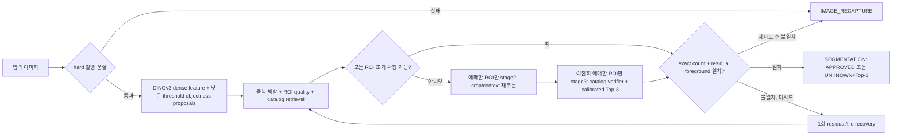

# DINOv3 Recall-First Adaptive Cascade 실험

이 문서는 활성 제품 `0.1.7`을 바꾸지 않고 수행한 detector 대체 실험과 다음 학습·추론 계약을
기록한다. 구조적 결론은 **기존 detector, YOLO 계열, RF-DETR을 사용하지 않고 DINOv3에서 직접
class-agnostic proposal을 만들되, detector 단독 결과는 승인하지 않는 선택적 cascade**다. 실험
결론은 **오류 0건과 accepted image coverage 10% 이상을 동시에 충족하지 못했으므로 후보 전체를
기각하고 활성 `0.1.7`을 유지한다**다.

## 결론

detector와 classifier의 책임은 분리하되 backbone은 공유한다.

- localization은 SKU를 모르는 one-class objectness head가 담당한다.
- identity는 DINOv3 ROI embedding과 catalog retrieval이 담당한다.
- 상품 추가 시 detector를 다시 학습하지 않고 catalog embedding과 identity calibration만 갱신한다.
- fixed closed-set softmax classifier는 최종 구조의 중심이 아니다.
- 한 이미지의 모든 객체가 조기 확정 조건과 장면 완전성 조건을 함께 통과하면 즉시 반환한다.
- 애매한 객체만 다음 stage로 보내며, 추가 추론 후에도 장면이 닫히지 않으면
  `IMAGE_RECAPTURE` 또는 객체별 `SEGMENT_RECAPTURE`를 반환한다.

`RECAPTURE`가 안전장치인 것은 맞지만, confidence가 낮은 경우만 막아서는 안 된다. detector가
아예 만들지 못한 proposal은 해당 객체의 confidence가 존재하지 않기 때문이다. 그래서 accepted
path에는 독립적인 exact-count와 unexplained-foreground 검사가 필수다.

## 파이프라인



### 바로 확정하는 조건

다음 조건을 모두 만족한 ROI는 내부 `EARLY_LOCK`으로 잠근다.

1. localization·crop quality가 calibration 안전 경계 이상
2. catalog inlier, Top-1 probability, Top-1/2 margin이 모두 안전 경계 이상
3. prototype·kNN support와 보조 verifier가 같은 SKU에 동의
4. 다른 proposal과 중복·포함 충돌이 없음

`EARLY_LOCK`은 공개 enum이 아니다. 이미지 전체 exact-count와 residual 검사가 실패하면 잠긴 ROI가
있어도 최상위 응답은 빈 segmentation의 `IMAGE_RECAPTURE`다. 품질 또는 identity만 실패한 개별
ROI는 기존 계약에 따라 `SEGMENT_RECAPTURE` 또는 `UNKNOWN`+Top-3가 된다.

### 추가 추론의 역할

- stage2는 detector를 다시 전체 실행하는 단계가 아니라 애매한 box의 고해상도 crop·주변 context와
  중복 관계만 다시 본다.
- stage3는 애매한 identity만 더 비싼 catalog verifier와 prediction set으로 확인한다.
- 동일 FCOS head를 학습 해상도와 다르게 960으로 단순 재실행한 실험은 recall이 하락했으므로 채택하지
  않는다. high-resolution recovery는 별도 학습한 tile/residual head로 검증해야 한다.
- prediction set이 3개를 넘거나 정답 후보를 보존한다는 calibration 근거가 없으면
  `SEGMENT_RECAPTURE`다. 임의로 Top-3를 잘라 성공으로 세지 않는다.

## 새 detector

실험 구현은 공식 Meta DINOv3 ConvNeXt-Tiny와 저장소 내부의 새 FPN/FCOS one-class head로 구성한다.
기존 detector의 graph·weight·prediction·proposal, YOLO 계열과 RF-DETR은 입력으로 금지된다.

- DINOv3 stride 8/16/32 dense feature를 256-channel FPN으로 결합
- P6/P7을 추가한 anchor-free objectness/box head
- backbone 마지막 stage만 낮은 learning rate로 adaptation
- group-aware 3-fold, fold 간 `perceptual_group_id` 중복 0
- checkpoint 선택은 proposal FN, miss 이미지, surplus proposal 순서
- threshold와 checkpoint는 development에서만 선택하며 test에는 맞추지 않음

실행 예:

```powershell
bixolon experiment bread-dinov3-detector `
  --config configs/experiments/bread/dinov3_objectness_fcos_adapted_0.2.json `
  --weights C:\models\dinov3_convnext_tiny_pretrain_lvd1689m-21b726bb.pth `
  --fold 0

bixolon experiment bread-dinov3-detector-oof `
  --manifest manifests/bread-zero-error-1.1/detector_manifest.jsonl `
  --predictions-template "artifacts/experiments/bread-adaptive-cascade-0.1/detector/dinov3-fcos-objectness-adapted/fold{fold}/predictions-best.jsonl" `
  --count-predictions artifacts/experiments/bread-adaptive-cascade-0.1/count/dinov3-patch-mean-true-oof.jsonl `
  --output artifacts/experiments/bread-adaptive-cascade-0.1/detector/dinov3-fcos-objectness-adapted/oof-report-true-count.json
```

## 2026-08-31 실제 결과

300장·1,410개 GT의 group-aware OOF 결과다. IoU 0.5에서 score 순서와 무관한 최대 일대일 proposal
matching을 사용했다.

| fold | 이미지 | GT | proposal FN | miss 이미지 | recall |
|---|---:|---:|---:|---:|---:|
| 0 | 100 | 470 | 9 | 9 | 98.09% |
| 1 | 101 | 473 | 13 | 12 | 97.25% |
| 2 | 99 | 467 | 6 | 6 | 98.72% |
| 합계 | 300 | 1,410 | 28 | 27 | 98.01% |

각 이미지에서 300 proposals를 보존했으므로 평균 precision이나 처리 부하 관점에서도 그대로 배포할
수 없다. frozen backbone fold-0은 94.89%였고 마지막 stage adaptation 후 98.09%로 개선됐지만,
목표인 proposal miss 0건에는 도달하지 못했다. 따라서 새 detector는 현재 runtime 부적격이다.

초기 보고에 사용한 `detector415-predictions.jsonl`은 최종 all-data head의 in-sample 결과였으므로
OOF 증거에서 제외했다. 교정한 true group-OOF count 결과는 다음과 같다.

| count 표현 | 전체 exact | within-one | proposal miss 27장 중 exact |
|---|---:|---:|---:|
| DINOv3 patch-mean | 238/300 (79.33%) | 295/300 (98.33%) | 21/27 |
| DINOv3 CLS | 191/300 (63.67%) | - | - |

oracle-filtered 진단에서 `patch confidence < 0.9` 또는 `count != oracle-filtered proposal count`를
적용하면 proposal miss 27장을 모두 차단한다. 여기서 oracle-filtered proposal count는 GT IoU로
surplus를 제거한 값이므로 실제 추론 지표가 아니라 stage2가 완벽하다는 가정의 상한선이다. detector와
count head도 DINOv3 계열 표현을 공유하므로 독립성도 충분하지 않다.

## 2차 proposal·identity OOF

90,000개 recall-first proposal에 대해 다음 순서로 실제 2차 경로를 측정했다.

1. frozen DINOv3 dense ROI feature와 geometry를 캐시한다.
2. 활성 detector는 사용하지 않고 고정 `0.1.7` DINOv3 embedder·Catalog로 각 독립 crop의
   adapter/retrieval 점수를 구한다.
3. 각 held-out fold의 proposal objectness, IoU와 대표-box assignment 점수는 다른 두 fold만으로
   학습한다.
4. count가 합의된 이미지에서 정확히 K개를 고르고, 같은 SKU의 겹친 proposal 점수를 집계한다.

IoU 0.5 이상 proposal 11,237개에서 Catalog adapter Top-1은 91.81%, Top-3는 98.43%였다. frozen
base DINOv3 crop prototype의 Top-3 약 24%보다 크게 높아, 위치는 dense feature, identity는
학습된 embedder·Catalog가 담당해야 한다는 결론을 지지한다. raw 300 proposals는 서로 심하게
겹치므로 neighbor mask는 이 단계에서 적용하지 않고 최종 선택 ROI 검증으로 미룬다.

## 선택적 E2E 개발 OOF 결과

고정 count gate는 patch confidence 0.97 이상, CLS confidence 0.8 이상, 두 head의 count 일치다.
27/300장이 이를 통과했고 이 27장에서는 count 오차가 0이었다. proposal 생성·count·proposal rank는
group-aware OOF이지만 선택 정책과 gate 자체는 같은 development OOF에서 골랐으므로 독립 test가
아니다.

| 항목 | 결과 |
|---|---:|
| `SEGMENTATION` 수락 이미지 | 2/300 (0.67%) |
| 수락 segmentation | 6 |
| 수락 상품 누락 | 0 |
| 수락 false positive·중복 | 0 |
| `APPROVED` 오인 | 0/6 |
| `UNKNOWN` | 0 |
| 수락 후보의 Top-3 candidate-out | 0 |
| `IMAGE_RECAPTURE` | 298/300 |

선택된 개발 후보는 ranker 세 점수의 product, SKU-unique suppression, NMS IoU 0.3, 겹침 IoU 0.3
class aggregation과 residual ratio 0.9 이하 gate다. 수락 이미지는 103, 131이다. 전부 재촬영하는
해는 피했고 관측 accepted error는 0이지만 coverage가 0.67%에 불과하며 gate 선택까지 동일 OOF에
맞췄다. 따라서 이는 **작동하는 E2E 실험 기준선**이지 0-error 일반화 보증이나 활성화 근거가 아니다.
별도 calibration과 locked test에서 한 건이라도 오류가 나오면 threshold를 test에 맞추지 않고
후보 전체를 기각한다.

## 후속 개선 실험 최종 정리

2026-08-31에 초기 0.67% coverage를 실사용 부적격으로 판단하고, 같은 300장 development의 고정
3-fold를 사용해 proposal 선택, localization, scene reject gate를 추가 실험했다. 모든 학습 출력은
자기 fold의 label을 직접 학습하지 않는 group-OOF다. 다만 upstream policy 자체는 development에서
선택됐고 독립 test는 없으므로 아래 수치는 일반화 보증이 아니다.

### 병목 진단

- 90,000 proposals × Catalog Top-5의 450,000 proposal-SKU pair에서 stage1이 포함한 GT 1,382개 중
  정답 SKU가 후보에 남은 GT는 1,381개(99.93%)였다.
- count-safe 49장 중 선택 SKU 집합이 정확한 장면은 44장이었다. 이 데이터에는 한 이미지 안의 동일
  SKU 중복이 0장이므로 SKU당 한 box 가정은 이 개발셋에서는 유효했다.
- 따라서 주 병목은 상품 정체성이나 SKU 후보 보존이 아니라 같은 SKU를 지지하는 proposals 중 IoU
  0.5 이상 대표 box를 고르는 localization이었다.

### 완료된 비교

| 실험 | 실제 OOF 결과 | 판단 |
|---|---:|---|
| class-conditional HGB regression 대표 box | 913/1,381 (66.11%) | 기준선 |
| scalar listwise 대표 box | 954/1,381 (69.08%) | 개선, 보존 |
| DINO dense+crop 64차원 고정 projection listwise | 789/1,381 (57.13%) | 과적합, 폐기 |
| image×SKU relative ranker | 1,047/1,381 (75.81%) | 대표 box 기준 최선 |
| box weighted fusion, count-safe 49장 | spatial+Top-3 exact 20/49 | gate 분리 불가 |
| relative ranker+fusion, count-safe 49장 | spatial+Top-3 exact 21/49 | gate 분리 불가 |
| class-conditional box-offset refiner | spatial+Top-3 exact 14/49 | 평균화로 악화, 폐기 |
| patch count 선필터 없이 300장 전체 통과 | gate 전 spatial+Top-3 exact 99/300 | 넓게 찾는 방향의 상한 확인 |
| count-conditioned 7-query set localizer | true-count exact 30/300, predicted-count exact 24/300 | proposal 경로보다 악화, 폐기 |

`DINO dense+crop` projection은 학습 listwise loss는 낮아졌지만 held-fold 대표 box 선택이 69.08%에서
57.13%로 하락했다. 그래서 실행 기본값은 projection을 끈 scalar feature로 고정했다. box-offset
refiner도 proposal 오차 방향을 scalar feature만으로 예측하지 못하고 fold 평균으로 수렴해 사용하지
않는다.

### “처음 넓게, 뒤에서 거르기” 검증

patch count confidence 0.97과 두 count head 일치를 선행 hard gate로 적용하면 count error는 0이지만
49/300장만 남고 최선의 gate 전 exact도 21장에 그쳤다. 선행 gate를 제거해 300장을 전부
class-relative localization으로 보내면 patch count error 62장이 포함되는 대신 gate 전
spatial+Top-3 exact가 99장으로 증가했다. 즉 높은 recall의 1차 결과를 만든 뒤 count·localization
risk를 함께 거르는 순서가 coverage 관점에서 맞다. 문제는 현재 verifier가 이 99장을 오류 없이
분리하지 못했다는 점이다.

### 누수 제한 scene gate

각 outer held fold에 대해 다른 두 fold의 교차 예측만으로 모델 family와 zero-error threshold를
선택했다. held fold label은 gate 선택에 사용하지 않았다.

| gate | 수락 | 오류 | 결론 |
|---|---:|---:|---|
| 67차원 scene risk | 6/300 (2.00%) | 1 | 기각 |
| OOF segment verifier 추가(81차원) | 11/300 (3.67%) | 4 | 기각 |

segment verifier의 held-fold ROC-AUC는 ExtraTrees 0.771~0.817, HistGradientBoosting
0.760~0.778이었다. 순위 신호는 있었지만 fold 1 분포 이동에서 zero-error threshold가 유지되지
않았다. held 결과를 본 뒤 threshold를 높이는 재튜닝은 하지 않았다. 따라서 오류 0건과 coverage
10%(30/300장) 이상을 동시에 만족한 leakage-controlled 후보는 0개다. 이 단계에서는 `APPROVED`
threshold나 독립 Top-3 calibration까지 진행할 수 없으며, 후보는 ONNX export·runtime 편입·제품
활성화 대상이 아니다.

### 중단된 실험

DINOv3 stride-8/16/32 feature에 center heatmap·offset·size head를 학습하는 실험은 사용자 요청으로
fold 2의 40/80 epoch에서 중단했다. `dinov3-center-localizer-true-oof.npz`가 생성되지 않았고 3-fold
OOF metric도 없으므로 성공·실패 어느 쪽의 결과로도 인용하지 않는다. 실행 코드는 후속 재현을 위해
남기지만 완료 artifact와 명확히 구분한다.

### 최종 상태와 artifact

- 채택 가능한 최종 모델: 없음
- 목표 달성 여부: 미달(오류 0건 + accepted coverage 10% 이상 동시 달성 실패)
- 독립 test: 미실행
- `activation_allowed`: `false`
- 활성 제품·Runtime·Catalog·Flutter 버전: `0.1.7` 그대로
- 금지된 기존 detector·YOLO·RF-DETR 입력: 사용하지 않음

주요 재현 증빙은 Git 비추적 artifact 아래에 있다.

| 증빙 | 경로 |
|---|---|
| class candidate recall | `stage2/dinov3-class-conditional-ranker-true-oof.report.json` |
| scalar/content listwise 비교 | `stage2/dinov3-class-conditional-listwise-*-true-oof.report.json` |
| relative ranker | `stage2/dinov3-relative-class-ranker-true-oof.report.json` |
| 전체 300장 gate 전 scene | `e2e/class-relative-all-scenes-oof.report.json` |
| nested scene gate | `e2e/class-relative-nested-gate-oof.report.json` |
| segment verifier와 nested gate | `e2e/class-relative-segment-verified-oof.report.json`, `e2e/class-relative-segment-nested-gate-oof.report.json` |
| set localizer | `stage2/dinov3-set-localizer-true-oof.report.json` |

후속 실험을 재개한다면 gate threshold 확대가 아니라, 별도 capture session과 group으로 calibration 및
locked test를 먼저 확보하고 DINOv3 stride-8 localization을 완료해야 한다. 독립 calibration이 없는
상태에서 현재 99개 safe scene을 사용해 gate를 반복 선택하면 development 적합만 커진다.

## 학습·평가 순서

1. class-agnostic detector는 실사 scene, 합성 scene, catalog cutout hard-negative로 학습한다.
2. stage2는 OOF proposal만 사용해 true object, duplicate, partial, background를 학습한다.
3. identity retrieval은 같은 물리 객체·capture session이 fold를 넘지 않게 학습한다.
4. 별도 calibration에서 `APPROVED`, `UNKNOWN` prediction set, count, residual threshold를 한 번 고정한다.
5. locked test에서는 다음 accepted-path 지표를 동시에 측정한다.
   - 상품 false negative 0
   - false positive·중복 0
   - 잘못된 `APPROVED` 0
   - `UNKNOWN` Top-3 candidate-out 0
6. 0-error 조건을 통과한 후보 중 `SEGMENTATION`/`APPROVED` coverage를 최대화하고 stage2·stage3
   호출률과 p50/p95/p99를 최소화한다.
7. 최종 후보만 ONNX로 export해 CPU/CUDA 상태·box·rank parity를 검증한다.

2단계 false-positive filtering과 end-to-end accepted route는 development OOF에서 측정했지만,
coverage가 낮고 독립 calibration·locked test가 없다. 따라서 ONNX export와 활성 `0.1.7` 변경을
하지 않았다. 다음 우선순위는 threshold 완화가 아니라 proposal miss 28개와 대표-box 선택 실패를
줄이는 stage1 localization 학습, 별도 count/residual 표현, 독립 calibration set 확보 순서다.

## 연구 근거

- [DINOv3 paper](https://arxiv.org/abs/2508.10104)과
  [Meta 기술 블로그](https://ai.meta.com/blog/dinov3-self-supervised-vision-model/): dense feature와
  lightweight adapter를 localization·identity의 공유 표현으로 사용
- [Cascade R-CNN](https://arxiv.org/abs/1906.09756): proposal 분포에 맞춘 단계별 IoU quality 학습;
  이 실험은 해당 모델을 쓰지 않고 progressively selective한 학습 원칙만 사용
- [SelectiveNet](https://proceedings.mlr.press/v97/geifman19a.html): reject option을 포함한
  risk-coverage 최적화
- [Distribution-Free, Risk-Controlling Prediction Sets](https://arxiv.org/abs/2101.02703)와
  [Conformal Risk Control](https://arxiv.org/abs/2208.02814): 별도 calibration에서 bounded risk를
  제어해야 하는 근거
- [ICML 2025 AURC 분석](https://proceedings.mlr.press/v267/zhou25y.html): 0-error 한 점 외에 전체
  risk-coverage curve도 함께 보고해야 하는 근거
- [DINOv3 License](https://github.com/facebookresearch/dinov3/blob/main/LICENSE.md): 제품 번들에
  포함해야 할 실제 사용·재배포 조건

이 자료들은 설계 근거이지 bakery 분포의 0-error 보증이 아니다.
