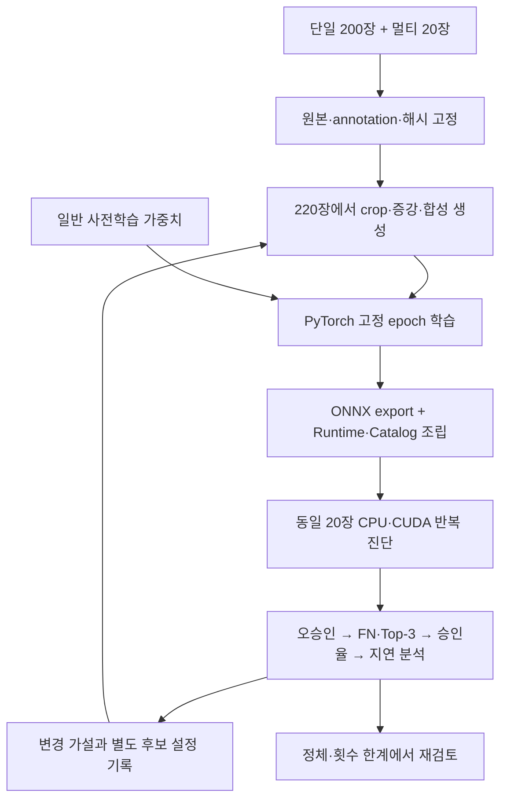

# 원본 220장으로 만드는 Worker 학습·개선 파이프라인

기준일: 2026-09-07. 이 문서는 실제 학습·진단 결과와 재현 계약이며 독립 일반화 성능이나 배포 인증을
주장하지 않는다. 제품 버전은 실험 동안 올리지 않고 활성 번들을 덮어쓰지 않는다.

## 목표와 데이터 경계

사용자가 지정한 `datasets/bread_dataset/single_objects_2`의 20개 클래스 × 10장과,
`multi_object_scenes`에서 선정한 20장만 사용한다. **학습 원본은 총 220장**이다.
일반 사전학습 가중치는 허용하지만 다른 빵 사진으로 적응된 checkpoint·Catalog는 초기값으로
사용하지 않는다. 추가 배경 사진도 사용하지 않는다. crop·증강·합성 이미지는 이 220장의
파생물로만 만들며 원본 수가 늘었다고 계산하지 않는다.

우선순위는 오승인 → 검출 누락 → UNKNOWN 정답 Top-3 누락 → 정답 자동승인율 → 지연이다.
오승인은 정답 bbox에 매칭된 오분류와 unmatched APPROVED를 모두 센다. 모든 출력을
UNKNOWN/RECAPTURE로 만든 후보는 목표 달성이 아니다. 초기 개발 진단 목표는 오승인·FN·Top-3
누락 0, 정답 자동승인율 99%, RTX 5080 full-path p95 70ms, CPU p95 250ms다. 목표치는 측정 결과가
아니며 20장의 결과로 SLA를 주장하지 않는다.

## 멀티 20장 선정과 provenance

`training.limited_source.select_scenes`는 모델이나 이미지 pixels를 보지 않고 annotation의 클래스
포함 여부·객체 수·배치 위치·형태·겹침·difficulty 경로를 사용한다. 새 클래스 포함을 먼저
확보하고 이미 많이 포함한 특징의 가중치를 낮춘다. 고정 seed와 image id 해시로 동률을 정한다.
20장을 고른 뒤에만 pixels를 읽고 원본 파일 SHA-256을 고정한다. 나머지 280장의 pixels·모델
예측은 학습·모델 선택·진단에 사용하지 않는다. 선정 시 전체 annotation을 읽었다는 사실은
`annotation_sha256`으로 기록한다.

첫 실행의 source manifest:

- 원본 220장 = 단일 200장 + 멀티 20장
- 선정 멀티 annotation: 136개 객체
- `originals.jsonl` SHA-256:
  `0a79b5bf70ea52beffebf9655a586b2d99661be1c2e5c99916617cb2962686a7`
- 실행 디렉터리: `artifacts/retraining/limited220`

사용자는 같은 실물을 반복 촬영했다고 확인했다. 따라서 관련 실물·촬영 세션은 모두 같은 train
group으로 유지한다. 사진 index로 임의의 8/2 split이나 5-fold를 만들지 않는다. 현재 예산 안에는
독립 closed-set validation/test를 만들 수 있는 새 실물이 없다. 재측정은
`same_physical_item_development_diagnostic`이며, threshold나 최종 checkpoint의 자동 선택은
비활성이다. 새로운 실물·세션의 validation이 생기면 source group 전체를 분리하고 그 집합에서
모델·threshold를 선택한다. 별도 test는 최종 진단에만 사용한다.

## 학습 설계



| 구성 | 첫 후보 | 선택 이유와 비교 대상 |
|---|---|---|
| Detector | COCO 사전학습 SSDLite320 MobileNetV3-Large → objectness 1-class 적응 | SKU label을 검출기에 묶지 않는다. FN/FP가 남으면 합성 객체 크기·밀집도·visible bbox와 실제 20장 반복 비중부터 분석한다. |
| Primary | DINOv3 ConvNeXt-Tiny 192 + cosine head | frozen/head-only 기준선과 낮은 backbone learning rate 적응을 비교할 수 있다. 현재 고정 후보는 backbone LR 3e-6이다. |
| Detail | 같은 checkpoint의 224 입력 | 별도 class별 모델 대신 전역 위험 조건으로 선택 실행한다. 192/224를 같은 학습 단계에서 consistency loss로 정렬한다. |
| Verifier | Frozen DINOv3 ViT-B/16 160 + Ridge | 다른 표현의 동의 증거만 사용한다. 단일 품질 실패를 재촬영으로 승격하거나 전수 검증하지 않는다. |
| Catalog | 단일 원본 10장/class, checksum 방식 | 물리 객체 group과 시각적 중복 식별은 별개로 보존한다. 새 모델 feature로 새 Catalog를 만든다. |

DINOv3의 frozen representation을 활용하는 접근과 SSDLite의 경량 구조를 출발점으로 택했다.
이 조합이 이 데이터에서 최적이라는 의미는 아니며 실제 비교가 필요하다.
근거: [DINOv3 논문](https://arxiv.org/abs/2508.10104),
[PyTorch SSDLite 구현 설명](https://pytorch.org/blog/torchvision-ssdlite-implementation/).

1. 원본을 audit하고 선택·설정·해시를 고정한다.
2. 단일 원본의 흰 배경 alpha에서 객체를 추출하여 procedural 배경에 1~8개를 합성한다.
   빈 배경 negative는 사진 없이 생성한다. 소스 mask의 추정 한계는 QA로 검토한다.
3. alpha ownership으로 최종 보이는 bbox를 계산하고 visible fraction 0.65 미만인 구도는 재생성한다.
   파생물은 원본 SHA-256 목록과 같은 source group을 가진다.
4. 초기 합성 1,200장과 멀티 20장 반복으로 Detector를 20 epoch 학습한다. 빈 이미지 loss를 명시적으로
   활성화한다. validation 선택 없이 마지막 epoch를 사용한다.
5. 단일 200장과 멀티 crop 136개로 분류기를 8 epoch 학습한다. 클래스별 추가 crop 빈도를 맞추고
   동일 checkpoint에 192/224 입력 consistency를 적용한다.
6. ONNX를 export하고 새 Runtime·3개 Catalog view·합의 Catalog를 만든다. 새 Runtime은 전역 승인
   0.8, 검증 상한 0.85인 사전 지정 후보로 시작한다. 이 값은 이번 20장으로 최적화한 threshold가
   아니다. `audit_routing`이 빈 승인 구간을 탐지하면 실험 조립 오류로 취급한다.
7. 같은 20장을 Worker 전체 경로로 CPU/CUDA에서 측정하고 원인·다음 실험을 기록한다.

기존 활성 metadata의 승인 0.8과 verifier 상한 0.55는 동시에 만족할 수 없다. 첫 새 후보에서는
`0.8 <= score < 0.85`로 검사 구간을 명시한다. 밀집·긴 ROI의 detail 승인 후보도 0.85 상한으로
도달 가능하게 한다. 기존 활성 model payload나 해시를 수정하는 방식으로 고치지 않는다.

## 실행

저장소 루트에서 실행한다. 이미 있는 output을 덮어쓰지 않는다. 모든 경로·명령은 `plan.json`에
argv 배열로 기록하고 shell 문자열로 실행하지 않는다. `run`은 각 단계 전에 원본과 파생물의
해시·부모 원본 allowlist·이전 단계 결과를 다시 검사한다.

```powershell
python -m bixolon_scanner.experiments.bread.limited220 prepare --work-dir artifacts/retraining/limited220
python -m bixolon_scanner.experiments.bread.limited220 generate --work-dir artifacts/retraining/limited220
python -m bixolon_scanner.experiments.bread.limited220 plan --work-dir artifacts/retraining/limited220 `
  --convnext-weights <official-convnext-tiny.pth> --vit-weights <official-vitb16.pt>

python -m bixolon_scanner.experiments.bread.limited220 run --work-dir artifacts/retraining/limited220 --stage cache-real
python -m bixolon_scanner.experiments.bread.limited220 run --work-dir artifacts/retraining/limited220 --stage cache-synthetic
python -m bixolon_scanner.experiments.bread.limited220 run --work-dir artifacts/retraining/limited220 --stage train-detector
python -m bixolon_scanner.experiments.bread.limited220 run --work-dir artifacts/retraining/limited220 --stage train-classifier
python -m bixolon_scanner.experiments.bread.limited220 run --work-dir artifacts/retraining/limited220 --stage export-primary
python -m bixolon_scanner.experiments.bread.limited220 run --work-dir artifacts/retraining/limited220 --stage export-detail
python -m bixolon_scanner.experiments.bread.limited220 run --work-dir artifacts/retraining/limited220 --stage export-verifier

python -m bixolon_scanner.operations.limited_source_runtime `
  --work-dir artifacts/retraining/limited220 `
  --template artifacts/retraining/next/runtime-selected-cuda-final-0.1.15/metadata.json `
  --output-dir artifacts/retraining/limited220/candidate
```

`stages/<stage>.json`에는 입력·출력 해시, 명령, 종료 코드, 걸린 시간과 로그 경로가 남는다.
`run --stage all`은 완료된 단계의 해시를 확인하고 남은 단계만 실행한다. 후보 간 동일한 단계는
`reuse --from-work-dir <이전 후보> --stage <단계>`로 재사용할 수 있다. 원본, foundation weight,
실행 명령, 실제 입력 해시와 기존 출력 해시가 다르면 재사용을 거부한다. 학습이 달라진 classifier는
재학습하고, unchanged Detector와 frozen verifier만 재사용한다.
실패한 실행은 성공 evidence로 재사용하지 않는다. 실패 원인을 수정한 다음 별도 실행 디렉터리로
재실행한다. 원본 선정은 같은 설정·seed로 재현한다.

Worker 진단은 20장 manifest를 명시한다. 전체 300장 기본값에 의존하지 않는다.

```powershell
python -m bixolon_scanner.evaluation.scanner_v2 `
  --runtime artifacts/retraining/limited220/candidate/runtime `
  --catalog artifacts/retraining/limited220/candidate/catalog --store-id limited220 `
  --dataset-root datasets/bread_dataset --manifest artifacts/retraining/limited220/sources/detector.jsonl `
  --provider cpu --expected-image-count 20 --evidence-role stress_regression `
  --output artifacts/retraining/limited220/evaluation-cpu.json `
  --trace-output artifacts/retraining/limited220/trace-cpu.jsonl

python -m bixolon_scanner.evaluation.limited_source_review `
  --work-dir artifacts/retraining/limited220 --measurement artifacts/retraining/limited220/evaluation-cpu.json `
  --history-dir artifacts/retraining/limited220-study/reviews
```

CUDA는 동일한 명령에서 provider와 출력 경로를 바꾸고 필요한 CUDA DLL 경로를 지정한다.
현재 기본 Python은 CPU용 ONNX Runtime이다. CUDA 진단은
`artifacts/build-envs/worker-cuda-py311/Scripts/python.exe`와
`artifacts/runtime/cuda-13.0-cudnn-9.13.1-win-x64`를 사용한다. CPU/CUDA parity도 같은 ONNX Runtime
버전 환경에서 비교한다. CPU의 ORT thread 기본값은 작은 ROI batch에서 느릴 수 있으므로
`--cpu-detector-threads`와 `--cpu-embedder-threads`를 함께 기록한다.
성능 측정 시 다른 GPU 학습 작업을 동시에 실행하지 않는다. full-path와 Detector 조기 종료를
분리하여 p50/p95/p99와 표본 수를 기록한다. 20장에서는 최소 3회 측정해 변동도 남긴다.

반복 측정·CPU/CUDA parity·원인 리뷰를 한 명령으로 실행할 수 있다.

```powershell
$env:PYTHONPATH = "$PWD/src"
& artifacts/build-envs/worker-cuda-py311/Scripts/python.exe `
  -m bixolon_scanner.experiments.bread.limited220_diagnostics `
  --work-dir artifacts/retraining/limited220-margin4 --repetitions 3 --cpu-threads 1 `
  --cuda-dll-dir artifacts/runtime/cuda-13.0-cudnn-9.13.1-win-x64 `
  --history-dir artifacts/retraining/limited220-study/reviews
```

`diagnostics-cpu1/summary.json`과 provider별 실행 로그·보고서·trace가 생성된다. 반복 중 판정 수,
원본, Runtime/Catalog 해시, 소스 코드 지문 또는 실행 환경이 달라지면 평균으로 숨기지 않고
진단을 중단한다. 같은 provider의 p95 중앙값에 해당하는 실행을 대표 리뷰로 기록하고 3회 원자료를
모두 남긴다. 다른 CPU thread 수를 비교할 때도 학습이나 다른 성능 진단과 동시에 실행하지 않는다.

## 성능 부족 시 반복

`limited_source_review`는 다른 image manifest의 보고서를 거부한다. 오승인→FN→Top-3 누락→
정답 승인율→p95 순으로 진단 순위를 기록하고 실패 종류별 다음 실험을 제안한다. 모델이나
threshold를 자동 승격하지 않는다. 최대 6개 후보 또는 같은 provider에서 2회 연속 개선 없음이면
원인과 데이터 한계를 재검토하도록 기록한다. 같은 보고서를 반복 등록해 개선 횟수를 늘릴 수 없다.
후보별 work directory가 달라도 같은 `--history-dir`을 사용하면 정체 횟수가 이어진다. 다른 원본
해시의 보고서는 같은 이력에 넣을 수 없다. 지연 반복 측정은 별도 파일에 보존하고 후보별 대표
진단을 한 번 등록한다. 정상 추론 표본이 없어 p95가 null이면 목표 미달로 기록한다.

| 관측 | 다음 실험 | 유지해야 할 조건 |
|---|---|---|
| unmatched APPROVED | 빈 배경·부분 객체·중복 검출 분리, hard-negative 합성 | 추가 실사진 금지, ERROR를 재촬영으로 바꾸지 않기 |
| raw FN | 크기·겹침별 recall, mask와 bbox QA, 합성 배치 개선 | threshold를 test에 맞추지 않기 |
| Top-3 누락 | GT crop과 Detector crop 비교, neighbor-mask 일치 학습 | 전역 정책, SKU별 우회 금지 |
| UNKNOWN 과다 | frozen/head-only/낮은 LR 후보, 192/224 feature consistency | 승인율과 오승인을 함께 기록 |
| 지연 과다 | decode·routing ROI 수·전처리·ONNX 분리 측정 | 동일 출력 parity와 원본 해시 유지 |

기술적 실패는 로그를 분석해 수정·재실행한다. 모델 성능 부족은 다음 **고정된 실험 가설**과
변경점 한 가지를 남긴 후 다시 학습한다. 새로운 독립 validation 없이 개발 진단 최고 점수를
일반화가 가장 좋은 모델이라고 부르지 않는다.

## 추론 안정성 수정

- Detector logits/boxes와 classifier 증거의 NaN/Inf를 `MODEL_EXECUTION_FAILED`로 차단한다.
- 디코딩을 이벤트 루프에서 단일 inference executor로 옮기고, 대기 요청은 디코딩 메모리를
  선점하지 않는다. 이미지 자원은 실행 완료 시 닫는다.
- deadline을 넘긴 디코딩 뒤에는 Detector를 시작하지 않는다. 응답 timeout이 나도 실행 중인
  native 호출의 슬롯은 완료까지 유지한다.
- overdue 작업 동안 readiness는 503이고 완료 후 복구한다. 영구 native hang을 종료하는 별도
  프로세스 supervisor는 아직 구현하지 않았다.
- verifier 승인 후보는 최종 판정과 같은 class threshold를 사용한다. 새 실험 정책은 모든 클래스에
  같은 threshold를 사용한다.
- neighbor mask의 좌표 격자를 실제 정수 pixel crop 경계와 맞춘다. 분리된 소수점 격자가 검출
  좌표의 미세한 provider 차이를 mask 한 pixel 차이로 증폭하던 문제를 수정했다.
- raw embedder tensor의 NaN/Inf도 모델 실행 오류로 처리한다. append-only 합의에서 명시적으로
  zero ranking과 함께 생성하는 비활성 class의 `-inf` mask는 유지한다.

## 학습 목적함수 개선

초기 cosine head는 cross-entropy의 정답률이 높아도 Runtime의 승인 증거인 정규화 logit 차이가
작을 수 있다. `limited220_margin.json`은 동일한 원본의 검증된 마지막 checkpoint에서 4 epoch를
이어 학습한다. 각 해상도의 cross-entropy에 다음 항을 더한다.

`weight × mean(relu(target - (logit_y - max(logit_other)) / ||logits||₂)²)`

첫 margin 후보의 weight는 2, target은 0.9이며 `limited220_margin4.json`은 weight만 4로 높이는
다음 후보다. 정답 label을 기준으로 한 signed gap이므로 확신한 오답에도 손실을 부과한다.
logit 배율만 키워서는 이 손실을 줄일 수 없다. Runtime 승인 임계값은 모두 0.8로 유지한다.
이 값은 calibration된 정답 확률이 아니며, 같은 실물 재측정의 승인율 향상이 새 실물의 오승인
위험 감소를 증명하지 않는다.

`limited220_context.json`은 세 번째 후보에서 이어 학습하며, 선택된 멀티 20장의 GT ROI와
전체 이웃 bbox를 함께 읽는 scene 학습 400회/epoch를 추가한다. crop margin 0~0.08과 Runtime과
동일한 neighbor distance bias -0.1을 사용한다. 기존에 잘라 둔 crop에서 잃어버린 장면 문맥과
마스크를 함께 학습하는 가설이다. 새로운 사진은 추가하지 않는다.

## 고정된 멀티 원본

선정된 image ID는 `225, 297, 127, 298, 199, 296, 262, 300, 295, 182, 299, 90, 192, 155, 198,
268, 158, 126, 292, 263`이며, 정답 annotation은 총 136개다. 실제 경로와 bbox는
`artifacts/retraining/limited220/sources/detector.jsonl`, 220장 전체 해시는 같은 디렉터리의
`originals.jsonl`에 있다. 모든 후보는 원본 manifest SHA-256
`0a79b5bf70ea52beffebf9655a586b2d99661be1c2e5c99916617cb2962686a7`을 공유한다.

## 동일한 최종 추론 코드에서의 비교 결과

Intel Core Ultra 9 285K, RTX 5080, ONNX Runtime 1.28.0에서 각 후보를 CPU/CUDA 각각 3회 측정했다.
CPU는 4 threads를 사용했다. 모든 후보에서 원본은 같은 20장이고 각 provider의 측정은 60회다.
표의 지연은 **각 실행 p95의 중앙값**이며 개별 p50/p95/p99와 표본 수는 실행 보고서에 남아 있다.

| 후보 | 추가 학습 | 정답 자동승인 | CPU p95 | CUDA p95 |
|---|---|---|---|---|
| 초기 CE | 8 epoch | 23/136 (16.9%) | 772.2ms | 173.1ms |
| margin weight 2 | +4 epoch | 105/136 (77.2%) | 855.1ms | 260.0ms |
| margin weight 4 | +4 epoch | 120/136 (88.2%) | 654.3ms | 248.8ms |
| scene context | +4 epoch, scene 400회/epoch | **134/136 (98.5%)** | **349.9ms** | 193.0ms |

모든 후보·반복에서 오승인, 검출 FN, 검출 FP, UNKNOWN Top-3 누락은 0건이며 CPU/CUDA parity를
통과했다. 초기 진행 보고의 25/136과 107/136은 crop-mask 정렬을 수정하기 전 결과다. 최종 표는
코드·환경 차이를 제거한 재측정 결과를 사용한다. 비교 원자료는
`artifacts/retraining/limited220-comparison/comparison.json`과 후보별 `diagnostics-cpu4`에 있다.
이 집합은 등록된 20개 클래스의 같은 실물로 구성되므로 미등록 객체의 오승인률을 측정한 결과도
아니다.

사용자 우선순위에 따른 관측상 가장 좋은 개발 후보는 `limited220-context`다. 이 후보의 CUDA
p95는 100.1 / 193.0 / 238.4ms로 변동이 컸고 CPU p95는 349.9 / 273.2 / 485.1ms였다. CPU/CUDA
상태·class rank·bbox는 모두 일치했고 최대 승인 점수 오차는 0.000454로 허용 오차 0.005 이내였다.
정답 승인율 99%, CUDA p95 70ms, CPU p95 250ms의 개발 목표는 **아직 충족하지 못했다**.
앞선 CPU 1-thread 실험도 느렸으므로 1 thread를 일반 권장값으로 채택하지 않는다.

실제 HTTP Worker에서 정상 스캔 200 `SEGMENTATION`, 손상 입력 422 `ERROR`, 공개 버전 일치와
readiness 200을 확인했다. 최종 후보 증빙은 `artifacts/retraining/limited220-context/http-smoke.json`이다.
마스크 거리 계산을 1차원 좌표와 broadcasting으로 재사용한 최적화도 같은 20장에서 판정 parity를
통과했으며 최대 승인 점수 변화는 0.00000036이었다. 이 비교는 전체 지연 목표 달성을 뜻하지 않는다.

남은 UNKNOWN은 image 299의 `bread_09`와 image 126의 `bread_07`이다. 승인 점수는 각각 0.304와
0.770이며 둘 다 Top-1은 정답이다. Detector bbox와 GT의 IoU는 0.942와 0.964여서 큰 위치 오류가
주원인으로 보이지 않는다. 실제 crop에서 첫 객체의 주요 외형이 다른 빵에 가려지고 두 번째도
이웃 빵과 겹친다. `unknown-cases.jpg`와 `unknown-cases.json`에 비교 증거를 남겼다. 승인 임계값을
낮춰 두 객체를 강제로 승인하지 않았다. 다음 가설은 전역 가림·neighbor-mask 증강의 개선이며,
새로운 실물의 독립 검증 없이 이 결과를 일반화 성능으로 해석하지 않는다. 지연은 decode·전처리와
선택 verifier의 호출 수·batch별 시간을 분리하고 반복 분산부터 확인해야 한다.

## 최종 후보 Worker 실행

저장소 루트의 별도 PowerShell에서 실행하면 실험 후보를 포트 8091에서 사용할 수 있다.

```powershell
$env:PYTHONPATH = "$PWD/src"
$env:BIXOLON_PACKAGE_DIR = "$PWD/artifacts/retraining/limited220-context/candidate/runtime"
$env:BIXOLON_CATALOG_DIR = "$PWD/artifacts/retraining/limited220-context/candidate/catalog"
$env:BIXOLON_CATALOG_STORE_ID = "limited220"
$env:BIXOLON_PROVIDER = "cuda"
$env:BIXOLON_CUDA_DLL_DIR = "$PWD/artifacts/runtime/cuda-13.0-cudnn-9.13.1-win-x64"
$env:BIXOLON_PORT = "8091"
& artifacts/build-envs/worker-cuda-py311/Scripts/python.exe `
  -c "from bixolon_scanner.worker.cli import serve; serve()"
```

API는 `POST /v1/scan`, multipart 필드는 `image`다. CPU 실행은 provider를 `cpu`로 바꾸고
`BIXOLON_CPU_DETECTOR_INTRA_OP_THREADS=4`, `BIXOLON_CPU_EMBEDDER_INTRA_OP_THREADS=4`를 지정한다.
활성 EXE/번들 교체와 새 제품 버전 생성은 수행하지 않았다.

최종 검증: 전체 Python 1,065개, Ruff check·format, Flutter analyze·전체 Flutter 188개 테스트,
`git diff --check` 통과. 원본·학습 파생물·checkpoint·ONNX는 Git에 추가하지 않았다.

HTTP 공개 필드·reason code·판정 우선순위는 변경하지 않는다. Windows EXE 빌드와 활성 번들 교체는
이번 학습 실험에 포함하지 않는다.
